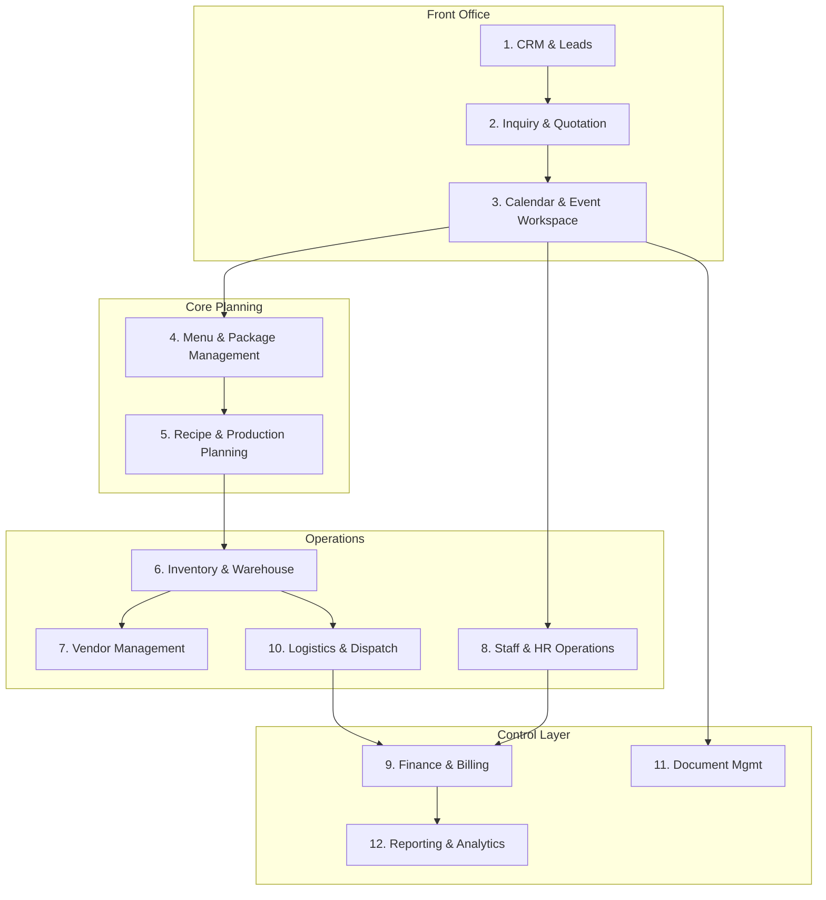

# Business Requirements Document (BRD)
## Multi-City, Multi-Branch Catering & Event Management ERP System
**Document Code:** ERP-BRD-001  
**Version:** 1.0.0  
**Status:** Draft  
**Author:** Senior ERP Solution Architect & Product Designer  

---

## 1. Executive Summary

This Business Requirements Document (BRD) defines the vision, scope, and technical objectives for the next-generation **Catering & Event Management ERP**. The platform is designed to consolidate fragmented operational tasks (CRM, inquiry management, menu selection, inventory tracking, kitchen production planning, staffing, logistics, and billing) into a single, unified enterprise solution. 

Catering and large-scale event operations suffer from significant communication silos and inventory losses due to mismatched event details, kitchen overproduction, scheduling conflicts, and poor logistics tracking. By replacing disjointed tools (spreadsheets, stand-alone calendars, and paper kitchen sheets) with a centralized **Event Workspace**, this platform optimizes resource allocation, maximizes event profitability, and lays the foundation for enterprise scalability.

---

## 2. Vision Statement

To build a world-class, multi-tenant Event ERP that empowers catering and event companies to scale from single-city boutiques to high-volume, multi-branch, and multi-franchise operations. Through standardizing the event lifecycle—from initial lead capture to event closure and financial reconciliation—the ERP guarantees high service levels, reduces culinary waste, prevents resource stockouts, and unlocks predictive AI forecasting.

---

## 3. Business Objectives

The platform is designed to achieve the following core objectives:

| Objective ID | Business Objective | Target KPI / Goal |
|---|---|---|
| **OBJ-001** | Centralize Event Workflows | 100% of event data managed in a single collaborative Workspace. |
| **OBJ-002** | Improve Kitchen Efficiency | Reduce culinary waste and ingredient over-procurement by 15% through unified recipe engines. |
| **OBJ-003** | Maximize Event Profitability | Provide real-time margin visibility during quotation phases to prevent underpricing. |
| **OBJ-004** | Operational Coordination | Automate task handoffs between Sales, Kitchen, Staffing, Logistics, and Finance. |
| **OBJ-005** | Multi-Branch Management | Maintain centralized controls while allowing branches to operate independently. |
| **OBJ-006** | Audit & Compliance | Ensure 100% traceabilty of all modifications, invoice statuses, and approvals. |

---

## 4. Stakeholders and User Personas

The system supports a diverse group of users. Each persona possesses distinct access permissions and goals:

### 4.1. Internal Corporate Personas
* **Executive Management (CEO/COO):** Focuses on overall business health, branch performance comparison, high-level financial analysis, and strategic growth.
* **Sales / Event Managers:** Handle client inquiries, draft proposals, create event layouts, assign menus, manage payments, and serve as the client's primary contact.
* **Kitchen / Executive Chefs:** Manage master recipes, run ingredient batch scaling tools, oversee food production, and coordinate hot/cold kitchen dispatches.
* **Logistics / Warehouse Managers:** Track hardware inventory, coordinate transportation fleets, manage load-ins/load-outs, and handle vendor hires.
* **Finance Team:** Oversee invoicing, vendor payouts, staff payroll reconciliation, cost allocations, tax filings, and event profitability analysis.
* **HR & Staffing Coordinators:** Handle internal roster schedules, manage external freelance servers/cooks, track clock-ins/outs, and manage compliance.

### 4.2. External Personas
* **Customers / Clients:** Submit inquiries, approve menus/quotations, make online payments, check countdown schedules, and provide post-event feedback.
* **Third-Party Vendors:** Receive purchase orders (florists, decorators, entertainers, equipment rental companies), manage delivery schedules, and submit invoices.

---

## 5. Functional Requirements

This section details the critical capabilities expected across the 15 Core Business Modules.

### 5.1. Module Breakdown & Scope Matrix



---

### 5.2. Functional Scope Definitions

#### 1. CRM & Lead Management
* **FR-1.1:** Lead capture via website widgets, social channels, and manually via cold-calls.
* **FR-1.2:** Dynamic lead scoring based on guest count, estimated budget, and historical customer value.
* **FR-1.3:** Communication log tracking emails, calls, and meeting minutes natively.

#### 2. Inquiry & Quotation Management
* **FR-2.1:** Smart quotation builder with automatic ingredient and labor cost estimations.
* **FR-2.2:** Multi-version quotation tracking (version history with diff view).
* **FR-2.3:** Client approval portal integration enabling digital signature and online deposit payment.

#### 3. Event Calendar & Event Workspace
* **FR-3.1:** Master Event Calendar supporting views filtered by branch, city, event category, or kitchen load.
* **FR-3.2:** Interactive Event Workspace acting as the single source of truth for all operational details.
* **FR-3.3:** Task checklists with role-based assignees and due dates relative to event start time.

#### 4. Menu & Package Management
* **FR-4.1:** Multi-tier package builder (e.g., Gold, Platinum, custom buffet).
* **FR-4.2:** Dietary tag tagging system (e.g., Gluten-Free, Halal, Vegan) automatically applied to menu items.
* **FR-4.3:** Live price recalculations based on seasonal ingredient price lists.

#### 5. Recipe & Production Planning
* **FR-5.1:** Master Recipe Database defining sub-recipes, preparation steps, plating instructions, and yield margins.
* **FR-5.2:** Automated Production Sheets mapping raw ingredient quantities to guest counts.
* **FR-5.3:** Kitchen dispatch list outlining delivery instructions for cold, prep, and hot lines.

#### 6. Inventory & Resource Management
* **FR-6.1:** Multi-warehouse trackability supporting hardware (crockery, furniture) and food items.
* **FR-6.2:** Real-time stock reservation mapping inventory directly to event dates.
* **FR-6.3:** Automated purchase requisitions when stock drops below safety margins.

#### 7. Vendor Management
* **FR-7.1:** Vendor profile database highlighting specialties, performance ratings, and contract structures.
* **FR-7.2:** Outsource planning engine to rent equipment or contract external services directly.
* **FR-7.3:** Vendor Invoice matching system linking purchase orders to vendor invoices.

#### 8. Staff & HR Operations
* **FR-8.1:** Shift scheduling dashboard linking required staff counts to event size formulas.
* **FR-8.2:** External gig portal allowing freelance staff to claim open shifts.
* **FR-8.3:** Shift check-in using GPS geofencing on mobile devices.

#### 9. Finance & Accounting
* **FR-9.1:** Multi-stage billing structures (e.g., 20% booking fee, 50% midpoint, 30% pre-event).
* **FR-9.2:** Cost center allocation assigning labor, food, transport, and vendor costs to events.
* **FR-9.3:** Profit and Loss (P&L) dashboard per event comparing actual margins against targets.

#### 10. Logistics & Dispatch Management
* **FR-10.1:** Vehicle management module detailing capacities, maintenance status, and dispatch schedules.
* **FR-10.2:** Digital Load-out checklists to ensure zero hardware items are left behind at warehouses.
* **FR-10.3:** Real-time route optimization for delivery drivers.

#### 11. Document Management
* **FR-11.1:** Automated generation of event run-sheets, Banquet Event Orders (BEOs), and invoice PDFs.
* **FR-11.2:** Centralized storage of vendor agreements, event licenses, and venue permits.

#### 12. Reporting & Analytics
* **FR-12.1:** Standard reports (Sales Pipeline, Inventory Valuation, Kitchen Yields).
* **FR-12.2:** Real-time operational dashboard for city executives.

#### 13. Mobile Applications
* **FR-13.1:** Operational Staff app (view schedules, check run-sheets, clock-in).
* **FR-13.2:** Delivery Driver app (routes, dispatch sign-off).
* **FR-13.3:** Client Portal app (menu review, payment, messaging).

#### 14. Workflow & Automation Engine
* **FR-14.1:** Automated escalation alerts if client payments are overdue.
* **FR-14.2:** Automated notification to kitchen staff when menu selections change within 72 hours of an event.

#### 15. AI & Forecasting Modules
* **FR-15.1:** Ingredient waste forecasting using historical consumption patterns.
* **FR-15.2:** Seasonality-based price fluctuations modeling for accurate quoting.

---

## 6. Non-Functional Requirements

To ensure enterprise-grade stability, usability, and speed, the following parameters must be met:

### 6.1. Usability and UI
* **NFR-1.1:** Responsive layout optimized for tablets, laptops, and standard desktop screens.
* **NFR-1.2:** Dynamic design supporting both Light and Dark themes, utilizing semantic tokens (e.g., `--background`, `--card`, `--foreground`) to guarantee visibility.
* **NFR-1.3:** WCAG 2.1 AA accessibility compliance.

### 6.2. Reliability & Availability
* **NFR-2.1:** High availability target of 99.9% uptime during operational window (04:00 AM - 02:00 AM daily).
* **NFR-2.2:** Recovery Point Objective (RPO) of 1 hour and Recovery Time Objective (RTO) of 4 hours.

### 6.3. Performance & Latency
* **NFR-3.1:** Critical API responses (auth, calendar lookups, invoice checks) under 300ms.
* **NFR-3.2:** Page rendering speed (NextJS SSR/ISR) under 1.2s.

---

## 7. Business Processes & Event Lifecycle

```
[Inquiry] ──> [Proposal/Quotation] ──> [Menu Locked] ──> [Procurement/Prep] ──> [Event Delivery] ──> [Reconciliation/Closure]
```

The system manages the lifecycle as follows:

| Stage | Process Flow Description | Trigger Event | Responsible Persona |
|---|---|---|---|
| **1. Inquiry** | Capture client name, budget estimate, guest counts, and event location. | Lead Submission | Sales Manager |
| **2. Quotation** | Build quote using standardized packages. Calculate initial profit margins. | Lead Qualified | Sales Manager |
| **3. Menu Selection** | Lock the menu and identify any special dietary requirements. | Contract Signed | Client / Sales Manager |
| **4. Prep Planning** | Scale recipes based on RSVPs. Check stock availability and create purchase orders. | 14 Days Before Event | Executive Chef / Procurement |
| **5. Staffing** | Publish shift schedules and assign event leads. | 7 Days Before Event | HR Coordinator |
| **6. Dispatch** | Run digital load-out lists and pack trucks. | Event Day | Logistics Manager |
| **7. Reconciliation** | Log returns, account for damaged items, pay out staff, and run final profit reports. | Post-Event (+48 hrs) | Finance Team |

---

## 8. Multi-City Architecture Considerations

A single instance of the ERP must scale across multiple locations. We define the hierarchy as follows:

```
[Holding Company]
       └── [City / Territory]
                 └── [Branches / Hubs]
                           ├── [Central Kitchen]
                           └── [Warehouses / Depots]
```

### 8.1. Data Isolation & Shared Registries
* **Global Registries:** Master Ingredients, Master Recipe Databases, Standard Operating Procedures (SOPs), and corporate tax rule definitions are shared across all entities.
* **Isolated Data:** Financial transactions, client CRM databases, local inventory levels, and labor rosters are isolated by Branch/City level.
* **Transfer Orders:** When warehouse assets (e.g., premium tables) are shared across branches, the system must trigger a Transfer Order. This logs the custody change and calculates cross-branch rent fees automatically.

---

## 9. Security Requirements

The system handles sensitive financial records, corporate files, and employee logs. A robust security model is essential.

### 9.1. Role-Based Access Control (RBAC) Matrix

| Module | Executive Mgmt | Sales Manager | Executive Chef | Logistics Manager | Finance Team |
|---|:---:|:---:|:---:|:---:|:---:|
| **Event Workspace** | View | Create / Edit | View | View | View |
| **Recipe Database** | View | View | Create / Edit | No Access | No Access |
| **Inventory Control** | View | View | View | Create / Edit | View |
| **Financial Adjustments** | Approve | No Access | No Access | No Access | Create / Edit |
| **System Settings** | Create / Edit | No Access | No Access | No Access | No Access |

### 9.2. Approval Workflows & Thresholds
To protect profitability, financial approvals are bound to user roles:
* **Level 1 (Sales Manager):** Can offer discounts up to 5% on standard menus.
* **Level 2 (Branch Director):** Approves discounts from 5.1% to 15%.
* **Level 3 (VP Operations/CFO):** Approves quotes with margins below the 35% corporate baseline.

---

## 10. Reporting Requirements

The reporting engine must serve both micro-operational teams and high-level corporate directors:

* **Banquet Event Orders (BEOs):** Automatically generated 3-page event operational document outlining the menu, event schedule, logistics list, and staff roster.
* **Culinary Production Schedules:** scaled batch kitchen lists grouped by hot, prep, pastry, and cold lines.
* **Aging Stock Reports:** Alerts detailing raw ingredient batches approaching expiry.
* **Branch Comparison Metrics:** Monthly comparisons of revenues, labor costs, food waste percentages, and net margins across branches.

---

## 11. Roadmap, Risks, and KPIs

### 11.1. Roadmap Phases
1. **Phase 1 (MVP):** CRM, Quotations, Event Calendar, Basic Inventory, and Invoicing.
2. **Phase 2 (Ops Scale):** Kitchen Recipe Scaling, Staff Rostering, and Logistics Load-out.
3. **Phase 3 (Enterprise):** Multi-company support, Client Mobile Portal, and AI waste forecasting.

### 11.2. Risks & Mitigations

> [!WARNING]
> **Risk 1: Poor Internet connectivity at event venues.**  
> *Mitigation:* Staff mobile apps must support offline data entry (e.g. clock-ins, checklist verification) and sync when back online.

> [!CAUTION]
> **Risk 2: Multi-branch inventory leaks.**  
> *Mitigation:* Enforce strict scan-in / scan-out checks using mobile barcode/QR systems at warehouses.

### 11.3. Success Metrics & KPIs
* **Quotation Turnaround Time:** Reduce time to quote from 48 hours to under 30 minutes using package builders.
* **Culinary Waste Reduction:** Decrease ingredient over-purchasing by 12% in year one.
* **Billing Adjustments:** Reduce invoicing errors by 95% via integrated inventory calculations.
