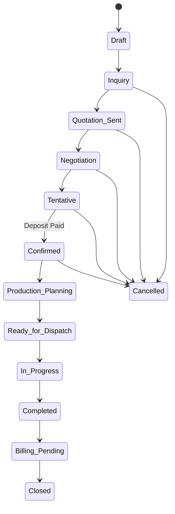

# Business Processes & Event Lifecycle Architecture
**Document Code:** ERP-BPA-001  
**Version:** 1.0.0  
**Status:** Draft  
**Author:** Senior Business Process Consultant & ERP Solution Architect  

---

## 1. Lead-to-Event Operational Workflow

This section outlines the operational flow from early client contact to event completion:

```
[Lead] ──► [Inquiry] ──► [Quotation] ──► [Negotiation] ──► [Tentative] ──► [Confirmed] ──► [Execution] ──► [Closure]
```

1. **Lead Stage:** Capture basic contact info, referral source, estimated guest count, and tentative date. Lead score is assigned.
2. **Inquiry Stage:** Capture detailed logistics requirements (venue constraints, catering style, rental packages).
3. **Quotation Stage:** Build menus, calculate labor costs, generate pricing, and send the proposal.
4. **Negotiation Stage:** Adjust parameters (discounts, ingredient substitutions, timing) and log version histories.
5. **Tentative Booking Stage:** Hold dates in the master calendar. The hold is locked for a defined window (e.g., 7 days) pending deposit.
6. **Confirmation Stage:** Receive the signed agreement and booking deposit. Assets are reserved, and BEO is generated.
7. **Event Execution Stage:** Kitchen production, warehouse load-out, venue setup, guest service, and teardown.
8. **Event Closure Stage:** Inventory checks, damage audits, final invoicing, client feedback, and P&L reconciliation.

---

## 2. Event Lifecycle State Machine

To prevent workflow errors, event status transitions are controlled by strict state rules:



### 2.1. Detailed State Definitions

#### State: Quotation Sent
* **Entry Criteria:** Quote is compiled and approved by finance or managers (if discounts are applied). Quote PDF generated.
* **Exit Criteria:** Quote is viewed by client and marked as under negotiation, tentative, or cancelled.
* **Responsible Departments:** Sales.
* **Mandatory Data Requirements:** Total Quote Value, Selected Menu Packages, Event Date, Venue Location, Guest Count.
* **Allowed Actions:** Resend quote email, log client feedback, adjust pricing, cancel lead.
* **Automatic Tasks & Notifications:** Set task for Sales: "Follow up on quote in 48 hours." Send email alert to client.

#### State: Confirmed
* **Entry Criteria:** Signed contract uploaded AND minimum booking deposit received (e.g., 20% of quote total).
* **Exit Criteria:** Transition to Production Planning.
* **Responsible Departments:** Sales & Accounts.
* **Mandatory Data Requirements:** Signed Contract PDF, Payment Transaction ID, Confirmed Menu, Guest Guarantee.
* **Allowed Actions:** Lock event date, assign core event managers, reserve warehouse assets.
* **Automatic Tasks & Notifications:** Lock assets in inventory. Send BEO draft alert to Chef and Warehouse Manager.

#### State: Production Planning
* **Entry Criteria:** 14 Days prior to Event Date.
* **Exit Criteria:** Kitchen scaling sheet signed off, purchase orders dispatched to vendors, shift schedules published.
* **Responsible Departments:** Kitchen (Culinary Prep), Staffing (HR), and Procurement.
* **Mandatory Data Requirements:** Scaled Recipe Quantities, Staff Roster List, Vendor PO Numbers.
* **Allowed Actions:** Modify recipe batch sizes, schedule kitchen prep shifts, publish gig portal shifts.
* **Automatic Tasks & Notifications:** Alert kitchen staff of prep schedules. Email purchase orders to food suppliers.

#### State: Ready for Dispatch
* **Entry Criteria:** 24 Hours prior to Event Date.
* **Exit Criteria:** Delivery trucks loaded, BEO dispatch checklist scanned and signed.
* **Responsible Departments:** Warehouse & Logistics.
* **Mandatory Data Requirements:** Load-out Scan Sheet, Vehicle Assignee, Driver Mobile Access Activated.
* **Allowed Actions:** Scan assets onto trucks, check temperature logs for refrigerated vans.
* **Automatic Tasks & Notifications:** Send delivery ETA notifications to venue contact and event manager.

---

## 3. Approval Workflows & Threshold Matrix

Financial and operational exceptions require system approvals. Workflows route approval tasks dynamically based on limits:

### 3.1. Approval Hierarchy Matrix

| Approval Trigger | Threshold limit | Primary Approver | Escalation Target |
|---|---|---|---|
| **Quote Discount** | 0.01% - 5.00% | Sales Manager | Auto-Approved |
| **Quote Discount** | 5.01% - 15.00% | Branch Director | VP Operations |
| **Quote Discount** | > 15.00% | VP Operations | CFO |
| **Procurement PO** | Up to $5,000 | Procurement Manager| Branch Director |
| **Procurement PO** | $5,001 - $25,000 | Branch Director | VP Operations |
| **Procurement PO** | > $25,000 | VP Operations | CFO |
| **Event Cancellation** | > 30 Days before event | Sales Manager | Branch Director |
| **Event Cancellation** | < 30 Days before event | Branch Director | VP Operations (Loss review) |
| **Refunds** | Up to $1,000 | Accounts Supervisor| Finance Director |
| **Refunds** | > $1,000 | Finance Director | CFO |

---

## 4. Automated Task Management Engine

To maintain consistent operational quality, the task engine dynamically creates task lists using rules tied to **Event Type**, **Package Type**, and **Branch Location**:

* **Rule TM-001 (Logistics Check):** If *Event Type = Outdoor Buffet* AND *Status = Confirmed*, generate task: *"Acquire municipal cooking permit"* assigned to Sales (Due Event Date -14 days).
* **Rule TM-002 (Production Scale):** If *Event Status = Confirmed* AND *Event Date -14 Days*, generate task: *"Run recipe batch scaling and inventory check"* assigned to Kitchen Lead (Due immediately).
* **Rule TM-003 (Staff Shift):** If *Staff Assignment Status < 100%* AND *Event Date -7 Days*, generate task: *"Publish vacant server shifts to gig portal"* assigned to HR Staffing Coordinator (Due immediately).

---

## 5. Event Health Engine & Readiness Score

The ERP calculates an **Event Health Score (0 - 100)** to give operations leads real-time visibility into whether upcoming events are prepared and ready:

```
Score = (P * 0.20) + (V * 0.15) + (S * 0.15) + (I * 0.20) + (D * 0.10) + (Pr * 0.10) + (C * 0.10)
```

Where each component is graded out of 100:

| Weight | Readiness Factor | Evaluation Criteria |
|---|---|---|
| **20%** | **Payment (P)** | `(Amount Paid / Amount Due) * 100`. Must be 100% before event day. |
| **15%** | **Vendor Assignment (V)** | Ratio of third-party contracts signed and confirmed. |
| **15%** | **Staff Assignment (S)** | Percentage of required shifts filled by rostered employees. |
| **20%** | **Inventory Readiness (I)** | Percentage of required stock items allocated and checked in. |
| **10%** | **Documentation (D)** | Contract signed, BEO approved, and venue permits uploaded. |
| **10%** | **Production Readiness (Pr)** | Prep schedule confirmed and ingredient batch sheets generated. |
| **10%** | **Checklist Completion (C)** | Completion rate of pre-event checklist items. |

### 5.1. Operational Health Status Levels
* **Green (90 - 100):** Operational readiness met. Safe for dispatch.
* **Amber (70 - 89):** Minor operational gaps (e.g., missing documents, partial payment). Needs manager review.
* **Red (< 70):** Critical operational risks (e.g., staff shortages, inventory deficits). Flagged on regional executive dashboards.

---

## 6. Notification Workflows

Notifications are delivered across multiple channels (Email, WhatsApp, SMS, In-App) based on urgency:

```
[System Trigger Event]
         │
         ├───► High Urgency (e.g., Cancellation/Alert) ──► WhatsApp + SMS + In-App
         ├───► Medium Urgency (e.g., Shift Assignment) ──► Email + In-App
         └───► Low Urgency (e.g., Payment Receipt) ──────► Email
```

* **Client Payments:** Send automated emails and WhatsApp reminders 14, 7, and 3 days before payment deadlines.
* **Vendor Orders:** Automate WhatsApp confirmations to suppliers asking them to confirm receipt and delivery times for food orders.
* **Operational Alerts:** Send instant in-app alerts and SMS messages to drivers if the delivery address is updated within 24 hours of an event.
