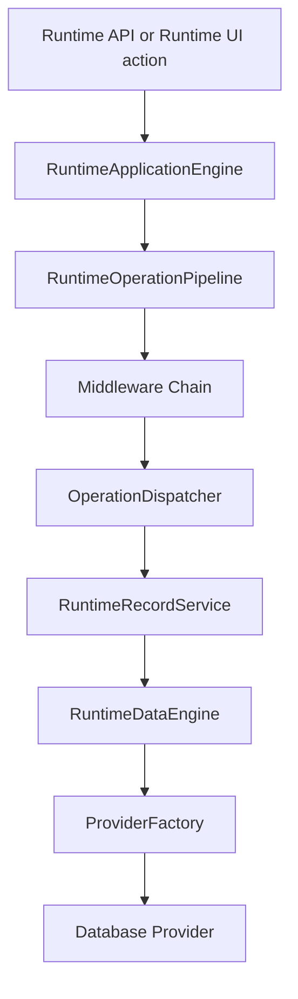

# VS06A - Runtime Application Engine and Record Lifecycle

**Version:** 1.1  
**Status:** Implemented  
**Date:** 2026-07-15

## VS06A-R Refinement

VS06A-R introduces architecture refinements without replacing the VS06A foundation.

- Pipeline converted to middleware execution model.
- RuntimeContext expanded with future milestone fields.
- RuntimeOperationResult expanded with diagnostics and categorized errors.
- RuntimeEventPublisher contract frozen for sync + async evolution.
- Runtime operation set frozen with workflow/document/integration operations.
- RuntimeTransaction scope introduced per execution.
- PlatformRuntime service registry introduced for engine discovery.
- Middleware ordering made metadata-driven (`order`, `priority`, `enabled`, `dependencies`).
- Middleware execution policies introduced (`Continue`, `StopOnFailure`, `ContinueOnWarning`, `AlwaysRun`).
- Named built-in middleware package introduced (Authorization, License, Validation, Business Rules, Workflow, Persistence, Notification, Audit).
- Lightweight runtime metrics collector introduced for operation count, average execution, failure rate, validation failures, workflow time, and persistence time.

## Purpose

VS06A introduces the Runtime Application Engine as the orchestration layer above CM-003 Runtime Data Engine. Runtime APIs now execute record lifecycle operations through a standardized operation pipeline with immutable runtime context, permission checks, event publishing, and standardized operation results.

## Runtime Stack

All runtime operations follow this stack:

## Frozen Operations

The supported operation set is frozen in VS06A:

- Create
- Load
- Save
- Delete
- Restore
- Duplicate
- Archive
- Submit
- Approve
- Reject
- Cancel
- Close
- Print
- Export
- Import

## Runtime Context

`RuntimeContext` is immutable and includes:

- RequestId (`requestId`)
- TenantId (`tenantId`)
- Tenant (`tenant`)
- OrganizationId (`organizationId`)
- Organization (`organization`)
- ModuleId (`moduleId`)
- Module (`module`)
- EntityId (`entityId`)
- Entity (`entity`)
- EntityDefinition (`entityDefinition`)
- ViewDefinition (`viewDefinition`)
- LayoutDefinition (`layoutDefinition`)
- UserId (`userId`)
- CurrentUser (`currentUser`)
- Roles (`roles`)
- Permissions (`permissions`)
- Operation (`operation`)
- RecordId (`recordId`)
- CorrelationId (`correlationId`)
- Transaction (`transaction`)
- TransactionId (`transactionId`)
- ExecutionMode (`executionMode`)
- TriggerSource (`triggerSource`)
- WorkflowState (`workflowState`)
- CurrentRecord (`currentRecord`)
- CurrentValues (`currentValues`)
- OriginalValues (`originalValues`)
- Culture (`culture`)
- Timezone (`timezone`)
- Timestamp (`timestamp`)

## Lifecycle Pipeline

Each runtime operation executes through a middleware chain:

```mermaid
flowchart LR
    A[Load Metadata Middleware] --> B[Authorization Middleware]
    B --> C[Validation Middleware]
    C --> D[Business Rules Middleware]
    D --> E[Workflow Middleware]
    E --> F[Load Record Middleware]
    F --> G[Before Event Middleware]
    G --> H[Persistence Middleware]
    H --> I[Notification Middleware]
    I --> J[Audit Middleware]
    J --> K[After Event Middleware]
    K --> L[Return RuntimeOperationResult]
```

Middleware and plug-in registration APIs:

- `registerMiddleware(name, middleware)`
- `registerAction(operation, action)`
- `registerValidator(name, validator)`
- `registerRule(name, rule)`
- `registerWorkflow(name, workflow)`

Middleware metadata contract includes:

- `id`
- `name`
- `order`
- `priority`
- `enabled`
- `dependencies`
- `policy`

## Runtime Events

VS06A event model includes:

- OperationStarted
- OperationCompleted
- OperationFailed
- RecordCreating
- RecordCreated
- RecordUpdating
- RecordUpdated
- RecordDeleting
- RecordDeleted
- RecordRestoring
- RecordRestored

Event publishing is synchronous in VS06A via `SynchronousRuntimeEventPublisher`.

Publisher contract is frozen as:

- `publish(event)`
- `publishAsync(event)`
- `subscribe(eventType, handler)`
- `unsubscribe(subscriptionId)`

## Public Interfaces

VS06A introduces frozen public interfaces for downstream milestones:

- `IRuntimeApplicationEngine`
- `IRuntimeRecordService`
- `IRuntimeEventPublisher`
- `IRuntimeOperationPipeline`

These contracts are intended to remain stable for future validation, business rules, workflow, and async event processing milestones.

## Standard Result Model

All operations return `RuntimeOperationResult`:

- `success`
- `messages`
- `warnings`
- `errors`
- `validationErrors`
- `businessRuleErrors`
- `workflowErrors`
- `recordId`
- `affectedRows`
- `correlationId`
- `executionTime`
- `operation`
- `metadata`
- `diagnostics`
- `record` (optional payload)

Runtime diagnostics fields include:

- `pipelineTime`
- `metadataTime`
- `authorizationTime`
- `validationTime`
- `businessRulesTime`
- `workflowTime`
- `persistenceTime`
- `notificationTime`
- `auditTime`
- `totalTime`

## Service Registry

`PlatformRuntime` provides runtime engine discovery:

- `getApplicationEngine()`
- `getWorkflowEngine()`
- `getNotificationEngine()`
- `getDocumentEngine()`

## Compatibility Notes

- CM-003 Runtime Data Engine public contract remains unchanged.
- ProviderFactory, repositories, and storage providers are untouched.
- Existing `RecordService` remains as a compatibility adapter and delegates orchestration to RuntimeApplicationEngine.
- Runtime API endpoints now call RuntimeApplicationEngine directly.
