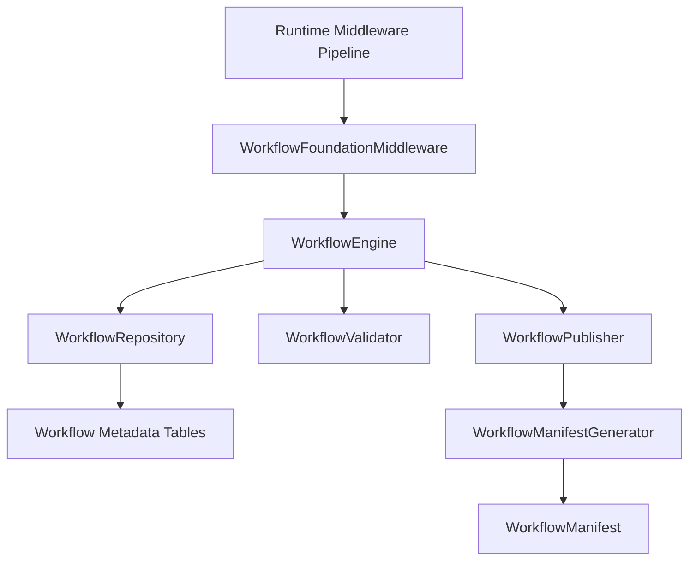

# VS07 - Workflow Engine Foundation and Metadata Architecture

**Version:** 1.0
**Status:** Implemented
**Date:** 2026-07-15

## Scope

VS07 Prompt 001 establishes workflow foundation architecture only:

- Workflow metadata domain model
- Workflow persistence schema
- Workflow repository and contracts
- Workflow metadata validation and publish pipeline
- Workflow manifest generation
- Designer metadata and Runtime manifest model separation
- Workflow middleware integration into Runtime Pipeline
- Runtime context workflow propagation
- Public interface freeze

Execution features are explicitly out of scope for this prompt.

## Architecture

## Metadata Model

Workflow metadata is fully generic and includes:

- WorkflowDefinition
- WorkflowVersion
- WorkflowState
- WorkflowTransition
- WorkflowCondition
  C --> SM[StateMachineEngine]
  SM --> TE[TransitionEngine]
  C --> D[WorkflowRepository]
  D --> E[Workflow Metadata Tables]
  C --> F[WorkflowValidator]
  C --> G[WorkflowPublisher]
  G --> N[Normalization]
  N --> O[Optimization]
  O --> H[WorkflowManifestGenerator]
  H --> I[WorkflowManifest Runtime Model]
- WorkflowSLA
- WorkflowHistory
- WorkflowComment
- WorkflowAttachment
- WorkflowInstance

Designer namespace:

- WorkflowVariable
- WorkflowRole
- WorkflowGroup
- WorkflowBusinessObjectReference

Runtime namespace:

## Validation Rules

Validation at publish includes:

- Duplicate state codes
- Missing initial state
- WorkflowRuntimeModel
- WorkflowGraph
- WorkflowNode
- WorkflowEdge
- Multiple initial states
- Orphan transitions (missing source or destination state)
- Circular transitions
- Missing transition action definitions
- Invalid expression syntax through RuntimeExpressionAdapter
- Invalid Condition -> Expression references and expected result type constraints
- Invalid publish status
- Duplicate version number check during publish

## Publish Pipeline

Publish flow:

1. Validate metadata snapshot baseline
2. Normalize metadata ordering and shape
3. Optimize metadata graph payload
4. Re-validate optimized snapshot
5. Persist validation report
6. Persist designer metadata snapshot
7. Generate runtime-only workflow manifest
8. Persist manifest and publish history
9. Return WorkflowPublishResult

Runtime consumers use manifest only and never read designer metadata directly.

## Runtime Integration

WorkflowFoundationMiddleware is registered in Runtime Operation Pipeline.

Current middleware responsibilities:

- Detect workflow-enabled entities from runtime metadata
- Load published workflow manifest for entity and tenant
- Validate manifest metadata
- Inject workflow context fields into RuntimeContext
- Pass control back to Runtime pipeline

No transition or action execution is performed in this prompt.

## Public Interfaces

Frozen interfaces:

- IWorkflowEngine
- IWorkflowRepository
- IWorkflowManifestGenerator
- IWorkflowValidator
- IWorkflowPublisher
- IWorkflowMetadataProvider
- IWorkflowMiddleware
- IWorkflowVersionManager
- IWorkflowSimulationService

## Database Model

Normalized metadata schema introduced in [db/migrations/01_workflow_foundation.sql](db/migrations/01_workflow_foundation.sql).

Key table groups:

- Designer metadata: definitions, versions, states, transitions, conditions, rules, actions, assignments, roles, groups, permissions, variables, expressions, notifications, escalations, sla
- Runtime history: instances, history, comments, attachments
- Publish artifacts: validation_reports, publish_history, manifests

All tables use UUID primary keys and ES-001 audit conventions.
Migration naming follows milestone traceability via [db/migrations/20260715_VS07_WorkflowFoundation.sql](db/migrations/20260715_VS07_WorkflowFoundation.sql).
The migration enables pgcrypto explicitly for gen_random_uuid support.
