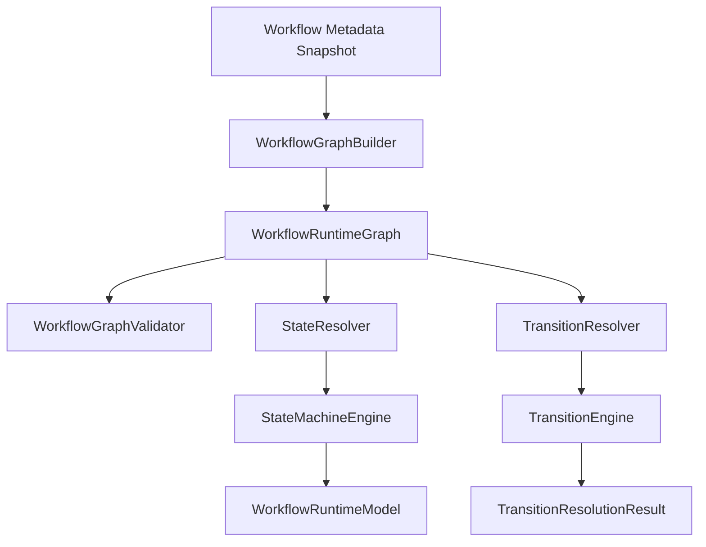

# VS07 Prompt 002 - State Machine and Transition Engine

Version: 1.0
Status: Implemented
Date: 2026-07-15

## Scope

Prompt 002 delivers deterministic state movement architecture without executing transitions.

Included:

- Generic finite state machine
- State registration and resolution
- Terminal state detection
- State graph generation
- Transition registration and validation
- Transition priority, rollback, retry, timeout, and parallel metadata handling
- Transition resolution (can move, available transitions, next state, required conditions, required permissions)
- Graph builder and graph validator
- Frozen public contracts

Not included:

- Workflow execution
- Approvals and assignment routing
- Notifications
- Runtime state mutation

## Frozen Contracts

- IStateMachineEngine
- ITransitionEngine
- IStateResolver
- ITransitionResolver
- IWorkflowGraphBuilder
- IWorkflowGraphValidator

## Architecture

## Determinism and Immutability

- State and transition registrations are sorted (state sequence, transition priority).
- Runtime graph and runtime model are deep-frozen before exposure.
- Resolution APIs return decisions only and never mutate runtime state.

## Runtime Graph Layers

The graph stack generated in Prompt 002:

- WorkflowGraph: nodes and edges
- StateGraph: outgoing and incoming adjacency maps by state
- TransitionGraph: transitions grouped by source state

These layers are reusable for visualization, simulation, and validation workflows.

## Validation Coverage

Graph validator detects:

- Circular paths
- Dead-end states
- Orphan states
- Duplicate transitions
- Multiple initial states
- Invalid terminal states
- Invalid rollback paths
- Invalid priorities

## Resolution Coverage

Transition resolution APIs answer:

- Can this record move?
- Which transitions are available?
- Which state comes next?
- What conditions must be true?
- Which permissions are required?

No transition execution occurs in Prompt 002.

## Test Coverage

Added test suites:

- WorkflowStateMachineEngine.test.ts
- WorkflowTransitionEngine.test.ts
- WorkflowGraphBuilderValidator.test.ts

Existing workflow foundation tests continue to validate compatibility and composition.
