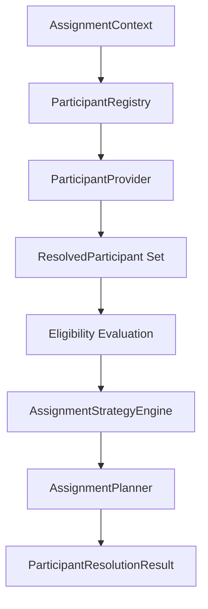

# VS07 Prompt 003 - Participant Resolution and Assignment Foundation

Version: 1.0
Status: Implemented
Date: 2026-07-15

## Scope

Prompt 003 introduces deterministic participant resolution and assignment planning.

Implemented:

- Plugin-based participant provider architecture
- Participant resolution engine
- Assignment strategy engine (metadata-driven, non-executing)
- Assignment planner (immutable assignment plan)
- Participant metadata validation
- Participant, assignment, and resolution manifests
- Runtime model extensions for participant artifacts
- PlatformRuntime registration for participant resolution engine

Not implemented:

- Workflow task creation
- Approval execution
- Notifications and email
- Queue processing
- State transitions or workflow execution
- Assignment persistence

## Public Contracts

- IParticipantResolutionEngine
- IParticipantProvider
- IUserParticipantProvider
- IRoleParticipantProvider
- IGroupParticipantProvider
- IExpressionParticipantProvider
- ILookupParticipantProvider
- IHierarchyParticipantProvider
- ICustomParticipantProvider
- IParticipantRegistry
- IAssignmentStrategyEngine
- IAssignmentPlanner
- IParticipantValidator
- IParticipantManifestGenerator
- IHierarchyResolver

## Participant Model

Participant source types:

- User
- Role
- Group
- Department
- BusinessUnit
- Manager
- Supervisor
- RecordOwner
- RecordCreator
- Requester
- ApproverChain
- Expression
- Lookup
- OrganizationHierarchy
- ExternalProvider
- CustomProvider

Runtime participant artifacts:

- ResolvedParticipant
- ParticipantSet
- ParticipantEligibilityResult
- ParticipantResolutionResult

## Assignment Strategy Model

Supported strategy metadata:

- SingleUser
- AllUsers
- AnyUser
- RoundRobin
- LeastLoaded
- Manager
- Hierarchy
- Expression
- Weighted
- Priority
- Random
- Custom

Prompt 003 resolves strategy metadata only; no execution or task creation occurs.

## Resolution Pipeline

## Manifest Generation

Workflow publish now emits runtime artifacts:

- ParticipantManifest
- AssignmentManifest
- ResolutionManifest

Runtime consumers remain manifest-only and do not read designer metadata directly.

## Validation Rules

Participant validator checks:

- Duplicate participants
- Circular hierarchy
- Missing providers
- Invalid strategy metadata
- Duplicate priorities
- Invalid delegation metadata
- Missing escalation targets

## Plugin Architecture

- Provider registry supports dynamic provider registration.
- Provider interfaces are source-specific and extensible.
- Custom provider support is represented by ICustomParticipantProvider.
- No static mutable global provider state is used.

## Runtime Integration

- WorkflowFoundation composes participant services with dependency injection.
- PlatformRuntime now registers and exposes ParticipantResolutionEngine.
- WorkflowEngine exposes getParticipantResolutionEngine for orchestration access.
