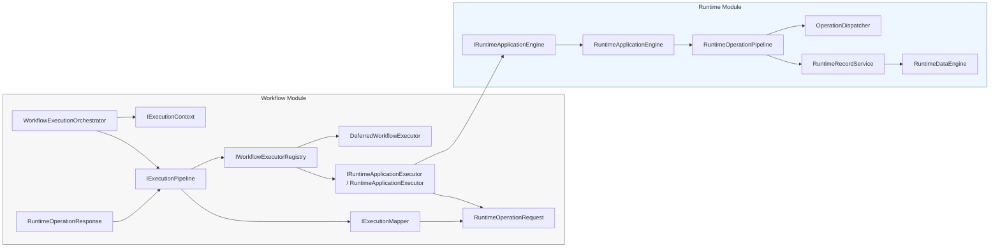

# VS07 Prompt 005B - Execution Architecture

This diagram captures the current execution boundary after the adapter slice was isolated. It is documentation only and does not change runtime behavior.

Textual dependency graph:

- `WorkflowExecutionOrchestrator` builds an immutable `ExecutionPlan` and hands it to `IExecutionPipeline`.
- `IExecutionPipeline` sequences execution stages and passes an immutable `IExecutionContext`.
- `IExecutionMapper` converts `ExecutionPlan` entries into `RuntimeOperationRequest` objects.
- `IWorkflowExecutorRegistry` resolves the executor for each request by effect type.
- `IRuntimeApplicationExecutor` translates the request and invokes only `IRuntimeApplicationEngine`.
- `IRuntimeApplicationEngine` stays inside the runtime module and reaches the runtime data layer through its own pipeline.
- The runtime module does not import workflow composition.

Boundary rule:

- Workflow depends on runtime contracts and runtime engine types.
- Runtime does not depend on workflow composition, orchestrators, registries, or execution pipeline implementations.
