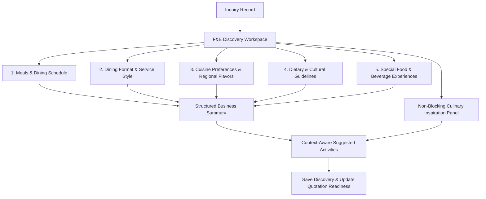

# Engineering Package: IM-WP02C-03A — Food & Beverage Discovery Workspace (Refined)

**Document ID**: ENG-PKG-IM-WP02C-03A  
**Module**: Catrack Catering ERP — Inquiry Management (`cat/inquiry`)  
**Feature Area**: Food & Beverage Discovery Workspace  
**Status**: APPROVED PRODUCT SPECIFICATION WITH REVIEW REFINEMENTS — **Lifecycle: Migrated (2026-07-27), historical**

> [!NOTE]
> **Source Lineage:** Migrated verbatim from AG Brain `engineering_package_im_wp02c_03a.md` as part of the docs/ repository migration — see `docs/project-governance/MIGRATION-LOG.md`.
>
> **No `01-business-discussion.md` exists for this Work Package.** None was found anywhere in the AG Brain historical archive or this repository. Per migration policy, this gap is preserved honestly — no business discussion document has been fabricated to fill it. This engineering package opens directly with a "Product Review Refinements Summary" (§1.2 below), implying a business discussion phase happened, but no artifact of it survives.

---

## 1. Executive Summary & Refined Intent

### 1.1 Business Purpose
The **Food & Beverage Discovery Workspace** (`IM-WP02C-03A`) is a dedicated guided conversation workspace designed to capture the customer's overall dining vision, culinary preferences, service format, and dietary parameters early in the sales inquiry lifecycle.

### 1.2 Product Review Refinements Summary
In accordance with Product Review feedback, this package incorporates the following refinements:
1. **Conversational Titles**: Card 1 renamed to **Meals & Dining Schedule**.
2. **Reordered 5-Card Flow**: Reordered to match the natural customer discussion flow:
   - 1. Meals & Dining Schedule
   - 2. Dining Format & Service Style
   - 3. Cuisine Preferences & Regional Flavors
   - 4. Dietary & Cultural Guidelines
   - 5. Special Food & Beverage Experiences
3. **Customer-Facing Business Language**: Replaced technical jargon (e.g., "Kitchen Segregation Level") with customer-centric business options.
4. **Qualitative Focus**: Removed quantitative counter count fields (`liveCounterCount`). Captures only qualitative station types and desire for live stations; quantities belong downstream in quotation and planning.
5. **Friendly Business Labels**: Presented Taste Profiles and Dietary Options in conversational business terms.
6. **Context-Aware Suggested Activities**: Dynamically recommends operational next steps based on specific captured preferences.
7. **Structured Business Summary**: Renders summaries in clean structured sections rather than a single dense block of text.
8. **Balanced Validation Statuses**: Uses `In Progress`, `Needs Attention`, and `Ready`. Reserves `Blocked` strictly for genuine business-rule conflicts.
9. **Non-Blocking Culinary Inspiration Panel**: Provides an intelligent discussion prompter to suggest conversation topics for salespeople without performing menu selection.

---

## 2. Reordered Guided Conversation Cards



### 2.1 Card 1: Meals & Dining Schedule
*Conversational Prompt*: **"What meals and refreshment windows will be served during your event?"**

- **Dining Scope & Meals**: Multi-select options (`High Tea Refreshments`, `Lunch Service`, `Dinner Reception`, `Lunch & Dinner Package`, `Breakfast & Morning Tea`, `Late Night Comfort Snacks`, `All-Day Executive Hospitality`).
- **Timing & Schedule Expectations**: Start/end time windows per meal.
- **Service Flow**: Seating turnover expectations (e.g. continuous rolling buffet vs synchronized meal service).

### 2.2 Card 2: Dining Format & Service Style
*Conversational Prompt*: **"How would you like the food to be presented and served to your guests?"**

- **Primary Dining Format**: Searchable picker (`ServiceStyleLookup`) with Organic Master Growth (`Royal Buffet Setup`, `Pre-Plated Table Service`, `Interactive Live Cooking Counters`, `Passed Canapés & Butler Service`, `Family Style Sharing Platter`).
- **Live Stations Desired**: Toggle (`Yes` / `No`).
- **Live Station Types**: Multi-select / tags for desired live stations (e.g. `Pasta & Risotto Wheel`, `Live Chaat Counter`, `Dim Sum Station`, `Wood-Fired Pizza`, `Live Tandoor & Kebabs`).
- **Butler & Hospitality Expectations**: Desired hospitality density (e.g., `Dedicated VIP Butler Service`, `Standard Server Ratio`).

### 2.3 Card 3: Cuisine Preferences & Regional Flavors
*Conversational Prompt*: **"What culinary traditions and regional flavors best represent your event?"**

- **Primary Cuisine**: Searchable picker (`CuisineLookup`) supporting Organic Master Growth.
- **Secondary / Theme Cuisines**: Searchable multi-select picker (`North Indian Royal Mughlai`, `Italian & Mediterranean`, `Pan-Asian Street & Wok`, `Awadhi & Hyderabadi Dum`, `Regional Coastal & South Indian`).
- **Flavor & Spicing Profile**: Conversational options:
  - `Mild & Subtle Flavors` (Elegantly spiced for international/varied palettes)
  - `Balanced Classic Spicing` (Standard traditional seasoning)
  - `Rich & Authentic Spicing` (Bold, authentic regional heat)
  - `Custom Flavor Profile` (Special chef instructions)

### 2.4 Card 4: Dietary & Cultural Guidelines
*Conversational Prompt*: **"What dietary guidelines, religious preferences, or food safety rules must we respect?"**

- **Conversational Dietary Options**:
  - `100% Pure Vegetarian Event`
  - `Jain Options Required (No Onion / No Garlic)`
  - `Halal Meats Required`
  - `Non-Vegetarian Dishes Included`
  - `Gluten-Free Friendly Choices`
  - `Nut-Free / Allergy Aware Preparation`
  - `Vegan Options Available`
- **Kitchen & Service Segregation**: Customer-facing business options:
  - `Standard Shared Preparation`
  - `Separate Vegetarian & Non-Vegetarian Service Counters`
  - `Dedicated Vegetarian Preparation Zone`
  - `Strict 100% Pure Vegetarian Kitchen Setup`

### 2.5 Card 5: Special Food & Beverage Experiences
*Conversational Prompt*: **"What signature culinary highlights or beverage bars will elevate your event?"**

- **Special Food Highlights**: Multi-select (`Live Chef Finishing Counters`, `Molecular Gastronomy Display`, `Artisanal Dessert & Pastry Wall`, `Interactive Grazing Table`, `Regional Sweet Halwai Counter`).
- **Beverage & Bar Experience**: Multi-select (`Custom Mocktail & Mixology Bar`, `Fresh Fruit Juices & Smoothies`, `Artisanal Coffee & Chai Bar`, `Beverage Station Setup`).

---

## 3. Data Model & Refined Schema Specification

### 3.1 TypeScript Interface (`FoodBeverageConversation`)

```typescript
export type MealScheduleType = 
  | 'HIGH_TEA'
  | 'LUNCH'
  | 'DINNER'
  | 'LUNCH_AND_DINNER'
  | 'BREAKFAST_AND_LUNCH'
  | 'ALL_DAY_PACKAGE'
  | 'LATE_NIGHT_SNACKS';

export type TasteProfileLabel = 
  | 'MILD_ELEGANT'
  | 'BALANCED_STANDARD'
  | 'AUTHENTIC_SPICY'
  | 'CUSTOM';

export type KitchenSegregationBusinessLabel = 
  | 'STANDARD_SHARED'
  | 'SEPARATE_SERVICE_COUNTERS'
  | 'DEDICATED_PREP_ZONE'
  | 'STRICT_PURE_VEG_KITCHEN';

export interface DietaryOptions {
  pureVegetarian?: boolean;
  jainAvailable?: boolean;
  halalCertified?: boolean;
  nonVegetarianAllowed?: boolean;
  glutenFreeOptions?: boolean;
  nutFreeAware?: boolean;
  veganOptions?: boolean;
}

export interface FoodBeverageConversation {
  mealSchedule: MealScheduleType[];
  primaryServiceStyleId?: string;
  primaryServiceStyleName?: string;
  liveStationsDesired: boolean;
  liveStationTypes: string[];
  primaryCuisineId?: string;
  primaryCuisineName?: string;
  secondaryCuisineIds?: string[];
  secondaryCuisineNames?: string[];
  tasteProfile: TasteProfileLabel;
  dietaryOptions: DietaryOptions;
  kitchenSegregation: KitchenSegregationBusinessLabel;
  specialFoodHighlights: string[];
  beverageSetup: string[];
  additionalCulinaryNotes?: string;
  businessSummary: string;
  isSummaryManuallyEdited?: boolean;
  discussionStatus: DiscussionStatus;
  validationStatus: BusinessValidationStatus;
}
```

### 3.2 Refined Business Validation Rules (`computeFoodBeverageValidation`)

Status Levels:
- **`READY`**: Core dining requirements captured (Dining Plan, Service Style, Primary Cuisine, Dietary Guidelines).
- **`NEEDS_ATTENTION`**: Missing essential choices.
- **`BLOCKED`**: Genuine business-rule conflicts only (e.g. `pureVegetarian` flagged AND `nonVegetarianAllowed` flagged simultaneously).

```typescript
export function computeFoodBeverageValidation(
  data: Partial<FoodBeverageConversation>
): BusinessValidationStatus {
  if (
    !data.mealSchedule || 
    data.mealSchedule.length === 0 || 
    (!data.primaryCuisineName && !data.primaryCuisineId) || 
    (!data.primaryServiceStyleName && !data.primaryServiceStyleId)
  ) {
    return 'NEEDS_ATTENTION';
  }

  // Strict Conflict Check: Pure Veg event cannot explicitly include Non-Veg dishes
  if (data.dietaryOptions?.pureVegetarian && data.dietaryOptions?.nonVegetarianAllowed) {
    return 'BLOCKED';
  }

  return 'READY';
}
```

---

## 4. Structured Business Summary Generation

Instead of a single dense text block, `generateAutoSummary()` produces clean **structured markdown sections**:

```markdown
### Dining Schedule & Format
- **Meals**: Lunch & Dinner Reception
- **Format**: Royal Buffet Setup + Live Cooking Counters (Pasta Wheel, Live Chaat)

### Cuisine & Taste Profile
- **Primary Cuisine**: North Indian Royal Mughlai
- **Secondary Themes**: Italian & Mediterranean, Pan-Asian Wok
- **Flavor Profile**: Balanced Classic Spicing

### Dietary & Kitchen Setup
- **Dietary Guidelines**: 100% Pure Vegetarian Event, Jain Options Required
- **Preparation & Service**: Dedicated Vegetarian Preparation Zone

### Special Experiences
- **Highlights**: Live Chef Finishing Counters, Artisanal Dessert & Pastry Wall
- **Beverages**: Custom Mocktail & Mixology Bar
```

---

## 5. Non-Blocking Culinary Inspiration Panel

The workspace introduces a **Culinary & Discussion Inspiration Panel** positioned alongside the guided cards.

> [!NOTE]
> **Guidance & Up-selling Prompter**: This panel analyzes current card selections to offer intelligent discussion prompts for salespeople. It is **100% non-blocking** and does **NOT** select menu items.

### Example Contextual Prompts:
- **If `High Tea` selected**:  
  💡 *"Consider suggesting an Artisanal Chai Bar or Live Churro & Waffle station for high guest engagement."*
- **If `Jain Options Required` selected**:  
  💡 *"Remind the client that our Executive Chef prepares custom Jain-friendly mocktails and dessert options without gelatin."*
- **If `Live Cooking Counters` selected**:  
  💡 *"Highlight our signature Wood-Fired Pizza station or Live Dim Sum basket display."*

---

## 6. Context-Aware Suggested Activities

Suggested activities dynamically adapt to the captured parameters:

| Captured Preference | Context-Aware Suggested Activity |
| :--- | :--- |
| **Jain / Veg Segregation** | *"Notify Executive Chef to prepare dedicated Jain prep station guidelines and ingredient sourcing sheet."* |
| **Live Cooking Stations** | *"Share Live Counter electrical, gas, and ventilation technical checklist with Venue Manager."* |
| **Special Beverage Bar** | *"Verify Mixologist team availability and confirm ice supply logistics for bar setup."* |
| **Validation = READY** | *"Proceed to Menu Engineering to assemble custom food proposal options."* |

---

## 7. Organic Master Growth & Duplicate Prevention

- **CuisineLookup** & **ServiceStyleLookup**:
  - Searchable pickers with debounced search, keyboard navigation, and top 15 matches.
  - Quick Choice Chips rendered below lookup where `show_in_discovery_quick_select = true` ordered by `display_order`.
  - **Inline Creation**: `+ Create Cuisine "<Query>"` opens lightweight drawer capturing only Name.
  - **Default Attributes**: Created as `DRAFT` / `isActive = true` with `show_in_discovery_quick_select = false` to prevent chip clutter.
  - **Normalized Duplicate Check**: Pre-creation check using `tenantId + LOWER(REGEXP_REPLACE(TRIM(name), '\s+', ' ', 'g'))`. Reuses existing master if matched and displays duplicate toast notification.

---

## 8. Verification & Sign-Off Checklist

| Requirement | Refined Specification | Status |
| :--- | :--- | :---: |
| Conversational Title | Card 1 renamed to "Meals & Dining Schedule" | VERIFIED |
| Reordered 5-Card Flow | Dining Plan -> Service Style -> Cuisines -> Dietary -> Special Experiences | VERIFIED |
| Customer-Facing Labels | Replaced technical jargon with clear business options | VERIFIED |
| No Quantitative Counts | Removed `liveCounterCount`; captured qualitative station types only | VERIFIED |
| Friendly Taste & Dietary | Presented as conversational options and flavor descriptions | VERIFIED |
| Structured Summary | Formatted into clean markdown sections | VERIFIED |
| Non-Blocking Inspiration | Prompts sales discussion based on preferences without menu selection | VERIFIED |
| Context-Aware Activities | Recommends operational next steps tailored to captured discovery | VERIFIED |
| Pure Engineering Package | Architectural design specification produced; zero code generated | VERIFIED |

---

**Sign-Off**: Engineering Specification Approved for Implementation Phase.
