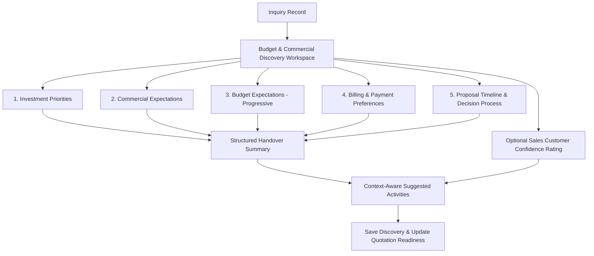

# Business Discussion & Philosophy: IM-WP02C-04 — Budget & Commercial Discovery (Refined)

**Document ID**: BUS-DISC-IM-WP02C-04  
**Module**: Catrack Catering ERP — Inquiry Management (`cat/inquiry`)  
**Feature Area**: Budget & Commercial Discovery Workspace  
**Status**: APPROVED PRODUCT SPECIFICATION WITH REVIEW REFINEMENTS — **Lifecycle: Migrated (2026-07-27), historical**

> [!NOTE]
> **Source Lineage:** Migrated verbatim from AG Brain `business_discussion_im_wp02c_04.md` as part of the docs/ repository migration — see `docs/project-governance/MIGRATION-LOG.md`. This Work Package was implemented prior to the adoption of ES-016 documentation lifecycle discipline. This document and `02-engineering-package.md` are the only lifecycle artifacts that exist historically for this Work Package; `03`–`06` were reconstructed retroactively during migration and say so explicitly — they are not real-time historical records.

---

## 1. Executive Summary & Refined Intent

### 1.1 Business Purpose
The **Budget & Commercial Discovery Workspace** (`IM-WP02C-04`) captures the customer's financial expectations, investment focus, proposal preferences, payment terms, and decision timeline early in the sales inquiry lifecycle.

### 1.2 Product Review Refinements Summary
In accordance with Product Review feedback, this business philosophy incorporates 10 core refinements:
1. **Reordered Conversation Flow**:
   - 1. Investment Priorities
   - 2. Commercial Expectations
   - 3. Budget Expectations (Progressive Capture)
   - 4. Billing & Payment Preferences (Separated)
   - 5. Proposal Timeline & Decision Process
2. **Customer-Facing Proposal Language**: Replaced technical "Financial Model" jargon with *"How would you like us to prepare your proposal?"* (`Per Guest Rate`, `Overall Event Package`, `Compare Both Options`, `Help Me Decide`).
3. **Progressive Budget Capture**: Asks whether the client has a budget target first; only requests numerical amounts/ranges if they indicate they do.
4. **Conversational Investment Focus**: Frames spending choices around experiential value rather than a technical cost checklist.
5. **Consultative Proposal Options**: Replaced operational billing terminology with customer-centric choices.
6. **Separated Billing & Payment Preferences**: Clear distinction between proposal billing structure and payment terms/schedule.
7. **Caterer Evaluation Stage**: Uncovers where the client is in their catering evaluation journey.
8. **Conversational Timeline Wording**: Replaced "Proposal Deadline" with *"When would you like to receive the proposal?"*
9. **Context-Aware Next Activities**: Driven dynamically by captured commercial intent.
10. **Structured Handover Summary**: Formatted into distinct markdown sections designed for seamless handover to Commercial/Quotation teams.
11. **Optional Salesperson "Customer Confidence" Assessment**: A non-mandatory win-probability indicator for opportunity management.

---

## 2. Reordered Guided Business Conversations



---

### Card 1: Investment Priorities
*Consultative Prompt*: **"What matters most for your event experience?"**

- **Conversational Investment Focus**:
  - `FOOD_QUALITY_VARIETY`: *"Gourmet food, live chef counters & signature regional flavors"*
  - `BEVERAGE_HOSPITALITY`: *"Craft mocktails, artisanal coffee setup & attentive butler service"*
  - `PRESENTATION_STYLING`: *"Luxury food displays, thematic counters & visual props"*
  - `BALANCED_ALL_ROUND`: *"Equal focus across food, service & presentation"*

- **Culinary vs Scope Preference**:
  - `FOCUS_ON_QUALITY`: Prefers higher ingredient quality and live counters over sheer dish count.
  - `FOCUS_ON_VARIETY`: Prefers a wider selection of appetizers and main courses.

---

### Card 2: Commercial Expectations
*Consultative Prompt*: **"How would you like us to prepare your proposal?"**

- **Consultative Proposal Format**:
  - `PER_GUEST_RATE`: *"Per-head price bundling menu & core service"*
  - `OVERALL_EVENT_PACKAGE`: *"Fixed lump-sum price for total event scope"*
  - `COMPARE_BOTH_OPTIONS`: *"Show both per-guest and event package structures"*
  - `HELP_ME_DECIDE`: *"Recommend the best structure based on event size"*

- **Service Scope Inclusions Expectation**:
  - `ALL_INCLUSIVE_BUNDLED`: Expects crockery, cutlery, basic buffet decor, and service staff bundled into the proposal.
  - `ITEMIZED_TRANSPARENT`: Prefers food cost separated from staffing and logistics add-ons.

---

### Card 3: Budget Expectations (Progressive Capture)
*Consultative Prompt*: **"Do you have a target budget in mind for your catering?"**

- **Progressive Step 1: Budget Target Availability**:
  - `YES_SPECIFIC`: *"Yes, I have a specific target in mind"*
  - `FLEXIBLE_RANGE`: *"I have an approximate range"*
  - `NO_BUDGET_YET`: *"No fixed budget yet, guide me based on menu options"*

- **Progressive Step 2: Target Figures (Only shown if `YES_SPECIFIC` or `FLEXIBLE_RANGE`)**:
  - Target Per-Guest Amount (Indicative e.g., ₹2,500 – ₹3,500).
  - Target Total Catering Budget Ceiling (Indicative total cap).

- **Value Sensitivity**:
  - `PRICE_SENSITIVE`: Focuses heavily on cost efficiency.
  - `BALANCED_VALUE`: Seeks fair pricing for quality service.
  - `PREMIUM_PRIORITY`: Prioritizes excellence over lowest price.

---

### Card 4: Billing & Payment Preferences
*Consultative Prompt*: **"What billing format and payment schedule suit your organization or family?"**

- **Billing Guidelines**:
  - `PERSONAL_INDIVIDUAL`: Personal / Individual billing.
  - `B2B_CORPORATE_GST`: B2B Corporate Invoice with GSTIN details.

- **Payment Schedule Preference**:
  - `STANDARD_STAGE_PAYMENTS`: *"Standard advance deposit, mid-point menu lock, and balance on event day"*
  - `TOKEN_DEPOSIT_BALANCE`: *"Small booking deposit + full balance upon event completion"*
  - `CORPORATE_CREDIT_TERMS`: *"Post-event invoicing with 15–30 day corporate credit terms"*

---

### Card 5: Proposal Timeline & Decision Process
*Consultative Prompt*: **"When would you like to receive the proposal, and how will your team decide?"**

- **Proposal Delivery Expectation**: Conversational prompt *"When would you like to receive the proposal?"* (Target Date picker).

- **Caterer Evaluation Stage**:
  - `FIRST_DISCUSSION`: *"First caterer we are speaking with"*
  - `COMPARING_OPTIONS`: *"Actively speaking with 2–3 caterers"*
  - `FINAL_SHORTLIST`: *"Down to final 2 caterers"*
  - `ALMOST_DECIDED`: *"Ready to book if proposal matches expectations"*

- **Decision Makers**:
  - `INDIVIDUAL_HOST`: Single host / decision maker.
  - `FAMILY_COMMITTEE`: Family elders & multi-stakeholder consensus.
  - `CORPORATE_PROCUREMENT`: Formal corporate procurement committee.

- **Primary Selection Driver**:
  - `CULINARY_TASTE`: Food tasting result is the #1 decision driver.
  - `COMMERCIAL_VALUE`: Overall price competitiveness is the #1 decision driver.
  - `BRAND_REPUTATION`: Caterer track record & trust is the #1 decision driver.
  - `CUSTOMIZATION`: Responsiveness to custom menu requests is the #1 decision driver.

---

## 3. Optional Salesperson "Customer Confidence" Rating

To support opportunity management and sales forecasting without cluttering or blocking the customer discovery workflow, the workspace provides a **non-mandatory post-conversation rating** for the Sales Director:

- **Customer Confidence Rating**:
  - 🟢 `HIGH_CONFIDENCE`: High win probability; client expectations and budget are strongly aligned.
  - 🟡 `MEDIUM_CONFIDENCE`: Competitive evaluation; client is comparing caterers, needs strong proposal.
  - 🔴 `EXPLORATORY_LOW_CONFIDENCE`: Early research stage or budget mismatch; higher deal risk.

> [!NOTE]
> This rating is purely internal to the Sales Director and CRM forecasting. It is **100% non-blocking** and does not alter customer discovery validation.

---

## 4. Structured Handover Business Summary

`generateAutoSummary()` formats captured discovery into clean markdown sections for seamless handover to Quotation Engineers:

```markdown
### Investment & Experience Priorities
- **Investment Focus**: Gourmet food, live chef counters & signature regional flavors
- **Quality Trade-off**: Prefers higher ingredient quality and live counters over dish count

### Commercial Structure & Proposal Format
- **Proposal Format**: Per-head price bundling menu & core service (Per Guest Rate)
- **Scope Expectations**: All-Inclusive Bundled (Crockery, service staff, and decor included)

### Budget Guidelines
- **Budget Availability**: Flexible Range
- **Indicative Per-Guest Target**: ₹2,500 – ₹3,200 per guest
- **Value Sensitivity**: Balanced Value Seeker

### Billing & Payment Terms
- **Billing Category**: B2B Corporate Invoice (GST Required)
- **Payment Schedule**: Standard Advance & Balance on Event Date

### Decision Timeline & Caterer Evaluation
- **Proposal Deadline**: Expected by 28-Jul-2026
- **Evaluation Stage**: Down to final 2 caterers (Final Shortlist)
- **Primary Selection Driver**: Culinary Taste & Food Quality
- **Decision Authority**: Corporate Procurement Committee
```

---

## 5. Context-Aware Suggested Activities

Activities react dynamically to captured commercial intent:

| Captured Commercial Intent | Context-Aware Suggested Activity |
| :--- | :--- |
| **Corporate Credit Terms** | *"Submit corporate credit check & GST details for commercial manager approval."* |
| **Food Taste is Driver** | *"Schedule Chef Tasting session at central kitchen before issuing formal quotation."* |
| **Comparing Options / Shortlist** | *"Highlight caterer execution track record & live counter videos in the proposal package."* |
| **Validation = READY** | *"Commercial expectations locked! Proceed to Quotation Engineering to generate formal proposal."* |

---

## 6. Summary & Verification Checklist

| Requirement | Refined Specification | Status |
| :--- | :--- | :---: |
| 1. Reordered Flow | Investment -> Commercial -> Budget -> Billing/Payment -> Decision Process | VERIFIED |
| 2. Customer Proposal Language | *"How would you like us to prepare your proposal?"* (`Per Guest`, `Event Package`, etc.) | VERIFIED |
| 3. Progressive Budget Capture | Asks budget availability first; requests numbers only if target exists | VERIFIED |
| 4. Conversational Investment | Experiential value choices (`Food Quality`, `Beverage & Hospitality`, etc.) | VERIFIED |
| 5. Consultative Terminology | Replaced technical billing jargon with customer-centric choices | VERIFIED |
| 6. Separated Billing & Payment | Separate sections for proposal billing structure vs payment terms | VERIFIED |
| 7. Caterer Evaluation Stage | Uncovers evaluation stage (`First Discussion`, `Comparing Options`, `Shortlist`, etc.) | VERIFIED |
| 8. Conversational Timeline | *"When would you like to receive the proposal?"* | VERIFIED |
| 9. Context-Aware Activities | Driven dynamically by captured commercial intent | VERIFIED |
| 10. Structured Summary | Formatted into clean markdown sections for quotation handover | VERIFIED |
| 11. Optional Confidence Rating | Non-mandatory win probability rating for Sales Director CRM forecasting | VERIFIED |

---

**Approval Status**: Business Discussion & Philosophy Approved. Ready for Engineering Package Phase.
