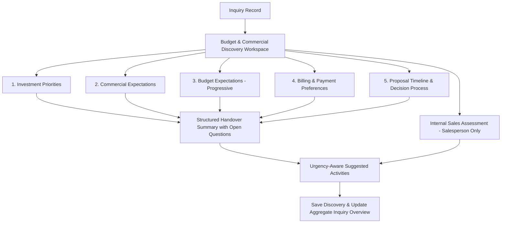

# Engineering Package: IM-WP02C-04 — Budget & Commercial Discovery Workspace (Refined)

**Document ID**: ENG-PKG-IM-WP02C-04  
**Module**: Catrack Catering ERP — Inquiry Management (`cat/inquiry`)  
**Feature Area**: Budget & Commercial Discovery Workspace  
**Status**: APPROVED SPECIFICATION WITH REVIEW REFINEMENTS — **Lifecycle: Migrated (2026-07-27), historical**

> [!NOTE]
> **Source Lineage:** Migrated verbatim from AG Brain `engineering_package_im_wp02c_04.md` as part of the docs/ repository migration — see `docs/project-governance/MIGRATION-LOG.md`.

---

## 1. Executive Summary & Architectural Intent

### 1.1 Business Purpose
The **Budget & Commercial Discovery Workspace** (`IM-WP02C-04`) captures customer financial expectations, investment priorities, commercial structure preferences, payment terms, and decision-making timelines early in the sales inquiry lifecycle.

### 1.2 Product Review Refinements Summary
In accordance with Product Review feedback, this engineering specification incorporates 10 core refinements:
1. **Extensible Proposal Preferences**: Uses flexible, extensible option structures so commercial preferences can evolve without rigid hardcoding.
2. **"Prefer Not to Discuss Yet" Budget Choice**: Adds `PREFER_NOT_TO_DISCUSS` to progressive budget availability options.
3. **Customer-Friendly Value Sensitivity Labels**: Replaced technical jargon with friendly business labels (`Best Value`, `Balance Quality & Cost`, `Premium Experience`).
4. **Softened Tax Validation**: GSTIN formatting issues trigger `NEEDS_ATTENTION` instead of `BLOCKED`. Discovery is never blocked by invoice formatting.
5. **"Not Sure Yet" Billing Option**: Added `NOT_SURE_YET` to billing category choices.
6. **Softer Corporate Payment Language**: Used consultative language for corporate terms (`Corporate Invoicing & Deferred Payment Alignment`).
7. **Demarcated Internal Sales Assessment**: Visually and logically separates the salesperson-only observation card from customer-facing discovery content.
8. **Summary Extension with "Open Commercial Questions"**: Adds an explicit `### Open Commercial Questions` section in the generated handover summary.
9. **Urgency-Aware Suggested Activities**: Recommends operational next steps based on proposal target delivery date and urgency.
10. **Decoupled Area Completion**: Area status maps to `Commercial Discovery Complete`. Overall `QuotationReadiness` remains an aggregate Inquiry-level evaluation calculated across all mandatory discovery areas.

---

## 2. Workspace UX & 5 Guided Conversation Cards Architecture



---

### 2.1 Card 1: Investment Priorities
*Consultative Prompt*: **"What matters most for your event experience?"**

- **Experiential Investment Focus**:
  - `FOOD_QUALITY_VARIETY`: *"Gourmet food, live chef counters & signature regional flavors"*
  - `BEVERAGE_HOSPITALITY`: *"Craft mocktails, artisanal coffee setup & attentive butler service"*
  - `PRESENTATION_STYLING`: *"Luxury food displays, thematic counters & visual props"*
  - `BALANCED_ALL_ROUND`: *"Equal focus across food, service & presentation"*

- **Culinary Trade-off Preference**:
  - `FOCUS_ON_QUALITY`: Prefers higher ingredient quality and live counters over sheer dish count.
  - `FOCUS_ON_VARIETY`: Prefers a wider selection of appetizers and main courses.

---

### 2.2 Card 2: Commercial Expectations
*Consultative Prompt*: **"How would you like us to prepare your proposal?"**

- **Consultative Extensible Proposal Format**:
  - `PER_GUEST_RATE`: *"Per-head price bundling menu & core service"*
  - `OVERALL_EVENT_PACKAGE`: *"Fixed lump-sum price for total event scope"*
  - `COMPARE_BOTH_OPTIONS`: *"Show both per-guest and event package structures"*
  - `HELP_ME_DECIDE`: *"Recommend the best structure based on event size"*

- **Scope Inclusions Expectation**:
  - `ALL_INCLUSIVE_BUNDLED`: Expects crockery, cutlery, basic buffet decor, and service staff bundled into the proposal.
  - `ITEMIZED_TRANSPARENT`: Prefers food cost separated from staffing and logistics add-ons.

---

### 2.3 Card 3: Budget Expectations (Progressive Disclosure)
*Consultative Prompt*: **"Do you have a target budget in mind for your catering?"**

- **Progressive Step 1: Budget Target Availability**:
  - `YES_SPECIFIC`: *"Yes, I have a specific target in mind"*
  - `FLEXIBLE_RANGE`: *"I have an approximate range"*
  - `NO_BUDGET_YET`: *"No fixed budget yet, guide me based on menu options"*
  - `PREFER_NOT_TO_DISCUSS`: *"Prefer not to discuss budget at this stage"*

- **Progressive Step 2 (Revealed ONLY if `YES_SPECIFIC` or `FLEXIBLE_RANGE`)**:
  - Target Per-Guest Amount (Indicative Min / Max e.g., ₹2,500 – ₹3,500).
  - Target Total Catering Budget Cap (Indicative total amount).

- **Customer-Friendly Value Sensitivity**:
  - `BEST_VALUE`: *"Best Value / Cost Efficient"*
  - `BALANCED_QUALITY_COST`: *"Balance Quality & Cost"*
  - `PREMIUM_EXPERIENCE`: *"Premium Experience Priority"*

---

### 2.4 Card 4: Billing & Payment Preferences (Separated)
*Consultative Prompt*: **"What billing format and payment schedule suit your organization or family?"**

- **Billing Category**:
  - `PERSONAL_INDIVIDUAL`: Personal / Individual billing.
  - `B2B_CORPORATE_GST`: B2B Corporate Invoice with GSTIN details. (Progressive Disclosure: GSTIN input field revealed).
  - `NOT_SURE_YET`: *"Not sure yet, advise me during proposal review"*

- **Softer Corporate Payment Schedule**:
  - `STANDARD_STAGE_PAYMENTS`: *"Standard Stage Advance & Balance on Event Day"*
  - `TOKEN_DEPOSIT_BALANCE`: *"Token Deposit + Balance on Event Completion"*
  - `CORPORATE_INVOICING_TERMS`: *"Corporate Invoicing & Deferred Payment Alignment"*

---

### 2.5 Card 5: Proposal Timeline & Decision Process
*Consultative Prompt*: **"When would you like to receive the proposal, and how will your team decide?"**

- **Proposal Delivery Expectation**: Conversational prompt *"When would you like to receive the proposal?"* (Target Date picker).

- **Caterer Evaluation Stage**:
  - `FIRST_DISCUSSION`: *"First caterer we are speaking with"*
  - `COMPARING_OPTIONS`: *"Actively speaking with 2–3 caterers"*
  - `FINAL_SHORTLIST`: *"Down to final 2 caterers"*
  - `ALMOST_DECIDED`: *"Ready to book if proposal matches expectations"*

- **Decision Authority**:
  - `INDIVIDUAL_HOST`: Single host / decision maker.
  - `FAMILY_COMMITTEE`: Family elders & multi-stakeholder consensus.
  - `CORPORATE_PROCUREMENT`: Formal corporate procurement committee.

- **Primary Selection Driver**:
  - `CULINARY_TASTE`: Food tasting result is the #1 decision driver.
  - `COMMERCIAL_VALUE`: Overall price competitiveness is the #1 decision driver.
  - `BRAND_REPUTATION`: Caterer track record & trust is the #1 decision driver.
  - `CUSTOMIZATION`: Responsiveness to custom menu requests is the #1 decision driver.

---

## 3. Internal Sales Assessment Section (Salesperson-Only Observation)

Demarcated clearly with a distinct visual badge **`INTERNAL SALES OBSERVATION (SALESPERSON ONLY)`** to separate internal sales observations from customer-facing discovery content:

- **Sales Assessment Rating**:
  - 🟢 `HIGH_CONFIDENCE`: High win probability; client expectations and budget are strongly aligned.
  - 🟡 `MEDIUM_CONFIDENCE`: Competitive evaluation; client is comparing caterers, needs strong proposal.
  - 🔴 `EXPLORATORY_LOW_CONFIDENCE`: Early research stage or budget mismatch; higher deal risk.

> [!NOTE]
> **Internal Sales Boundary**: This rating is strictly internal for the Sales Director. It is **100% non-blocking** and does **NOT** affect customer discovery validation or aggregate Inquiry-level Quotation Readiness calculations.

---

## 4. Data Model & Conversation Schema Specification

### 4.1 TypeScript Interface (`BudgetCommercialConversation`)

```typescript
export type InvestmentFocusType = 
  | 'FOOD_QUALITY_VARIETY'
  | 'BEVERAGE_HOSPITALITY'
  | 'PRESENTATION_STYLING'
  | 'BALANCED_ALL_ROUND';

export type CulinaryTradeoffType = 
  | 'FOCUS_ON_QUALITY'
  | 'FOCUS_ON_VARIETY';

export type ConsultativeProposalFormat = 
  | 'PER_GUEST_RATE'
  | 'OVERALL_EVENT_PACKAGE'
  | 'COMPARE_BOTH_OPTIONS'
  | 'HELP_ME_DECIDE';

export type ScopeInclusionType = 
  | 'ALL_INCLUSIVE_BUNDLED'
  | 'ITEMIZED_TRANSPARENT';

export type BudgetAvailabilityType = 
  | 'YES_SPECIFIC'
  | 'FLEXIBLE_RANGE'
  | 'NO_BUDGET_YET'
  | 'PREFER_NOT_TO_DISCUSS';

export type ValueSensitivityType = 
  | 'BEST_VALUE'
  | 'BALANCED_QUALITY_COST'
  | 'PREMIUM_EXPERIENCE';

export type BillingCategoryType = 
  | 'PERSONAL_INDIVIDUAL'
  | 'B2B_CORPORATE_GST'
  | 'NOT_SURE_YET';

export type PaymentScheduleType = 
  | 'STANDARD_STAGE_PAYMENTS'
  | 'TOKEN_DEPOSIT_BALANCE'
  | 'CORPORATE_INVOICING_TERMS';

export type CatererEvaluationStage = 
  | 'FIRST_DISCUSSION'
  | 'COMPARING_OPTIONS'
  | 'FINAL_SHORTLIST'
  | 'ALMOST_DECIDED';

export type DecisionAuthorityType = 
  | 'INDIVIDUAL_HOST'
  | 'FAMILY_COMMITTEE'
  | 'CORPORATE_PROCUREMENT';

export type SelectionDriverType = 
  | 'CULINARY_TASTE'
  | 'COMMERCIAL_VALUE'
  | 'BRAND_REPUTATION'
  | 'CUSTOMIZATION';

export type SalesAssessmentConfidence = 
  | 'HIGH_CONFIDENCE'
  | 'MEDIUM_CONFIDENCE'
  | 'EXPLORATORY_LOW_CONFIDENCE';

export interface BudgetCommercialConversation {
  investmentFocus: InvestmentFocusType;
  culinaryTradeoff: CulinaryTradeoffType;
  proposalFormat: ConsultativeProposalFormat;
  scopeInclusion: ScopeInclusionType;
  budgetAvailability: BudgetAvailabilityType;
  targetPerGuestMin?: number;
  targetPerGuestMax?: number;
  targetTotalCap?: number;
  valueSensitivity: ValueSensitivityType;
  billingCategory: BillingCategoryType;
  corporateGstin?: string;
  paymentSchedule: PaymentScheduleType;
  proposalTargetDate?: string;
  evaluationStage: CatererEvaluationStage;
  decisionAuthority: DecisionAuthorityType;
  selectionDriver: SelectionDriverType;
  salesAssessment?: SalesAssessmentConfidence;
  additionalNotes?: string;
  businessSummary: string;
  isSummaryManuallyEdited?: boolean;
  discussionStatus: DiscussionStatus;
  validationStatus: BusinessValidationStatus;
}
```

### 4.2 Computed Business Validation Rules (`computeBudgetCommercialValidation`)

```typescript
export function computeBudgetCommercialValidation(
  data?: Partial<BudgetCommercialConversation>
): BusinessValidationStatus {
  if (!data) return 'NEEDS_ATTENTION';

  // 1. Core commercial intent must be captured
  if (
    !data.investmentFocus ||
    !data.proposalFormat ||
    !data.budgetAvailability ||
    !data.paymentSchedule ||
    !data.evaluationStage
  ) {
    return 'NEEDS_ATTENTION';
  }

  // 2. Softened Tax Validation: Incomplete or unverified GSTIN triggers NEEDS_ATTENTION instead of BLOCKED
  if (data.billingCategory === 'B2B_CORPORATE_GST') {
    const trimmedGst = data.corporateGstin?.trim() || '';
    if (trimmedGst.length === 0 || trimmedGst.length !== 15) {
      return 'NEEDS_ATTENTION'; // Soft alert for sales follow-up; never BLOCKED
    }
  }

  return 'READY';
}
```

---

## 5. Structured Business Summary with Open Questions Section

`generateAutoSummary()` formats captured discovery into clean markdown sections, concluding with an explicit **`### Open Commercial Questions`** section for handover to Quotation Engineers:

```markdown
### Investment & Experience Priorities
- **Investment Focus**: Gourmet food, live chef counters & signature regional flavors
- **Quality Trade-off**: Prefers higher ingredient quality and live counters over dish count

### Commercial Structure & Proposal Format
- **Proposal Format**: Per-head price bundling menu & core service (Per Guest Rate)
- **Scope Expectations**: All-Inclusive Bundled (Crockery, service staff, decor included)

### Budget Guidelines
- **Budget Availability**: Flexible Range
- **Indicative Per-Guest Target**: ₹2,500 – ₹3,200 per guest
- **Value Preference**: Balance Quality & Cost

### Billing & Payment Terms
- **Billing Category**: B2B Corporate Invoice (GSTIN Pending Verification)
- **Payment Schedule**: Corporate Invoicing & Deferred Payment Alignment

### Decision Timeline & Caterer Evaluation
- **Proposal Target Date**: 28-Jul-2026 (Urgent: Delivery within 48 Hours)
- **Evaluation Stage**: Down to final 2 caterers (Final Shortlist)
- **Primary Selection Driver**: Culinary Taste & Food Quality

### Open Commercial Questions
- Verify B2B Corporate GSTIN number prior to final invoice issue.
- Confirm exact payment credit terms with Commercial Manager.
```

---

## 6. Urgency-Aware Suggested Activities

Activities adapt dynamically to proposal target date urgency and captured commercial intent:

| Commercial Intent / Urgency | Urgency-Aware Suggested Activity |
| :--- | :--- |
| **Proposal Date <= 48 Hours** | *"⚡ URGENT: Client requested proposal within 48 hours. Expedite menu costing and chef consultation."* |
| **Corporate Invoicing Terms** | *"Submit corporate credit check & GST details for commercial manager approval."* |
| **Food Taste is Driver** | *"Schedule Chef Tasting session at central kitchen before issuing formal quotation."* |
| **Area Status = READY** | *"Commercial Discovery Complete! Proceed to Quotation Engineering to generate formal proposal."* |

---

## 7. Decoupled Area Completion vs. Aggregate Quotation Readiness

- **Discovery Area Status**: Setting `validationStatus = 'READY'` indicates **Commercial Discovery Complete** for this specific area.
- **Aggregate Inquiry Overview**: Overall Inquiry-level `QuotationReadiness` (`READY_FOR_QUOTATION`, `NEEDS_ATTENTION`, `NOT_READY`) remains an aggregate calculation computed across all mandatory areas by `calculateInquiryDiscoveryOverview`. Updating this single workspace panel does **not** override aggregate readiness.

---

## 8. Verification & Engineering Checklist

| Requirement | Refined Specification | Status |
| :--- | :--- | :---: |
| 1. Extensible Proposal Preferences | Extensible option sets for proposal format choices | VERIFIED |
| 2. "Prefer Not to Discuss" Budget | `PREFER_NOT_TO_DISCUSS` option added to budget availability | VERIFIED |
| 3. Friendly Value Sensitivity | Replaced technical labels with `Best Value`, `Balance Quality & Cost`, `Premium` | VERIFIED |
| 4. Softened Tax Validation | GSTIN formatting issues trigger `NEEDS_ATTENTION` instead of `BLOCKED` | VERIFIED |
| 5. "Not Sure Yet" Billing | `NOT_SURE_YET` option added to billing category choices | VERIFIED |
| 6. Softer Corporate Terms | Consultative language (`Corporate Invoicing & Deferred Payment Alignment`) | VERIFIED |
| 7. Demarcated Internal Sales Card | Visually & logically separated with `INTERNAL SALES OBSERVATION` badge | VERIFIED |
| 8. Summary Open Questions | `### Open Commercial Questions` section added to summary output | VERIFIED |
| 9. Urgency-Aware Activities | Suggested activities react to proposal target delivery date | VERIFIED |
| 10. Decoupled Area Completion | Area completion = `Commercial Discovery Complete`; Quotation Readiness remains aggregate | VERIFIED |

---

**Approval**: Refined Engineering Package Approved. Ready for Implementation Phase.
