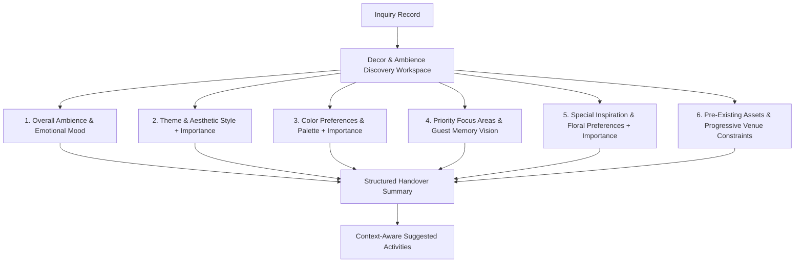

# Business Discussion & Philosophy: IM-WP02C-05 — Decor & Ambience Discovery (Final Refinement)

**Document ID**: BUS-DISC-IM-WP02C-05  
**Module**: Catrack Catering ERP — Inquiry Management (`cat/inquiry`)  
**Feature Area**: Decor & Ambience Discovery Workspace  
**Compliance Standard**: DDS-001 (Discovery Design Standard)  
**Status**: FROZEN BUSINESS DISCUSSION SPECIFICATION — **Lifecycle: Migrated (2026-07-27)**

> [!NOTE]
> **Source Lineage:** Migrated verbatim from AG Brain `business_discussion_im_wp02c_05.md` as part of the docs/ repository migration — see `docs/project-governance/MIGRATION-LOG.md`. Unlike IM-WP02C-03A/04, this Work Package's `03`–`06` documents describe **real, verified work performed directly in an implementation session** (a full UX polish pass with live browser verification), not a retroactive reconstruction — see `05-ux-polish.md`.

---

## 1. Executive Summary & Core Business Philosophy

### 1.1 Business Purpose
The **Decor & Ambience Discovery Workspace** (`IM-WP02C-05`) uncovers the customer's visual vision, emotional mood expectations, aesthetic style, color palette, focus priorities, preference weightings, pre-existing assets, and physical venue constraints during the sales discovery process.

### 1.2 The Core Philosophy: "Decor Discovery is NOT Decor Design"
> [!IMPORTANT]
> **Discovery vs. Design**: The purpose of this workspace is **NOT** to design decor, render 3D concepts, create CAD blueprints, calculate floral stem counts, issue bill of quantities (BOQ), allocate vendors, or quote decor prices. 
> 
> The goal is to discover the customer's desired mood, visual theme, color palette, focus zones, preference weighting, pre-existing assets, and physical venue constraints so that decor specialists can later craft tailored proposals and execution plans.

```
┌────────────────────────────────────────────────────────────────────────────────────────┐
│                          DISCOVERY BOUNDARY ARCHITECTURE                               │
├──────────────────────────────────────────┬─────────────────────────────────────────────┤
│   IM-WP02C-05 Discovery Workspace        │     Downstream Decor & Design Systems         │
│   (THIS WORKSPACE)                       │     (OUTSIDE SCOPE)                         │
├──────────────────────────────────────────┼─────────────────────────────────────────────┤
│ • Overall Ambience & Emotional Mood     │ ❌ 3D Decor Rendering / CAD Blueprints      │
│ • Theme & Aesthetic Style Preferences    │ ❌ Floral Stem / Fabric Meter BOQ           │
│ • Preferred & Avoided Color Palettes     │ ❌ Decor Vendor / Florist Booking           │
│ • Primary Focus Zone & Guest Memory      │ ❌ Detailed Production Costing / Pricing    │
│ • Preference Importance (Essential/Pfrd) │ ❌ Material Procurement & Warehouse Picking │
│ • Pre-Existing Assets (LED Walls/Props)  │ ❌ On-site Labor Scheduling / Execution Plan│
│ • Progressive Venue Restrictions & Rules  │                                             │
└──────────────────────────────────────────┴─────────────────────────────────────────────┘
```

### 1.3 Final Product Refinements Summary
This frozen business specification incorporates 3 final product refinements:
1. **Preference Importance Weighting**: Allows Sales Directors to mark major decor preferences (Theme, Floral Preference, Color Palette, Lighting Mood, Primary Focus Area) as `ESSENTIAL` (Must Have), `PREFERRED` (Strongly Desired), or `OPTIONAL` (Nice to Have). *Captures preference weighting only; does NOT affect pricing or validation.*
2. **Guest Memory Vision Prompt**: Asks *"When your guests leave, what do you hope they remember most?"* (`Grand Entrance Impact`, `Stage Backdrop Beauty`, `Dining Presentation`, `Floral Artistry`, `Luxury Ambience`). Incorporated directly into the Business Summary.
3. **Pre-Existing Assets Discovery**: Asks *"Will any decor, branding, props, LED walls, furniture or installations already be provided?"* to discover host/venue-supplied assets without introducing vendor allocation or setup planning.

---

## 2. Reordered & Refined Guided Business Conversations



---

### Card 1: Overall Ambience & Emotional Mood
*Consultative Prompt*: **"How do you want your guests to feel when they walk into the venue?"**

1. **Emotional Guest Experience Vibe**:
   - `ROYAL_REGAL`: *"Awed by grand, opulent, and majestic evening hospitality"*
   - `WARM_INVITING_WELCOMING`: *"Embraced by a warm, intimate, and hospitable atmosphere"*
   - `ELEGANT_SOPHISTICATED`: *"Impressed by clean, subtle, and refined contemporary luxury"*
   - `JOYFUL_FESTIVE_CELEBRATORY`: *"Energized by vibrant, colorful, and joyful celebration"*
   - `DRAMATIC_GLAMOROUS`: *"Enchanted by dramatic, moody, and high-end evening lounge glamour"*

2. **Lighting Atmosphere Preference & Importance**:
   - Atmosphere: `WARM_CANDLELIGHT_SOFT`, `DYNAMIC_THEMATIC_LIGHTING`, `NATURAL_DAYLIGHT_OPEN`, `DRAMATIC_SPOTLIGHT_HIGH_CONTRAST`.
   - **Preference Weighting**: `ESSENTIAL` (Must Have), `PREFERRED` (Strongly Desired), `OPTIONAL` (Nice to Have).

---

### Card 2: Theme & Aesthetic Style
*Consultative Prompt*: **"Let's discuss the theme concept and visual style for your event."**

1. **Theme Concept (Narrative & Motif)**:
   - `TRADITIONAL_HERITAGE`: Classic Indian heritage, temple motifs, and cultural artistry.
   - `FLORAL_GARDEN_DREAM`: Lush floral installations, greenery walls, and garden aesthetics.
   - `MODERN_CHIC_GEOMETRIC`: Geometric structures, metallic accents, and contemporary art.
   - `VINTAGE_ELEGANCE`: Antique props, lace drapes, and classic European elegance.
   - `FUSION_BOHEMIAN`: Eclectic fusion, pampas grass, macramé, and bohemian artistic flair.

2. **Visual Execution Style**:
   - `GRAND_OPULENT`: Heavy draping, large installations, and high visual density.
   - `SUBTLE_MINIMALIST`: Refined accents, clean spacing, and understated elegance.
   - `RUSTIC_ORGANIC`: Natural wooden textures, jute, and raw organic elements.

3. **Theme Preference Weighting**: `ESSENTIAL`, `PREFERRED`, `OPTIONAL`.

---

### Card 3: Color Preferences & Palette
*Consultative Prompt*: **"What colors reflect your event palette, and are there any colors you'd like us to avoid?"**

1. **Color Palette Theme & Importance**:
   - Palette Style: `PASTELS_AND_SOFT_NEUTRALS`, `ROYAL_GOLD_AND_DEEP_RED`, `EMERALD_IVORY_AND_GOLD`, `MONOCHROMATIC_SLEEK`, `CUSTOM_BRAND_PALETTE`.
   - **Palette Weighting**: `ESSENTIAL`, `PREFERRED`, `OPTIONAL`.

2. **Dominant Colors**: Quick selection tags (Blush Pink, Champagne, Gold, Emerald Green, Royal Blue, Lavender, Terracotta).

3. **Avoided Colors Prompt**: *"Are there any colors you'd like us to avoid?"* (Tags: Avoid Black, Avoid Dark Purple, Avoid Bright Yellow, Avoid Neon Tones).

---

### Card 4: Priority Focus Areas & Guest Memory Vision
*Consultative Prompt*: **"What is the single most memorable decorated area for your guests?"**

1. **Guest Memory Vision Prompt**:
   - *"When your guests leave, what do you hope they remember most?"*
   - Options:
     - `GRAND_ENTRANCE_IMPACT`: *"Grand Entrance & Walkway Impact"*
     - `STAGE_BACKDROP_BEAUTY`: *"Stage & Central Backdrop Beauty"*
     - `CATERING_DINING_EXPERIENCE`: *"Catering & Dining Presentation"*
     - `BREATHTAKING_FLORAL_ARTISTRY`: *"Breathtaking Floral Artistry"*
     - `LUXURY_AMBIENCE_LIGHTING`: *"Overall Luxury Ambience & Lighting"*

2. **Primary Memorable Focus Area (Select One First)**:
   - `BUFFET_CATERING_STYLING`: *"Luxury catering food counters, props & thematic food presentation"*
   - `ENTRANCE_AND_WALKWAY`: *"Grand entrance archway, welcome signage & carpeted aisle"*
   - `STAGE_AND_MAIN_BACKDROP`: *"Central stage, mandap, or focal photo backdrop"*
   - `GUEST_DINING_TABLES`: *"Tablescapes, centerpiece florals, and luxury linen setup"*
   - `PHOTO_BOOTH_EXPERIENCE`: *"Interactive photo wall, props & brand activation zone"*
   - **Primary Focus Area Weighting**: `ESSENTIAL`, `PREFERRED`, `OPTIONAL`.

3. **Secondary Priority Focus Areas (Optional Multi-Select)**: Additional focus zones selected after locking the primary memorable area.

---

### Card 5: Special Inspiration & Floral Preferences
*Consultative Prompt*: **"Are there signature elements, floral preferences, or inspiration boards you love?"**

1. **Floral Preferences & Importance**:
   - Preference: `FRESH_FLOWERS_ONLY`, `ARTIFICIAL_SILK_FLORALS`, `MIXED_FRESH_AND_SILK`, `MINIMAL_GREENERY`, `HEAVY_FLORAL_INSTALLATIONS`.
   - **Floral Weighting**: `ESSENTIAL`, `PREFERRED`, `OPTIONAL`.

2. **Inspiration Sources**:
   - `PINTEREST_BOARDS`: Pinterest board links or saved pin themes.
   - `INSTAGRAM_REFERENCES`: Instagram reel/post references.
   - `PREVIOUS_EVENTS_ATTENDED`: References from recent family or corporate events.
   - `FAMILY_TRADITIONS`: Custom cultural customs or family heirloom props.

3. **Special Highlight Elements**: `DRAMATIC_FABRIC_DRAPERY`, `CANDLELIGHT_AND_LANTERNS`, `CUSTOM_PROPS_AND_SCULPTURES`.

---

### Card 6: Pre-Existing Assets & Progressive Venue Constraints
*Consultative Prompt*: **"Will any decor, branding, props, LED walls or furniture already be provided?"**

1. **Pre-Existing Assets Discovery**:
   - Prompt: *"Will any decor, branding, props, LED walls, furniture or installations already be provided by host or venue?"*
   - Asset Options (Checkboxes/Tags): `VENUE_LED_WALL_PROVIDED`, `HOST_BRANDING_PROPS`, `VENUE_FURNITURE_IN_PLACE`, `HOST_CULTURAL_MANDAP_FRAME`, `NONE_ALL_CATERER_DECOR`.

2. **Progressive Venue Restriction Status**:
   - Step 1: `YES_RESTRICTIONS`, `NO_KNOWN_RESTRICTIONS`, `NOT_SURE_YET`.
   - Step 2 (Revealed ONLY if `YES_RESTRICTIONS`):
     - `OPEN_FLAME_RESTRICTIONS`: *"No open flames or real candles permitted by venue"*
     - `HANGING_WEIGHT_LIMITS`: *"No ceiling rigging or heavy truss hanging permitted"*
     - `SHORT_SETUP_WINDOW`: *"Strict setup window (under 4 hours available before event)"*
     - `OUTDOOR_WEATHER_SAFEGUARDS`: *"Outdoor venue requires wind/rain backup structures"*
     - `STRICT_TAKEDOWN_DEADLINE`: *"Same-night immediate takedown required by venue"*

3. **Access & Logistics Notes**: Loading dock rules, elevator dimensions, power supply rules.

---

## 3. Structured Handover Business Summary

`generateAutoSummary()` formats captured discovery into clean markdown sections for seamless handover to Decor Designers:

```markdown
### Decor Vision
- **Guest Emotional Vibe**: Royal Regal & Opulent evening hospitality
- **Guest Memory Vision**: Grand Entrance & Walkway Impact
- **Lighting Atmosphere**: Warm Candlelight & Soft Ambient Lighting (Weight: ESSENTIAL)

### Theme & Style
- **Theme Concept**: Traditional Heritage (Weight: ESSENTIAL)
- **Visual Style**: Grand Opulent (Heavy draping & high visual density)

### Colours
- **Color Palette**: Royal Gold & Deep Red (Weight: PREFERRED)
- **Dominant Tones**: Crimson, Maroon, Antique Gold
- **Avoided Colors**: Avoid Black, Avoid Neon Tones

### Priority Areas
- **Primary Memorable Area**: Buffet & Catering Styling (Weight: ESSENTIAL)
- **Secondary Areas**: Entrance & Walkway, Central Stage Backdrop

### Special Inspiration
- **Floral Preference**: Fresh Flowers Only - Heavy Installations (Weight: ESSENTIAL)
- **Inspiration Sources**: Pinterest Board reference (Royal Awadhi mandap)
- **Host Notes**: Requests fresh marigold & mogra fragrance at entrance.

### Pre-Existing Assets & Venue Constraints
- **Pre-Existing Assets**: Venue LED Wall Provided, Host Cultural Mandap Frame
- **Venue Restrictions**: No open flames permitted; Short setup window (3 hours max)
- **Access Notes**: Basement loading dock; elevator width 6ft.
```

---

## 4. Context-Aware Suggested Activities

Suggested activities adapt dynamically to captured decor preferences, pre-existing assets, and venue rules:

| Discovery Finding | Context-Aware Suggested Activity |
| :--- | :--- |
| **Short Setup Window** | *"⚡ URGENT: Setup window under 4 hours. Coordinate pre-fabricated decor modules with production team."* |
| **Pre-Existing LED Wall** | *"Coordinate video resolution and content playback specs for venue-provided LED wall."* |
| **Buffet Styling Primary Focus** | *"Schedule Food Counter Presentation review with Executive Chef and Decor Designer."* |
| **Open Flame Ban** | *"Note for Decor Team: Replace real candles with LED flameless votives to comply with venue fire code."* |
| **Essential Floral Weighting** | *"Coordinate seasonal fresh flower availability with floral sourcing team."* |
| **Discovery Complete** | *"Decor & Ambience Discovery Ready! Proceed to Decor Design & Concept Proposal."* |

---

## 5. Final Verification Checklist

| Requirement | Final Specification | Status |
| :--- | :--- | :---: |
| 1. Preference Weighting | Allows `Essential`, `Preferred`, `Optional` weighting without pricing/validation impact | VERIFIED |
| 2. Guest Memory Vision Prompt | *"When your guests leave, what do you hope they remember most?"* included in summary | VERIFIED |
| 3. Pre-Existing Assets Discovery | Captures host/venue-supplied assets (LED walls, props, furniture) | VERIFIED |
| DDS-001 Compliance | Discovery design standard strictly followed | VERIFIED |
| Workspace First & Insight Assistant | Cohesive workspace shell with Insight Assistant sidebar | VERIFIED |
| Strict Boundaries Preserved | Zero BOQ, 3D rendering, CAD, vendor booking, pricing, or planning | VERIFIED |

---

**Status**: Frozen Business Discussion & Philosophy Specification. Ready for Engineering Package.
