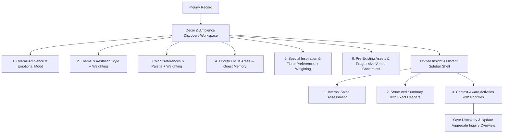

# Engineering Package: IM-WP02C-05 — Decor & Ambience Discovery Workspace

**Document ID**: ENG-PKG-IM-WP02C-05  
**Module**: Catrack Catering ERP — Inquiry Management (`cat/inquiry`)  
**Feature Area**: Decor & Ambience Discovery Workspace  
**Compliance Standard**: DDS-001 (Discovery Design Standard)  
**Status**: APPROVED SPECIFICATION FOR ENGINEERING IMPLEMENTATION — **Lifecycle: Migrated (2026-07-27)**

> [!NOTE]
> **Source Lineage:** Migrated verbatim from AG Brain `engineering_package_im_wp02c_05.md` as part of the docs/ repository migration — see `docs/project-governance/MIGRATION-LOG.md`.

---

## 1. Executive Summary & Architectural Intent

### 1.1 Business Purpose
The **Decor & Ambience Discovery Workspace** (`IM-WP02C-05`) captures customer visual expectations, emotional mood vision, aesthetic theme preferences, color palettes, focus priorities, preference weightings, pre-existing assets, and venue constraints early in the sales inquiry lifecycle.

### 1.2 Strict Scope & Operational Boundaries
> [!IMPORTANT]
> **Discovery Workspace vs. Decor Design/BOQ**: This workspace is **NOT** a 3D spatial layout generator, CAD blueprint tool, floral stem BOQ calculator, vendor booking engine, decor cost sheet, or setup execution planner. It exists purely to discover and record visual & atmospheric intent so that decor specialists can craft tailored proposals downstream.

```
┌────────────────────────────────────────────────────────────────────────────────────────┐
│                          DISCOVERY BOUNDARY ARCHITECTURE                               │
├──────────────────────────────────────────┬─────────────────────────────────────────────┤
│   IM-WP02C-05 Discovery Workspace        │     Downstream Decor & Design Systems         │
│   (THIS WORKSPACE)                       │     (OUTSIDE SCOPE)                         │
├──────────────────────────────────────────┼─────────────────────────────────────────────┤
│ • Overall Ambience & Emotional Mood     │ ❌ 3D Spatial Renders / CAD Blueprints      │
│ • Theme & Visual Execution Style         │ ❌ Floral Stem / Fabric Meter BOQ           │
│ • Preferred & Avoided Color Palettes     │ ❌ Decor Vendor / Florist Booking           │
│ • Primary Focus Zone & Guest Memory      │ ❌ Detailed Production Costing / Pricing    │
│ • Informational Preference Weighting     │ ❌ Material Procurement & Warehouse Picking │
│ • Pre-Existing Assets (LED Walls/Props)  │ ❌ On-site Labor Scheduling / Execution Plan│
│ • Progressive Venue Restrictions & Rules  │                                             │
└──────────────────────────────────────────┴─────────────────────────────────────────────┘
```

### 1.3 DDS-001 Compliance
This engineering package complies strictly with **DDS-001 (Discovery Design Standard)**:
- **Workspace First**: Dedicated workspace panel mounted within Requirements Discovery directory.
- **Informational Weighting**: Preference importance (`Essential`, `Preferred`, `Optional`) is strictly informational and has zero impact on pricing or validation.
- **Unified Insight Assistant**: Right sidebar shell containing Internal Sales Assessment, Structured Handover Summary, and Context-Aware Suggested Activities.

---

## 2. Workspace UX & 6 Guided Conversation Cards Architecture



---

### 2.1 Card 1: Overall Ambience & Emotional Mood
*Consultative Prompt*: **"How do you want your guests to feel when they walk into the venue?"**

- **Emotional Guest Experience Vibe**:
  - `ROYAL_REGAL`: *"Awed by grand, opulent, and majestic evening hospitality"*
  - `WARM_INVITING_WELCOMING`: *"Embraced by a warm, intimate, and hospitable atmosphere"*
  - `ELEGANT_SOPHISTICATED`: *"Impressed by clean, subtle, and refined contemporary luxury"*
  - `JOYFUL_FESTIVE_CELEBRATORY`: *"Energized by vibrant, colorful, and joyful celebration"*
  - `DRAMATIC_GLAMOROUS`: *"Enchanted by dramatic, moody, and high-end evening lounge glamour"*

- **Lighting Atmosphere Preference & Importance**:
  - Atmosphere: `WARM_CANDLELIGHT_SOFT`, `DYNAMIC_THEMATIC_LIGHTING`, `NATURAL_DAYLIGHT_OPEN`, `DRAMATIC_SPOTLIGHT_HIGH_CONTRAST`.
  - **Lighting Weighting**: `ESSENTIAL` (Must Have), `PREFERRED` (Strongly Desired), `OPTIONAL` (Nice to Have).

---

### 2.2 Card 2: Theme & Aesthetic Style
*Consultative Prompt*: **"Let's discuss the theme concept and visual style for your event."**

- **Theme Concept (Narrative & Motif)**:
  - `TRADITIONAL_HERITAGE`: Classic Indian heritage, temple motifs, and cultural artistry.
  - `FLORAL_GARDEN_DREAM`: Lush floral installations, greenery walls, and garden aesthetics.
  - `MODERN_CHIC_GEOMETRIC`: Geometric structures, metallic accents, and contemporary art.
  - `VINTAGE_ELEGANCE`: Antique props, lace drapes, and classic European elegance.
  - `FUSION_BOHEMIAN`: Eclectic fusion, pampas grass, macramé, and bohemian artistic flair.

- **Visual Execution Style**:
  - `GRAND_OPULENT`: Heavy draping, large installations, and high visual density.
  - `SUBTLE_MINIMALIST`: Refined accents, clean spacing, and understated elegance.
  - `RUSTIC_ORGANIC`: Natural wooden textures, jute, and raw organic elements.

- **Theme Weighting**: `ESSENTIAL`, `PREFERRED`, `OPTIONAL`.

---

### 2.3 Card 3: Color Preferences & Palette
*Consultative Prompt*: **"What colors reflect your event palette, and are there any colors you'd like us to avoid?"**

- **Color Palette Theme & Importance**:
  - Palette Style: `PASTELS_AND_SOFT_NEUTRALS`, `ROYAL_GOLD_AND_DEEP_RED`, `EMERALD_IVORY_AND_GOLD`, `MONOCHROMATIC_SLEEK`, `CUSTOM_BRAND_PALETTE`.
  - **Palette Weighting**: `ESSENTIAL`, `PREFERRED`, `OPTIONAL`.

- **Dominant Colors**: Quick selection tags (Blush Pink, Champagne, Gold, Emerald Green, Royal Blue, Lavender, Terracotta).

- **Avoided Colors Prompt**: *"Are there any colors you'd like us to avoid?"* (Tags: Avoid Black, Avoid Dark Purple, Avoid Bright Yellow, Avoid Neon Tones).

---

### 2.4 Card 4: Priority Focus Areas & Guest Memory Vision
*Consultative Prompt*: **"What is the single most memorable decorated area for your guests?"**

- **Guest Memory Vision Prompt**:
  - *"When your guests leave, what do you hope they remember most?"*
  - Options:
    - `GRAND_ENTRANCE_IMPACT`: *"Grand Entrance & Walkway Impact"*
    - `STAGE_BACKDROP_BEAUTY`: *"Stage & Central Backdrop Beauty"*
    - `CATERING_DINING_EXPERIENCE`: *"Catering & Dining Presentation"*
    - `BREATHTAKING_FLORAL_ARTISTRY`: *"Breathtaking Floral Artistry"*
    - `LUXURY_AMBIENCE_LIGHTING`: *"Overall Luxury Ambience & Lighting"*

- **Primary Memorable Focus Area (Select One First)**:
  - `BUFFET_CATERING_STYLING`: *"Luxury catering food counters, props & thematic food presentation"*
  - `ENTRANCE_AND_WALKWAY`: *"Grand entrance archway, welcome signage & carpeted aisle"*
  - `STAGE_AND_MAIN_BACKDROP`: *"Central stage, mandap, or focal photo backdrop"*
  - `GUEST_DINING_TABLES`: *"Tablescapes, centerpiece florals, and luxury linen setup"*
  - `PHOTO_BOOTH_EXPERIENCE`: *"Interactive photo wall, props & brand activation zone"*
  - **Primary Focus Weighting**: `ESSENTIAL`, `PREFERRED`, `OPTIONAL`.

- **Secondary Priority Focus Areas (Optional Multi-Select)**: Additional focus zones selected after locking the primary memorable area.

---

### 2.5 Card 5: Special Inspiration & Floral Preferences
*Consultative Prompt*: **"Are there signature elements, floral preferences, or inspiration boards you love?"**

- **Floral Preferences & Importance**:
  - Preference: `FRESH_FLOWERS_ONLY`, `ARTIFICIAL_SILK_FLORALS`, `MIXED_FRESH_AND_SILK`, `MINIMAL_GREENERY`, `HEAVY_FLORAL_INSTALLATIONS`.
  - **Floral Weighting**: `ESSENTIAL`, `PREFERRED`, `OPTIONAL`.

- **Inspiration Sources**:
  - `PINTEREST_BOARDS`: Pinterest board links or saved pin themes.
  - `INSTAGRAM_REFERENCES`: Instagram reel/post references.
  - `PREVIOUS_EVENTS_ATTENDED`: References from recent family or corporate events.
  - `FAMILY_TRADITIONS`: Custom cultural customs or family heirloom props.

- **Special Highlight Elements**: `DRAMATIC_FABRIC_DRAPERY`, `CANDLELIGHT_AND_LANTERNS`, `CUSTOM_PROPS_AND_SCULPTURES`.

---

### 2.6 Card 6: Pre-Existing Assets & Progressive Venue Constraints
*Consultative Prompt*: **"Will any decor, branding, props, LED walls or furniture already be provided?"**

- **Pre-Existing Assets Discovery**:
  - Prompt: *"Will any decor, branding, props, LED walls, furniture or installations already be provided by host or venue?"*
  - Asset Tags: `VENUE_LED_WALL_PROVIDED`, `HOST_BRANDING_PROPS`, `VENUE_FURNITURE_IN_PLACE`, `HOST_CULTURAL_MANDAP_FRAME`, `NONE_ALL_CATERER_DECOR`.

- **Progressive Venue Restriction Status**:
  - Step 1: `YES_RESTRICTIONS`, `NO_KNOWN_RESTRICTIONS`, `NOT_SURE_YET`.
  - Step 2 (Revealed ONLY if `YES_RESTRICTIONS`):
    - `OPEN_FLAME_RESTRICTIONS`: *"No open flames or real candles permitted by venue"*
    - `HANGING_WEIGHT_LIMITS`: *"No ceiling rigging or heavy truss hanging permitted"*
    - `SHORT_SETUP_WINDOW`: *"Strict setup window (under 4 hours available before event)"*
    - `OUTDOOR_WEATHER_SAFEGUARDS`: *"Outdoor venue requires wind/rain backup structures"*
    - `STRICT_TAKEDOWN_DEADLINE`: *"Same-night immediate takedown required by venue"*

- **Access & Logistics Notes**: Loading dock access, elevator dimensions, power supply rules.

---

## 3. Data Model Specification (`DecorAmbienceConversation`)

### 3.1 TypeScript Interface

```typescript
export type PreferenceImportanceWeighting = 'ESSENTIAL' | 'PREFERRED' | 'OPTIONAL';

export type EmotionalAmbienceVibe = 
  | 'ROYAL_REGAL'
  | 'WARM_INVITING_WELCOMING'
  | 'ELEGANT_SOPHISTICATED'
  | 'JOYFUL_FESTIVE_CELEBRATORY'
  | 'DRAMATIC_GLAMOROUS';

export type LightingAtmosphereType = 
  | 'WARM_CANDLELIGHT_SOFT'
  | 'DYNAMIC_THEMATIC_LIGHTING'
  | 'NATURAL_DAYLIGHT_OPEN'
  | 'DRAMATIC_SPOTLIGHT_HIGH_CONTRAST';

export type ThemeConceptType = 
  | 'TRADITIONAL_HERITAGE'
  | 'FLORAL_GARDEN_DREAM'
  | 'MODERN_CHIC_GEOMETRIC'
  | 'VINTAGE_ELEGANCE'
  | 'FUSION_BOHEMIAN';

export type VisualExecutionStyle = 
  | 'GRAND_OPULENT'
  | 'SUBTLE_MINIMALIST'
  | 'RUSTIC_ORGANIC';

export type ColorPaletteStyle = 
  | 'PASTELS_AND_SOFT_NEUTRALS'
  | 'ROYAL_GOLD_AND_DEEP_RED'
  | 'EMERALD_IVORY_AND_GOLD'
  | 'MONOCHROMATIC_SLEEK'
  | 'CUSTOM_BRAND_PALETTE';

export type GuestMemoryVisionType = 
  | 'GRAND_ENTRANCE_IMPACT'
  | 'STAGE_BACKDROP_BEAUTY'
  | 'CATERING_DINING_EXPERIENCE'
  | 'BREATHTAKING_FLORAL_ARTISTRY'
  | 'LUXURY_AMBIENCE_LIGHTING';

export type DecorFocusAreaType = 
  | 'BUFFET_CATERING_STYLING'
  | 'ENTRANCE_AND_WALKWAY'
  | 'STAGE_AND_MAIN_BACKDROP'
  | 'GUEST_DINING_TABLES'
  | 'PHOTO_BOOTH_EXPERIENCE';

export type FloralPreferenceType = 
  | 'FRESH_FLOWERS_ONLY'
  | 'ARTIFICIAL_SILK_FLORALS'
  | 'MIXED_FRESH_AND_SILK'
  | 'MINIMAL_GREENERY'
  | 'HEAVY_FLORAL_INSTALLATIONS';

export type PreExistingAssetTag = 
  | 'VENUE_LED_WALL_PROVIDED'
  | 'HOST_BRANDING_PROPS'
  | 'VENUE_FURNITURE_IN_PLACE'
  | 'HOST_CULTURAL_MANDAP_FRAME'
  | 'NONE_ALL_CATERER_DECOR';

export type VenueRestrictionStatus = 
  | 'YES_RESTRICTIONS'
  | 'NO_KNOWN_RESTRICTIONS'
  | 'NOT_SURE_YET';

export type VenueRestrictionRule = 
  | 'OPEN_FLAME_RESTRICTIONS'
  | 'HANGING_WEIGHT_LIMITS'
  | 'SHORT_SETUP_WINDOW'
  | 'OUTDOOR_WEATHER_SAFEGUARDS'
  | 'STRICT_TAKEDOWN_DEADLINE';

export interface DecorAmbienceConversation {
  emotionalVibe: EmotionalAmbienceVibe;
  lightingAtmosphere: LightingAtmosphereType;
  lightingWeighting: PreferenceImportanceWeighting;
  themeConcept: ThemeConceptType;
  themeWeighting: PreferenceImportanceWeighting;
  visualStyle: VisualExecutionStyle;
  colorPalette: ColorPaletteStyle;
  colorWeighting: PreferenceImportanceWeighting;
  dominantColors: string[];
  avoidedColors: string[];
  guestMemoryVision: GuestMemoryVisionType;
  primaryFocusArea: DecorFocusAreaType;
  primaryFocusWeighting: PreferenceImportanceWeighting;
  secondaryFocusAreas: DecorFocusAreaType[];
  floralPreference: FloralPreferenceType;
  floralWeighting: PreferenceImportanceWeighting;
  inspirationSources: string[];
  specialHighlights: string[];
  inspirationNotes?: string;
  preExistingAssets: PreExistingAssetTag[];
  venueRestrictionStatus: VenueRestrictionStatus;
  venueRestrictions: VenueRestrictionRule[];
  logisticsNotes?: string;
  businessSummary: string;
  isSummaryManuallyEdited?: boolean;
  discussionStatus: DiscussionStatus;
  validationStatus: BusinessValidationStatus;
}
```

---

## 4. Computed Business Validation Rules (`computeDecorAmbienceValidation`)

```typescript
export function computeDecorAmbienceValidation(
  data?: Partial<DecorAmbienceConversation>
): BusinessValidationStatus {
  if (!data) return 'NEEDS_ATTENTION';

  // Core decor intent must be captured
  if (
    !data.emotionalVibe ||
    !data.themeConcept ||
    !data.colorPalette ||
    !data.primaryFocusArea ||
    !data.floralPreference ||
    !data.venueRestrictionStatus
  ) {
    return 'NEEDS_ATTENTION';
  }

  // Soft advisory validation: If venue restrictions exist but none selected, trigger NEEDS_ATTENTION
  if (data.venueRestrictionStatus === 'YES_RESTRICTIONS' && (!data.venueRestrictions || data.venueRestrictions.length === 0)) {
    return 'NEEDS_ATTENTION';
  }

  return 'READY';
}
```

---

## 5. Persistence Model & Database Integration

- **Table**: `cat_inquiry_discovery_areas`
- **Column**: `decor_ambience` (JSONB)
- **API Endpoint**: `PATCH /api/cat/inquiries/[id]/discovery` with payload `areaKey = 'DECOR_AMBIENCE'` and `decorAmbience` object.

```sql
ALTER TABLE cat_inquiry_discovery_areas
ADD COLUMN IF NOT EXISTS decor_ambience JSONB;
```

---

## 6. Structured Business Summary Generation

`generateAutoSummary()` formats captured discovery into clean markdown sections:

```markdown
### Decor Vision
- **Guest Emotional Vibe**: Royal Regal & Opulent evening hospitality
- **Guest Memory Vision**: Grand Entrance & Walkway Impact
- **Lighting Atmosphere**: Warm Candlelight & Soft Ambient Lighting (Weight: ESSENTIAL)

### Theme & Style
- **Theme Concept**: Traditional Heritage (Weight: ESSENTIAL)
- **Visual Style**: Grand Opulent (Heavy draping & high visual density)

### Colours
- **Color Palette**: Royal Gold & Deep Red (Weight: PREFERRED)
- **Dominant Tones**: Crimson, Maroon, Antique Gold
- **Avoided Colors**: Avoid Black, Avoid Neon Tones

### Priority Areas
- **Primary Memorable Area**: Buffet & Catering Styling (Weight: ESSENTIAL)
- **Secondary Areas**: Entrance & Walkway, Central Stage Backdrop

### Special Inspiration
- **Floral Preference**: Fresh Flowers Only - Heavy Installations (Weight: ESSENTIAL)
- **Inspiration Sources**: Pinterest Board reference (Royal Awadhi mandap)
- **Host Notes**: Requests fresh marigold & mogra fragrance at entrance.

### Pre-Existing Assets & Venue Constraints
- **Pre-Existing Assets**: Venue LED Wall Provided, Host Cultural Mandap Frame
- **Venue Restrictions**: No open flames permitted; Short setup window (3 hours max)
- **Access Notes**: Basement loading dock; elevator width 6ft.
```

---

## 7. Organic Master Growth Considerations

- **Theme & Color Tag Suggestions**: If a host requests a novel theme motif or specialty color tag not in standard preset lists, the UI provides an organic inline quick-create feature (`allowQuickCreate`) that saves the custom string cleanly to `dominantColors` or `inspirationSources` without abstracting a generic VAP framework.

---

## 8. Verification & Engineering Checklist

| Requirement | Package Specification | Status |
| :--- | :--- | :---: |
| DDS-001 Compliance | Discovery design standard strictly followed | VERIFIED |
| Workspace First Composition | Dedicated workspace panel mounted under Requirements Directory | VERIFIED |
| Informational Weighting | `Essential`, `Preferred`, `Optional` weighting has zero pricing/validation impact | VERIFIED |
| Exact Summary Headers | `Decor Vision`, `Theme & Style`, `Colours`, `Priority Areas`, etc. | VERIFIED |
| Context-Aware Activities | Recommends operational activities with priority badges | VERIFIED |
| Pure Discovery Boundaries | Zero BOQ, 3D spatial renders, CAD, vendor booking, or pricing | VERIFIED |
| API & DB Integration | `decor_ambience` JSONB column in `cat_inquiry_discovery_areas` | VERIFIED |

---

**Approval**: Ready for Engineering Implementation Phase.
