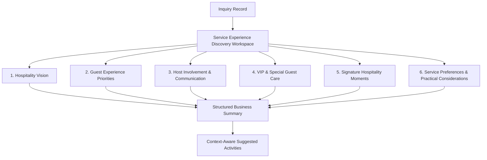

# Business Discussion & Philosophy: Service Experience Discovery Workspace (`IM-WP02C-06`)

The **Business Discussion and Business Philosophy** for the **Service Experience Discovery Workspace** (`IM-WP02C-06`) has been established following **DDS-001 (Discovery Design Standard)**.

---

# Core Philosophy: "Service Experience Discovery is NOT Service Planning"

> **Service Experience Discovery is NOT Service Planning.**
>
> The purpose of this workspace is **NOT** to determine staffing levels, allocate banquet captains, assign stewards, calculate manpower, create shift schedules, or plan operational execution.
>
> The goal is to discover the customer's expectations around hospitality, guest interaction, attentiveness, VIP handling, memorable service moments, communication style, and overall guest care so that downstream Operations can later design the appropriate service plan.

```
┌────────────────────────────────────────────────────────────────────────────────────────┐
│                        DISCOVERY BOUNDARY ARCHITECTURE                                 │
├──────────────────────────────────────────┬─────────────────────────────────────────────┤
│ IM-WP02C-06 Discovery Workspace          │ Downstream Service Operations               │
│ (THIS WORKSPACE)                         │ (OUT OF SCOPE)                             │
├──────────────────────────────────────────┼─────────────────────────────────────────────┤
│ • Hospitality Vision                     │ ❌ Staff Scheduling                         │
│ • Guest Experience Expectations          │ ❌ Captain / Steward Assignment             │
│ • Host Involvement Preferences           │ ❌ Shift Planning                           │
│ • VIP & Special Guest Handling           │ ❌ Manpower Allocation                      │
│ • Memorable Service Moments              │ ❌ Operational Checklists                   │
│ • Communication Preferences              │ ❌ Execution Planning                       │
└──────────────────────────────────────────┴─────────────────────────────────────────────┘
```

---

# Discovery Philosophy

Customers rarely ask:

> "I need 18 waiters and 2 banquet captains."

Instead they say things like:

- "We want everyone to feel genuinely cared for."
- "Please don't interrupt conversations."
- "Our VIP guests should receive extra attention."
- "Food service should feel smooth and effortless."
- "We want to relax and enjoy the event ourselves."

Those are business discovery conversations.

Operational planning comes later.

---

# The 6 Guided Business Conversations



---

## 1. Hospitality Vision

**Consultative Opening**

> **"When your guests think back to this event, how would you like them to describe the hospitality?"**

Examples:

- Luxury Five-Star Experience
- Warm Family Hospitality
- Professional & Efficient
- Royal Traditional Hospitality
- Friendly & Relaxed
- Elegant & Discreet

Also discover the preferred service atmosphere:

- Highly Attentive
- Available but Unobtrusive
- Formal
- Casual
- Personalized

---

## 2. Guest Experience Priorities

**Consultative Opening**

> **"What parts of the guest experience matter most to you?"**

Examples:

- Warm Hospitality
- Fast Food Service
- Personalized Guest Care
- Queue-Free Experience
- Beverage Service
- Children's Assistance
- Senior Citizen Support

Importance Weighting (Informational Only):

- Must Have
- Preferred
- Nice to Have

---

## 3. Host Involvement & Communication

**Consultative Opening**

> **"How involved would you like to be during the event?"**

Examples:

Host Preference

- Relax and Enjoy
- Stay Informed
- Be Involved in Key Moments
- Coordinate Throughout

Communication Style

- Single Point of Contact
- Continuous Updates
- Milestone Updates Only
- Minimal Interruptions

---

## 4. VIP & Special Guest Care

**Consultative Opening**

> **"Are there any guests who may appreciate a little extra attention?"**

Examples:

- VIP Guests
- Senior Citizens
- Children
- Guests with Accessibility Needs
- International Guests
- Religious Dignitaries

Additional Notes

Free-text observations for unique guest requirements.

---

## 5. Signature Hospitality Moments

**Consultative Opening**

> **"Which moments should feel especially memorable?"**

Examples:

- Warm Welcome Experience
- Personalized Greetings
- Arrival Refreshments
- VIP Table Service
- Cake Ceremony Support
- Toast Coordination
- Farewell Hospitality
- Departure & Thank You

---

## 6. Service Preferences & Practical Considerations

**Consultative Opening**

> **"Are there any service preferences or practical considerations we should know about?"**

Examples:

Customer Preferences

- Premium Uniformed Service
- Traditional Attire
- English Speaking Staff
- Local Language Preference
- Child-Friendly Staff
- Allergy Awareness

Practical Notes

Examples:

- Cultural Etiquette
- Religious Customs
- Restricted Guest Areas
- Photography Sensitivity
- Security Requirements

---

# Hospitality Memory

Conclude the discussion with one final customer-focused question:

> **"If one guest described your event afterwards, what would you love to hear them say about our hospitality?"**

Examples:

- "The staff treated everyone like family."
- "Everything felt effortless."
- "Everyone felt genuinely cared for."
- "The team anticipated every need."
- "The hospitality was unforgettable."

---

# Informational Preference Weighting

The following discovery items support informational weighting only:

- Hospitality Vision
- Guest Experience Priorities
- Communication Style
- VIP Service Expectations
- Signature Hospitality Moments

Weighting Options:

- Must Have
- Preferred
- Nice to Have

> **Governance Safeguard**
>
> These values exist only to preserve customer intent.
>
> They do **NOT**:
>
> - influence pricing
> - determine staffing
> - affect validation
> - allocate resources

---

# Structured Business Summary

The workspace automatically generates:

```markdown
### Hospitality Vision

### Guest Experience Priorities

### Host Involvement & Communication

### VIP & Special Guest Care

### Signature Hospitality Moments

### Service Preferences

### Hospitality Memory
```

The summary is written as a business handover for Operations and Event Management while preserving customer language.

---

# Context-Aware Suggested Activities

Examples:

🟠 IMPORTANT

- Confirm VIP hospitality expectations before quotation.

🟢 RECOMMENDATION

- Share communication preferences with the Event Manager.

🔴 URGENT

- Clarify accessibility or medical assistance requirements before planning.

Suggested Activities remain advisory only and do not create operational tasks.

---

# Reused Workspace UX Controls & Integration

The workspace reuses the standard Discovery experience:

- System Validation Badge
- Discussion Status
- Conversation Progress
- 6 Guided Conversation Cards
- Insight Assistant Sidebar
  - Internal Sales Assessment
  - Structured Business Summary
  - Suggested Next Activities
- Save Discovery

---

# DDS-001 Compliance

- ✅ Workspace First
- ✅ Guided Business Conversations
- ✅ Discovery Before Planning
- ✅ Insight Assistant
- ✅ Structured Business Summary
- ✅ Context-Aware Suggested Activities
- ✅ Zero Staffing Planning
- ✅ Zero Operational Scheduling
- ✅ Zero Resource Allocation
- ✅ Zero Pricing Decisions

---

# Status

**Business Discussion & Philosophy Complete.**

**Lifecycle**: Approved → Engineering Package → Implementation → Product Review → UX Polish → **Frozen** (2026-07-27).

See `02-engineering-package.md`, `03-implementation-walkthrough.md`, `04-product-review.md`, `05-ux-polish.md`, and `06-freeze.md` in this folder for the full downstream lifecycle record. No content in this document was altered as part of that process.
