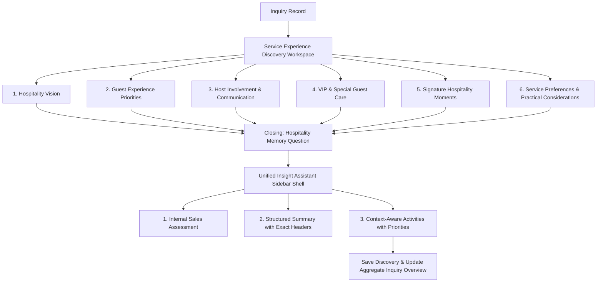

# Engineering Package: IM-WP02C-06 — Service Experience Discovery Workspace

**Document ID**: ENG-PKG-IM-WP02C-06
**Module**: Catrack Catering ERP — Inquiry Management (`cat/inquiry`)
**Feature Area**: Service Experience Discovery Workspace
**Compliance Standard**: DDS-001 (Discovery Design Standard)
**Status**: IMPLEMENTED & FROZEN — Product Review Approved (2026-07-27)

---

## 1. Executive Summary & Architectural Intent

### 1.1 Business Purpose
Guests rarely remember the exact menu — they remember how the hospitality made them *feel*. The **Service Experience Discovery Workspace** (`IM-WP02C-06`) exists to capture that feeling before the event happens: the customer's hospitality vision, guest-experience priorities, host involvement preferences, VIP and special-guest care, signature memorable service moments, and practical service considerations — early in the sales inquiry lifecycle, in the customer's own words.

### 1.2 Strict Scope & Operational Boundaries
> [!IMPORTANT]
> **Service Experience Discovery is NOT Service Planning.** This workspace is **NOT** a staffing calculator, captain/steward assignment tool, shift scheduler, manpower allocator, or execution checklist. It exists purely to discover hospitality intent so that downstream Operations can later design the appropriate service plan.

```
┌────────────────────────────────────────────────────────────────────────────────────────┐
│                          DISCOVERY BOUNDARY ARCHITECTURE                               │
├──────────────────────────────────────────┬─────────────────────────────────────────────┤
│   IM-WP02C-06 Discovery Workspace        │     Downstream Service Operations            │
│   (THIS WORKSPACE)                       │     (OUTSIDE SCOPE)                          │
├──────────────────────────────────────────┼─────────────────────────────────────────────┤
│ • Hospitality Vision                     │ ❌ Staff Scheduling                          │
│ • Guest Experience Priorities            │ ❌ Captain / Steward Assignment              │
│ • Host Involvement Preferences           │ ❌ Shift Planning                            │
│ • VIP & Special Guest Care               │ ❌ Manpower Allocation                       │
│ • Signature Hospitality Moments          │ ❌ Operational Checklists                    │
│ • Communication Preferences              │ ❌ Execution Planning                        │
└──────────────────────────────────────────┴─────────────────────────────────────────────┘
```

### 1.3 DDS-001 Compliance
- **Workspace First**: Dedicated workspace panel mounted within the Requirements Discovery directory, alongside Event Basics, Venue, Food & Beverage, Budget & Commercial, and Decor & Ambience.
- **Informational Weighting**: Preference importance (`Essential`, `Preferred`, `Optional`) is strictly informational and has zero impact on pricing, staffing, or validation.
- **Unified Insight Assistant**: Right sidebar shell containing Internal Sales Assessment, Structured Business Summary, and Context-Aware Suggested Activities — identical shell used by every other Discovery workspace.

---

## 2. Workspace UX & 6 Guided Conversation Cards Architecture



> **Refinement applied (#1)** — the Card 1 opening below is phrased to focus on *remembering* the hospitality, not merely *describing* it, per Product Review feedback.

---

### 2.1 Card 1: Hospitality Vision
*Consultative Prompt*: **"When your guests think back to this event, how would you like them to remember your hospitality?"**

- **Hospitality Vision**:
  - `LUXURY_FIVE_STAR`: *"Luxury Five-Star Experience"*
  - `WARM_FAMILY_HOSPITALITY`: *"Warm Family Hospitality"*
  - `PROFESSIONAL_EFFICIENT`: *"Professional & Efficient"*
  - `ROYAL_TRADITIONAL_HOSPITALITY`: *"Royal Traditional Hospitality"*
  - `FRIENDLY_RELAXED`: *"Friendly & Relaxed"*
  - `ELEGANT_DISCREET`: *"Elegant & Discreet"*
  - **Hospitality Vision Weighting**: `ESSENTIAL` (Must Have), `PREFERRED` (Strongly Desired), `OPTIONAL` (Nice to Have).

- **Service Atmosphere Preference**:
  - `HIGHLY_ATTENTIVE`: *"Highly Attentive"*
  - `AVAILABLE_UNOBTRUSIVE`: *"Available but Unobtrusive"*
  - `FORMAL`: *"Formal"*
  - `CASUAL`: *"Casual"*
  - `PERSONALIZED`: *"Personalized"*

---

### 2.2 Card 2: Guest Experience Priorities
*Consultative Prompt*: **"What parts of the guest experience matter most to you?"**

- **Guest Experience Priorities (Multi-Select)**:
  - `WARM_HOSPITALITY`: *"Warm Hospitality"*
  - `FAST_FOOD_SERVICE`: *"Fast Food Service"*
  - `PERSONALIZED_GUEST_CARE`: *"Personalized Guest Care"*
  - `QUEUE_FREE_EXPERIENCE`: *"Queue-Free Experience"*
  - `BEVERAGE_SERVICE`: *"Beverage Service"*
  - `CHILDRENS_ASSISTANCE`: *"Children's Assistance"*
  - `SENIOR_CITIZEN_SUPPORT`: *"Senior Citizen Support"*
  - **Guest Experience Weighting** (Informational Only): `ESSENTIAL`, `PREFERRED`, `OPTIONAL`.

---

### 2.3 Card 3: Host Involvement & Communication
*Consultative Prompt*: **"How involved would you like to be during the event?"**

- **Host Involvement Preference**:
  - `RELAX_AND_ENJOY`: *"Relax and Enjoy"*
  - `STAY_INFORMED`: *"Stay Informed"*
  - `BE_INVOLVED_KEY_MOMENTS`: *"Be Involved in Key Moments"*
  - `COORDINATE_THROUGHOUT`: *"Coordinate Throughout"*

- **Communication Style**:
  - `SINGLE_POINT_OF_CONTACT`: *"Single Point of Contact"*
  - `CONTINUOUS_UPDATES`: *"Continuous Updates"*
  - `MILESTONE_UPDATES_ONLY`: *"Milestone Updates Only"*
  - `MINIMAL_INTERRUPTIONS`: *"Minimal Interruptions"*
  - **Communication Style Weighting**: `ESSENTIAL`, `PREFERRED`, `OPTIONAL`.

> [!NOTE]
> An earlier Product Review comment explored placing this content "within Card 5." That suggestion was exploratory and was superseded when the Business Discussion was finalized — `01-business-discussion.md` is the authoritative source, and it places Host Involvement & Communication as its own dedicated **Card 3**. Confirmed.

---

### 2.4 Card 4: VIP & Special Guest Care
*Consultative Prompt*: **"Are there any guests who may appreciate a little extra attention?"**

> **Refinement applied (#2)** — softened from operational "extra care" phrasing to a consultative, hospitality-toned question.

- **VIP & Special Guest Tags (Multi-Select)**:
  - `VIP_GUESTS`: *"VIP Guests"*
  - `SENIOR_CITIZENS`: *"Senior Citizens"*
  - `CHILDREN`: *"Children"*
  - `ACCESSIBILITY_NEEDS`: *"Guests with Accessibility Needs"*
  - `INTERNATIONAL_GUESTS`: *"International Guests"*
  - `RELIGIOUS_DIGNITARIES`: *"Religious Dignitaries"*
  - **VIP Service Expectations Weighting**: `ESSENTIAL`, `PREFERRED`, `OPTIONAL`.

- **Additional Notes**: Free-text observations for unique guest requirements.

---

### 2.5 Card 5: Signature Hospitality Moments
*Consultative Prompt*: **"Which moments should feel especially memorable?"**

> **Refinement applied (#3)** — "Departure / Thank You" included as a memorable hospitality moment.

- **Signature Hospitality Moments (Multi-Select)**:
  - `WARM_WELCOME_EXPERIENCE`: *"Warm Welcome Experience"*
  - `PERSONALIZED_GREETINGS`: *"Personalized Greetings"*
  - `ARRIVAL_REFRESHMENTS`: *"Arrival Refreshments"*
  - `VIP_TABLE_SERVICE`: *"VIP Table Service"*
  - `CAKE_CEREMONY_SUPPORT`: *"Cake Ceremony Support"*
  - `TOAST_COORDINATION`: *"Toast Coordination"*
  - `FAREWELL_HOSPITALITY`: *"Farewell Hospitality"*
  - `DEPARTURE_THANK_YOU`: *"Departure / Thank You"*
  - **Signature Moments Weighting**: `ESSENTIAL`, `PREFERRED`, `OPTIONAL`.

---

### 2.6 Card 6: Service Preferences & Practical Considerations
*Consultative Prompt*: **"Are there any service preferences or practical considerations we should know about?"**

- **Customer Preferences (Multi-Select)**:
  - `PREMIUM_UNIFORMED_SERVICE`: *"Premium Uniformed Service"*
  - `TRADITIONAL_ATTIRE`: *"Traditional Attire"*
  - `ENGLISH_SPEAKING_STAFF`: *"English Speaking Staff"*
  - `LOCAL_LANGUAGE_PREFERENCE`: *"Local Language Preference"*
  - `CHILD_FRIENDLY_STAFF`: *"Child-Friendly Staff"*
  - `ALLERGY_AWARENESS`: *"Allergy Awareness"*

- **Practical Notes**: Free-text, guided by example prompts only (Cultural Etiquette, Religious Customs, Restricted Guest Areas, Photography Sensitivity, Security Requirements) — not a structured tag list.

---

### 2.7 Closing Question: Hospitality Memory
*Consultative Prompt*: **"If one guest described your event afterwards, what would you love to hear them say about our hospitality?"**

- Free-text field (`hospitalityMemoryResponse`), presented after Card 6, before the sidebar summary.
- Not a mandatory validation field — a reflective closing prompt captured verbatim for the handover summary.

---

## 3. Data Model Specification (`ServiceExperienceConversation`)

### 3.1 TypeScript Interface

```typescript
// Reuses the existing shared PreferenceImportanceWeighting type
// ('ESSENTIAL' | 'PREFERRED' | 'OPTIONAL') already defined in discovery-types.ts
// for Decor & Ambience — do not redeclare.

export type HospitalityVisionType =
  | 'LUXURY_FIVE_STAR'
  | 'WARM_FAMILY_HOSPITALITY'
  | 'PROFESSIONAL_EFFICIENT'
  | 'ROYAL_TRADITIONAL_HOSPITALITY'
  | 'FRIENDLY_RELAXED'
  | 'ELEGANT_DISCREET';

export type ServiceAtmospherePreference =
  | 'HIGHLY_ATTENTIVE'
  | 'AVAILABLE_UNOBTRUSIVE'
  | 'FORMAL'
  | 'CASUAL'
  | 'PERSONALIZED';

export type GuestExperiencePriority =
  | 'WARM_HOSPITALITY'
  | 'FAST_FOOD_SERVICE'
  | 'PERSONALIZED_GUEST_CARE'
  | 'QUEUE_FREE_EXPERIENCE'
  | 'BEVERAGE_SERVICE'
  | 'CHILDRENS_ASSISTANCE'
  | 'SENIOR_CITIZEN_SUPPORT';

export type HostInvolvementPreference =
  | 'RELAX_AND_ENJOY'
  | 'STAY_INFORMED'
  | 'BE_INVOLVED_KEY_MOMENTS'
  | 'COORDINATE_THROUGHOUT';

export type CommunicationStyleType =
  | 'SINGLE_POINT_OF_CONTACT'
  | 'CONTINUOUS_UPDATES'
  | 'MILESTONE_UPDATES_ONLY'
  | 'MINIMAL_INTERRUPTIONS';

export type VipGuestTag =
  | 'VIP_GUESTS'
  | 'SENIOR_CITIZENS'
  | 'CHILDREN'
  | 'ACCESSIBILITY_NEEDS'
  | 'INTERNATIONAL_GUESTS'
  | 'RELIGIOUS_DIGNITARIES';

export type SignatureHospitalityMoment =
  | 'WARM_WELCOME_EXPERIENCE'
  | 'PERSONALIZED_GREETINGS'
  | 'ARRIVAL_REFRESHMENTS'
  | 'VIP_TABLE_SERVICE'
  | 'CAKE_CEREMONY_SUPPORT'
  | 'TOAST_COORDINATION'
  | 'FAREWELL_HOSPITALITY'
  | 'DEPARTURE_THANK_YOU';

export type ServicePreferenceTag =
  | 'PREMIUM_UNIFORMED_SERVICE'
  | 'TRADITIONAL_ATTIRE'
  | 'ENGLISH_SPEAKING_STAFF'
  | 'LOCAL_LANGUAGE_PREFERENCE'
  | 'CHILD_FRIENDLY_STAFF'
  | 'ALLERGY_AWARENESS';

export interface ServiceExperienceConversation {
  hospitalityVision: HospitalityVisionType;
  hospitalityVisionWeighting: PreferenceImportanceWeighting;
  serviceAtmospherePreference: ServiceAtmospherePreference;

  guestExperiencePriorities: GuestExperiencePriority[];
  guestExperienceWeighting: PreferenceImportanceWeighting;

  hostInvolvementPreference: HostInvolvementPreference;
  communicationStyle: CommunicationStyleType;
  communicationStyleWeighting: PreferenceImportanceWeighting;

  vipGuestTags: VipGuestTag[];
  vipServiceWeighting: PreferenceImportanceWeighting;
  vipAdditionalNotes?: string;

  signatureMoments: SignatureHospitalityMoment[];
  signatureMomentsWeighting: PreferenceImportanceWeighting;

  servicePreferenceTags: ServicePreferenceTag[];
  practicalNotes?: string;

  hospitalityMemoryResponse?: string;

  businessSummary: string;
  isSummaryManuallyEdited?: boolean;
  discussionStatus: DiscussionStatus;
  validationStatus: BusinessValidationStatus;
}
```

---

## 4. Computed Business Validation Rules (`computeServiceExperienceValidation`)

```typescript
export function computeServiceExperienceValidation(
  data?: Partial<ServiceExperienceConversation>
): BusinessValidationStatus {
  if (!data) return 'NEEDS_ATTENTION';

  // Core hospitality intent must be captured
  if (
    !data.hospitalityVision ||
    !data.serviceAtmospherePreference ||
    !data.hostInvolvementPreference ||
    !data.communicationStyle ||
    !data.guestExperiencePriorities ||
    data.guestExperiencePriorities.length === 0
  ) {
    return 'NEEDS_ATTENTION';
  }

  return 'READY';
}
```

> VIP tags, Signature Moments, and Service Preference tags are intentionally **not** required — a host may legitimately have no VIP guests or special requests. Their absence is a valid answer, not an incomplete one, consistent with DDS-001's non-blocking discovery principle.

---

## 5. Persistence Model & Database Integration

- **Table**: `cat_inquiry_discovery_areas`
- **Column**: `service_experience` (JSONB)
- **API Endpoint**: `PATCH /api/cat/inquiries/[id]/discovery` with payload `areaKey = 'SERVICE_EXPERIENCE'` and `serviceExperience` object.
- `DiscoveryAreaKey` already includes the `'SERVICE_EXPERIENCE'` literal in `discovery-types.ts` — no union change required, only the new `serviceExperience?: ServiceExperienceConversation` field on `DiscoveryArea`.

```sql
ALTER TABLE cat_inquiry_discovery_areas
ADD COLUMN IF NOT EXISTS service_experience JSONB;
```

---

## 6. Structured Business Summary Generation

`generateAutoSummary()` formats captured discovery into the exact section headers specified in the business discussion:

```markdown
### Hospitality Vision
- **Vision**: Warm Family Hospitality (Weight: ESSENTIAL)
- **Service Atmosphere**: Highly Attentive

### Guest Experience Priorities
- **Priorities**: Warm Hospitality, Personalized Guest Care, Senior Citizen Support (Weight: PREFERRED)

### Host Involvement & Communication
- **Host Preference**: Be Involved in Key Moments
- **Communication Style**: Milestone Updates Only (Weight: PREFERRED)

### VIP & Special Guest Care
- **VIP Tags**: Senior Citizens, International Guests
- **Notes**: Grandmother uses a wheelchair — please ensure step-free access near the stage.

### Signature Hospitality Moments
- **Moments**: Warm Welcome Experience, Cake Ceremony Support, Departure / Thank You (Weight: ESSENTIAL)

### Service Preferences
- **Preferences**: English Speaking Staff, Allergy Awareness
- **Practical Notes**: Please avoid photography during the religious ceremony segment.

### Hospitality Memory
- **In the Host's Words**: "Everyone felt genuinely cared for, and nothing felt rushed."
```

The summary is written as a business handover for Operations and Event Management while preserving the customer's own language — identical presentation convention to Decor & Ambience's `businessSummary`.

---

## 7. Context-Aware Suggested Activities

| Captured Hospitality Intent | Context-Aware Suggested Activity |
| :--- | :--- |
| **VIP / Accessibility tags present** | 🟠 IMPORTANT — *"Confirm VIP and accessibility hospitality expectations before quotation."* |
| **Communication Style captured** | 🟢 RECOMMENDATION — *"Share host communication preferences with the Event Manager."* |
| **Accessibility Needs tag selected** | 🔴 URGENT — *"Clarify accessibility or medical assistance requirements before planning."* |
| **Validation = READY & Discussion Complete** | 🟢 RECOMMENDATION — *"Service Experience discovery ready for internal handover summary review."* |

Suggested Activities remain advisory only and do not create operational tasks — consistent with every other Discovery workspace in this module.

---

## 8. Organic Master Growth Considerations

- No lookup-table dependency for this workspace — all tag/enum lists are static presets (unlike Cuisine/Occasion/Service-Style, which use `CatCuisine`/`CatOccasionType` master lookups elsewhere in `cat/`). If a host names a hospitality vision or moment not covered by the preset list, capture it as free text in **Additional Notes** or **Practical Notes** rather than expanding the enum inline — avoids uncontrolled enum growth for a low-cardinality, discovery-only field set.

---

## 9. Verification & Engineering Checklist

| Requirement | Package Specification | Status |
| :--- | :--- | :---: |
| DDS-001 Compliance | Discovery design standard strictly followed | VERIFIED |
| Workspace First Composition | Dedicated workspace panel mounted under Requirements Directory | VERIFIED |
| Informational Weighting | `Essential`/`Preferred`/`Optional` weighting has zero pricing/staffing/validation impact | VERIFIED |
| Refinement #1 — Emotional Opening | Card 1 prompt reframed around guests *remembering* hospitality | VERIFIED |
| Refinement #2 — Softened VIP Prompt | "extra attention," consultative tone, no operational "extra care" phrasing | VERIFIED |
| Refinement #3 — Departure / Thank You | Added to Signature Hospitality Moments enum (`DEPARTURE_THANK_YOU`) | VERIFIED |
| Refinement #4 — Professional & Efficient | `PROFESSIONAL_EFFICIENT` enum value, no "Professional Corporate" remnant | VERIFIED |
| Refinement #5 — Hospitality Memory Question | Exact wording captured verbatim as closing question | VERIFIED |
| Refinement #6 — Host Involvement | Content present verbatim as its own dedicated Card 3; exploratory "within Card 5" recap superseded by finalized Business Discussion | VERIFIED |
| Refinement #7 — Hospitality Vision Summary Header | `### Hospitality Vision` used in generated summary, no "Hospitality Style" | VERIFIED |
| Exact Summary Headers | `Hospitality Vision`, `Guest Experience Priorities`, `Host Involvement & Communication`, `VIP & Special Guest Care`, `Signature Hospitality Moments`, `Service Preferences`, `Hospitality Memory` | VERIFIED |
| Context-Aware Activities | Recommends operational activities with priority badges | VERIFIED |
| Pure Discovery Boundaries | Zero staffing, scheduling, resource allocation, or execution planning | VERIFIED |
| API & DB Integration | `service_experience` JSONB column in `cat_inquiry_discovery_areas` | VERIFIED |

---

**Approval**: Engineering Package complete — 100% aligned with the approved Business Discussion document. Product Review completed and approved; implementation is frozen. See `03-implementation-walkthrough.md`, `04-product-review.md`, `05-ux-polish.md`, and `06-freeze.md` in this folder for the full downstream lifecycle record. No content in this document (sections 1–9 above) was altered as part of that process.
