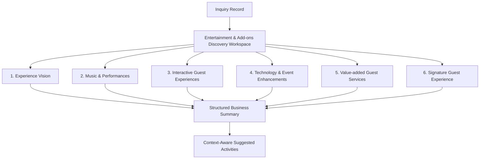

# Business Discussion & Philosophy: Entertainment & Add-ons Discovery Workspace (`IM-WP02C-07`)

The **Business Discussion and Business Philosophy** for the **Entertainment & Add-ons Discovery Workspace** (`IM-WP02C-07`) has been established following **DDS-001 (Discovery Design Standard)**.

---

# Core Philosophy: "Entertainment Discovery is NOT Entertainment Planning"

> **Entertainment Discovery is NOT Entertainment Planning.**
>
> The purpose of this workspace is **NOT** to book artists, allocate DJs, select vendors, produce stage layouts, design AV systems, prepare BOQs, estimate pricing, schedule performances, or plan execution.
>
> The goal is to discover the customer's expectations for guest engagement, entertainment, memorable experiences, celebration enhancements, and optional value-added services so that Sales can prepare an appropriate proposal and Operations can later understand the customer's vision.

```
┌────────────────────────────────────────────────────────────────────────────────────────┐
│                        DISCOVERY BOUNDARY ARCHITECTURE                                 │
├──────────────────────────────────────────┬─────────────────────────────────────────────┤
│ IM-WP02C-07 Discovery Workspace          │ Downstream Entertainment & Production Ops   │
│ (THIS WORKSPACE)                         │ (OUT OF SCOPE)                             │
├──────────────────────────────────────────┼─────────────────────────────────────────────┤
│ • Experience Vision                      │ ❌ Vendor Booking                           │
│ • Music & Performance Expectations       │ ❌ Artist Selection                         │
│ • Guest Engagement Ideas                 │ ❌ Stage Production                         │
│ • Technology & Event Enhancements        │ ❌ Sound Engineering                        │
│ • Value-Added Guest Services             │ ❌ Lighting Engineering                     │
│ • Signature Guest Experience             │ ❌ Event Production Planning                │
│                                           │ ❌ Equipment Scheduling                     │
│                                           │ ❌ Pricing                                  │
│                                           │ ❌ BOQ                                      │
│                                           │ ❌ Execution Planning                       │
└──────────────────────────────────────────┴─────────────────────────────────────────────┘
```

---

# Discovery Philosophy

Customers rarely ask:

> "I need a 4-piece band, a 20x20 LED wall, and a photo booth vendor confirmed by Friday."

Instead they say things like:

- "We want our guests to have a great time, not just eat well."
- "Some live music would be nice, but nothing too loud during dinner."
- "Kids will be there — we'd love something to keep them entertained."
- "It would be fun if guests had something to do besides sit and talk."
- "We want people to remember this as a fun, joyful celebration."

Those are business discovery conversations.

Entertainment planning, vendor booking, and production design come later.

---

# The 6 Guided Business Conversations



---

## 1. Experience Vision

**Consultative Opening**

> **"What kind of overall atmosphere do you want your event to have?"**

Examples (Overall Event Atmosphere):

- Lively & High-Energy Celebration
- Warm & Relaxed Social Gathering
- Elegant & Refined Atmosphere
- Fun-Filled Family Celebration
- Cultural & Traditional Festivity

With that atmosphere in mind:

> **"Besides great food and hospitality, how would you like your guests to enjoy the event?"**

Also discover the preferred guest engagement style:

- Guests Fully Immersed & Participating
- Guests Entertained While Mingling
- Light, Background Enjoyment Only

Preference Importance (Informational Only):

- Must Have
- Preferred
- Nice to Have

---

## 2. Music & Performances

**Consultative Opening**

> **"What kind of music and performances would bring your event to life?"**

**Background Entertainment** *(ambient — during mingling, dining, or cocktail hour)*

- Instrumental Music

**Featured Entertainment** *(spotlight — main event moments)*

- DJ
- Live Band
- Singer
- Cultural Performances
- Dance Performances
- Host / Emcee

> [!NOTE]
> This card discovers **interest only**. It does not involve artist selection, vendor discussion, or booking of any kind.

**Things to Avoid**

> **"Is there any type of music or performance you'd prefer we avoid?"**

Examples:

- Loud Music During Dining
- Specific Genres to Avoid (free text)
- No Fire / Pyrotechnic Elements
- Keep it Family-Friendly
- No Late-Night Loud Performances

---

## 3. Interactive Guest Experiences

**Consultative Opening**

> **"How involved would you like your guests to be?"**

Guest Participation Level:

- Fully Participating & Hands-On
- Watching & Enjoying
- A Mix of Both

With that in mind:

> **"What kind of interactive experiences would make your guests smile?"**

Examples:

- Photo Booth
- Selfie Station
- Kids Entertainment
- Games
- Interactive Experiences
- Live Demonstrations
- Other Memorable Guest Activities (free text)

The focus throughout this card stays on **guest enjoyment**, not activity logistics or setup.

---

## 4. Technology & Event Enhancements

**Consultative Opening**

> **"What's the main purpose you'd like technology to serve at your event?"**

Business Purpose:

- Enhance Guest Engagement
- Capture Memories for Keepsake
- Event Branding & Promotion
- Support Presentations / Speeches
- Elevate Visual Impact

Once the purpose is clear:

> **"Would you like any technology touches to elevate the experience?"**

Examples:

- LED Wall
- Live Streaming
- Event Recording
- Projectors
- Presentation Support
- Digital Displays
- Event Branding

> [!NOTE]
> Discovery only. No AV production planning, equipment scheduling, or technical design happens here.

**Venue Awareness** *(discovery only)*

> **"Is there anything about your venue we should be aware of that might affect these ideas — like space, power access, or timing restrictions?"**

- No Known Restrictions
- Some Restrictions We Know Of
- Not Sure Yet

> [!NOTE]
> This is awareness only, not a technical feasibility assessment. Detailed production and technical planning happens later, outside this workspace.

---

## 5. Value-added Guest Services

**Consultative Opening**

> **"Are there any additional guest services you'd like us to help arrange?"**

Examples:

- Welcome Drinks
- Valet Parking
- Guest Registration
- Return Gifts
- Hospitality Desk
- Directional Signage
- Transportation Assistance

**Service Importance** *(Informational Only)*

- Must Have
- Preferred
- Nice to Have

**Service Ownership**

> **"Who do you expect to coordinate these experience services?"**

- I'll Handle These Myself
- I'd Like Your Team's Help
- A Bit of Both
- Not Decided Yet

---

## 6. Signature Guest Experience

**Consultative Closing**

> **"Years from now, when your guests remember this celebration, what's the one moment you want them to carry with them forever?"**

Examples:

- Amazing Entertainment
- Beautiful Celebration Moments
- Interactive Guest Experiences
- Luxury Welcome
- Technology Experience
- Personal Touches
- Simple, Elegant Celebration

**One Priority to Remember**

> **"If you could invest extra attention in only one memorable experience, what would it be?"**

This captures a single customer priority only — no weighting, no multi-select, and no influence on pricing or resource allocation. It exists purely to tell Sales and Operations where the customer's heart is.

This closing conversation is the **emotional close** of the workspace, in the same spirit as Hospitality Memory in Service Experience Discovery.

---

# Informational Preference Weighting

The following discovery items support informational weighting only:

- Experience Vision (Atmosphere & Engagement Style)
- Music & Performance Interests
- Value-added Service Importance
- Signature Guest Experience

Weighting Options:

- Must Have
- Preferred
- Nice to Have

> **Governance Safeguard**
>
> These values exist only to preserve customer intent.
>
> They do **NOT**:
>
> - influence pricing
> - determine vendor selection
> - trigger bookings
> - affect validation

---

# Structured Business Summary

The workspace automatically generates:

```markdown
### Experience Vision

### Music & Performances

### Guest Experiences

### Experience Enhancements

### Value-added Services

### Signature Experience
```

The summary is written as a business handover for Sales and Operations while preserving customer language — never technical production terminology.

---

# Context-Aware Suggested Activities

Examples:

🟢 RECOMMENDATION

- Mention the desired event atmosphere and experience vision when preparing the proposal.

🟠 IMPORTANT

- Note guest-service ownership preference (self-arranged vs. caterer-assisted) when drafting the proposal.
- Include any "things to avoid" for entertainment or music as a proposal note.

🔴 URGENT

- Carry forward any venue awareness flags (space, power, timing restrictions) as a proposal note for early attention.

Suggested Activities remain **advisory and proposal-oriented only** — they inform what Sales writes into the proposal. They never imply a booking has been made, a vendor has been confirmed, or that operational execution has begun.

---

# Reused Workspace UX Controls & Integration

The workspace reuses the standard Discovery experience:

- System Validation Badge
- Discussion Status
- Conversation Progress
- 6 Guided Conversation Cards
- Insight Assistant Sidebar
  - Internal Sales Assessment
  - Structured Business Summary
  - Suggested Next Activities
- Save Discovery

---

# DDS-001 Compliance

- ✅ Workspace First
- ✅ Guided Business Conversations
- ✅ Discovery Before Planning
- ✅ Insight Assistant
- ✅ Structured Business Summary
- ✅ Context-Aware Suggested Activities
- ✅ Zero Vendor Booking
- ✅ Zero Production Planning
- ✅ Zero Equipment Scheduling
- ✅ Zero Pricing Decisions

---

# Status

**Business Discussion & Philosophy: APPROVED — FROZEN.**

**Lifecycle**: Business Discussion (Approved) → Engineering Package (Approved) → Implementation (Complete) → Product Review (8/10, Approved After Final UX Polish) → UX Polish (Complete) → **Freeze (Complete)**.

Per ES-016, this document was locked after approval — only lifecycle-status lines changed. See `02-engineering-package.md` through `06-freeze.md` in this folder for the full downstream lifecycle record.
