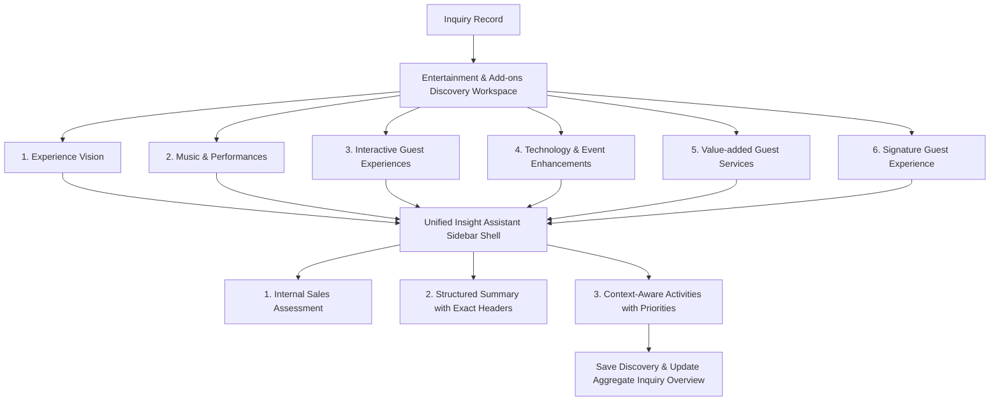

# Engineering Package: IM-WP02C-07 — Entertainment & Add-ons Discovery Workspace

**Document ID**: ENG-PKG-IM-WP02C-07
**Module**: Catrack Catering ERP — Inquiry Management (`cat/inquiry`)
**Feature Area**: Entertainment & Add-ons Discovery Workspace
**Compliance Standard**: DDS-001 (Discovery Design Standard)
**Status**: IMPLEMENTED & FROZEN — Product Review Approved (2026-07-28)

---

## 1. Executive Summary & Architectural Intent

### 1.1 Business Purpose
Guests remember whether an event was *fun*, not just whether it was well catered. The **Entertainment & Add-ons Discovery Workspace** (`IM-WP02C-07`) exists to capture the customer's expectations for guest engagement, music and performances, interactive experiences, technology enhancements, and value-added guest services — early in the sales inquiry lifecycle, in the customer's own words — so Sales can prepare an appropriate proposal and Operations can later understand the customer's vision.

### 1.2 Strict Scope & Operational Boundaries
> [!IMPORTANT]
> **Entertainment Discovery is NOT Entertainment Planning.** This workspace is **NOT** an artist-booking tool, vendor selector, stage-production designer, AV engineering tool, BOQ generator, pricing calculator, or performance scheduler. It exists purely to discover the customer's entertainment vision so that downstream Sales and Operations can later prepare proposals and execution plans.

```
┌────────────────────────────────────────────────────────────────────────────────────────┐
│                          DISCOVERY BOUNDARY ARCHITECTURE                               │
├──────────────────────────────────────────┬─────────────────────────────────────────────┤
│   IM-WP02C-07 Discovery Workspace        │     Downstream Entertainment & Production Ops │
│   (THIS WORKSPACE)                       │     (OUTSIDE SCOPE)                          │
├──────────────────────────────────────────┼─────────────────────────────────────────────┤
│ • Experience Vision                      │ ❌ Vendor Booking                            │
│ • Music & Performance Interests          │ ❌ Artist Selection                          │
│ • Guest Participation & Activities       │ ❌ Stage / Sound / Lighting Engineering      │
│ • Technology Purpose & Enhancements      │ ❌ Event Production Planning                 │
│ • Value-Added Guest Services             │ ❌ Equipment Scheduling                      │
│ • Signature Guest Experience             │ ❌ Pricing / BOQ / Execution Planning        │
└──────────────────────────────────────────┴─────────────────────────────────────────────┘
```

### 1.3 DDS-001 Compliance
- **Workspace First**: Dedicated workspace panel to be mounted within the Requirements Discovery directory, alongside Event Basics, Venue, Food & Beverage, Budget & Commercial, Decor & Ambience, and Service Experience.
- **Informational Weighting**: Preference importance (`ESSENTIAL`/`PREFERRED`/`OPTIONAL`) is strictly informational and has zero impact on pricing, vendor selection, or validation.
- **Unified Insight Assistant**: Right sidebar shell containing Internal Sales Assessment, Structured Business Summary, and Context-Aware Suggested Activities — identical shell used by every other Discovery workspace.

---

## 2. Workspace UX & 6 Guided Conversation Cards Architecture



---

### 2.1 Card 1: Experience Vision
*Consultative Prompt 1*: **"What kind of overall atmosphere do you want your event to have?"**

- **Event Atmosphere**:
  - `LIVELY_HIGH_ENERGY`: *"Lively & High-Energy Celebration"*
  - `WARM_RELAXED_SOCIAL`: *"Warm & Relaxed Social Gathering"*
  - `ELEGANT_REFINED`: *"Elegant & Refined Atmosphere"*
  - `FUN_FILLED_FAMILY`: *"Fun-Filled Family Celebration"*
  - `CULTURAL_TRADITIONAL`: *"Cultural & Traditional Festivity"*
  - **Event Atmosphere Weighting**: `ESSENTIAL` (Must Have), `PREFERRED`, `OPTIONAL` (Nice to Have).

*Consultative Prompt 2*: **"Besides great food and hospitality, how would you like your guests to enjoy the event?"**

- **Guest Engagement Style**:
  - `FULLY_IMMERSED_PARTICIPATING`: *"Guests Fully Immersed & Participating"*
  - `ENTERTAINED_WHILE_MINGLING`: *"Guests Entertained While Mingling"*
  - `LIGHT_BACKGROUND_ENJOYMENT`: *"Light, Background Enjoyment Only"*

---

### 2.2 Card 2: Music & Performances
*Consultative Prompt*: **"What kind of music and performances would bring your event to life?"**

- **Background Entertainment (Multi-Select)** — *ambient, during mingling/dining/cocktail hour*:
  - `INSTRUMENTAL_MUSIC`: *"Instrumental Music"*

- **Featured Entertainment (Multi-Select)** — *spotlight, main event moments*:
  - `DJ`: *"DJ"*
  - `LIVE_BAND`: *"Live Band"*
  - `SINGER`: *"Singer"*
  - `CULTURAL_PERFORMANCES`: *"Cultural Performances"*
  - `DANCE_PERFORMANCES`: *"Dance Performances"*
  - `HOST_EMCEE`: *"Host / Emcee"*

> [!NOTE]
> This card discovers **interest only**. It does not involve artist selection, vendor discussion, or booking of any kind.

*Consultative Prompt*: **"Is there any type of music or performance you'd prefer we avoid?"**

- **Things to Avoid (Multi-Select)**:
  - `LOUD_MUSIC_DURING_DINING`: *"Loud Music During Dining"*
  - `NO_FIRE_PYROTECHNICS`: *"No Fire / Pyrotechnic Elements"*
  - `KEEP_FAMILY_FRIENDLY`: *"Keep it Family-Friendly"*
  - `NO_LATE_NIGHT_LOUD_PERFORMANCES`: *"No Late-Night Loud Performances"*
  - **Genres to Avoid**: free text (`entertainmentGenresToAvoid`)

---

### 2.3 Card 3: Interactive Guest Experiences
*Consultative Prompt 1*: **"How involved would you like your guests to be?"**

- **Guest Participation Level**:
  - `FULLY_PARTICIPATING_HANDS_ON`: *"Fully Participating & Hands-On"*
  - `WATCHING_ENJOYING`: *"Watching & Enjoying"*
  - `MIX_OF_BOTH`: *"A Mix of Both"*

*Consultative Prompt 2*: **"What kind of interactive experiences would make your guests smile?"**

- **Interactive Experiences (Multi-Select)**:
  - `PHOTO_BOOTH`: *"Photo Booth"*
  - `SELFIE_STATION`: *"Selfie Station"*
  - `KIDS_ENTERTAINMENT`: *"Kids Entertainment"*
  - `GAMES`: *"Games"*
  - `INTERACTIVE_EXPERIENCES`: *"Interactive Experiences"*
  - `LIVE_DEMONSTRATIONS`: *"Live Demonstrations"*
  - **Other Memorable Guest Activities**: free text (`otherGuestActivities`)

---

### 2.4 Card 4: Technology & Event Enhancements
*Consultative Prompt 1*: **"What's the main purpose you'd like technology to serve at your event?"**

- **Technology Business Purpose**:
  - `ENHANCE_GUEST_ENGAGEMENT`: *"Enhance Guest Engagement"*
  - `CAPTURE_MEMORIES_KEEPSAKE`: *"Capture Memories for Keepsake"*
  - `EVENT_BRANDING_PROMOTION`: *"Event Branding & Promotion"*
  - `SUPPORT_PRESENTATIONS_SPEECHES`: *"Support Presentations / Speeches"*
  - `ELEVATE_VISUAL_IMPACT`: *"Elevate Visual Impact"*

*Consultative Prompt 2*: **"Would you like any technology touches to elevate the experience?"**

- **Technology Enhancements (Multi-Select)**:
  - `LED_WALL`: *"LED Wall"*
  - `LIVE_STREAMING`: *"Live Streaming"*
  - `EVENT_RECORDING`: *"Event Recording"*
  - `PROJECTORS`: *"Projectors"*
  - `PRESENTATION_SUPPORT`: *"Presentation Support"*
  - `DIGITAL_DISPLAYS`: *"Digital Displays"*
  - `EVENT_BRANDING`: *"Event Branding"*

> [!NOTE]
> Discovery only. No AV production planning, equipment scheduling, or technical design happens here.

*Consultative Prompt 3 (Venue Awareness — discovery only)*: **"Is there anything about your venue we should be aware of that might affect these ideas — like space, power access, or timing restrictions?"**

- **Venue Awareness Status**:
  - `NO_KNOWN_RESTRICTIONS`: *"No Known Restrictions"*
  - `SOME_RESTRICTIONS_KNOWN`: *"Some Restrictions We Know Of"*
  - `NOT_SURE_YET`: *"Not Sure Yet"*
  - **Venue Awareness Notes**: free text (`venueAwarenessNotes`), shown only when `SOME_RESTRICTIONS_KNOWN` is selected — mirrors the progressive-disclosure pattern already used for Venue Restrictions in Decor & Ambience.

> [!NOTE]
> This is awareness only, not a technical feasibility assessment. Detailed production and technical planning happens later, outside this workspace.

---

### 2.5 Card 5: Value-added Guest Services
*Consultative Prompt*: **"Are there any additional guest services you'd like us to help arrange?"**

- **Value-added Services (Multi-Select)**:
  - `WELCOME_DRINKS`: *"Welcome Drinks"*
  - `VALET_PARKING`: *"Valet Parking"*
  - `GUEST_REGISTRATION`: *"Guest Registration"*
  - `RETURN_GIFTS`: *"Return Gifts"*
  - `HOSPITALITY_DESK`: *"Hospitality Desk"*
  - `DIRECTIONAL_SIGNAGE`: *"Directional Signage"*
  - `TRANSPORTATION_ASSISTANCE`: *"Transportation Assistance"*
  - **Service Importance Weighting** (Informational Only): `ESSENTIAL`, `PREFERRED`, `OPTIONAL`.

*Consultative Prompt (Service Ownership — softened per Product Review)*: **"Who do you expect to coordinate these experience services?"**

- **Service Ownership Preference**:
  - `SELF_COORDINATING`: *"I'll Handle These Myself"*
  - `REQUEST_TEAM_HELP`: *"I'd Like Your Team's Help"*
  - `SHARED_COORDINATION`: *"A Bit of Both"*
  - `NOT_DECIDED_YET`: *"Not Decided Yet"*

---

### 2.6 Card 6: Signature Guest Experience
*Consultative Closing*: **"Years from now, when your guests remember this celebration, what's the one moment you want them to carry with them forever?"**

- **Signature Guest Experience (Multi-Select)**:
  - `AMAZING_ENTERTAINMENT`: *"Amazing Entertainment"*
  - `BEAUTIFUL_CELEBRATION_MOMENTS`: *"Beautiful Celebration Moments"*
  - `INTERACTIVE_GUEST_EXPERIENCES`: *"Interactive Guest Experiences"*
  - `LUXURY_WELCOME`: *"Luxury Welcome"*
  - `TECHNOLOGY_EXPERIENCE`: *"Technology Experience"*
  - `PERSONAL_TOUCHES`: *"Personal Touches"*
  - `SIMPLE_ELEGANT_CELEBRATION`: *"Simple, Elegant Celebration"*

*Consultative Follow-up (added per Product Review)*: **"If you could invest extra attention in only one memorable experience, what would it be?"**

- **One Priority to Remember**: single-select from the same Signature Guest Experience tag set (`priorityExperience?: SignatureExperienceTag`) — captures the customer's single priority only. No weighting, no multi-select, no influence on pricing or resource allocation.

---

## 3. Data Model Specification (`EntertainmentExperienceConversation`)

> [!NOTE]
> **Naming**: The interface is named `EntertainmentExperienceConversation` (renamed from an earlier `EntertainmentAddonsConversation` draft) — it reads better alongside `Experience Vision` and `Experience Enhancements`, and since no code exists yet, the rename carries zero implementation churn. This is purely the TypeScript interface name; the pre-existing `'ENTERTAINMENT_ADDONS'` literal already in `discovery-types.ts`'s `DiscoveryAreaKey` union, and the `entertainment_addons` DB column name below, are untouched — renaming those would touch already-real code and isn't part of this refinement.

### 3.1 TypeScript Interface

```typescript
// Reuses the existing shared PreferenceImportanceWeighting type
// ('ESSENTIAL' | 'PREFERRED' | 'OPTIONAL') already defined in discovery-types.ts
// for Decor & Ambience / Service Experience — do not redeclare.

export type EventAtmosphereType =
  | 'LIVELY_HIGH_ENERGY'
  | 'WARM_RELAXED_SOCIAL'
  | 'ELEGANT_REFINED'
  | 'FUN_FILLED_FAMILY'
  | 'CULTURAL_TRADITIONAL';

export type GuestEngagementStyle =
  | 'FULLY_IMMERSED_PARTICIPATING'
  | 'ENTERTAINED_WHILE_MINGLING'
  | 'LIGHT_BACKGROUND_ENJOYMENT';

export type BackgroundEntertainmentTag = 'INSTRUMENTAL_MUSIC';

export type FeaturedEntertainmentTag =
  | 'DJ'
  | 'LIVE_BAND'
  | 'SINGER'
  | 'CULTURAL_PERFORMANCES'
  | 'DANCE_PERFORMANCES'
  | 'HOST_EMCEE';

export type EntertainmentAvoidTag =
  | 'LOUD_MUSIC_DURING_DINING'
  | 'NO_FIRE_PYROTECHNICS'
  | 'KEEP_FAMILY_FRIENDLY'
  | 'NO_LATE_NIGHT_LOUD_PERFORMANCES';

export type GuestParticipationLevel =
  | 'FULLY_PARTICIPATING_HANDS_ON'
  | 'WATCHING_ENJOYING'
  | 'MIX_OF_BOTH';

export type InteractiveExperienceTag =
  | 'PHOTO_BOOTH'
  | 'SELFIE_STATION'
  | 'KIDS_ENTERTAINMENT'
  | 'GAMES'
  | 'INTERACTIVE_EXPERIENCES'
  | 'LIVE_DEMONSTRATIONS';

export type TechnologyBusinessPurpose =
  | 'ENHANCE_GUEST_ENGAGEMENT'
  | 'CAPTURE_MEMORIES_KEEPSAKE'
  | 'EVENT_BRANDING_PROMOTION'
  | 'SUPPORT_PRESENTATIONS_SPEECHES'
  | 'ELEVATE_VISUAL_IMPACT';

export type TechnologyEnhancementTag =
  | 'LED_WALL'
  | 'LIVE_STREAMING'
  | 'EVENT_RECORDING'
  | 'PROJECTORS'
  | 'PRESENTATION_SUPPORT'
  | 'DIGITAL_DISPLAYS'
  | 'EVENT_BRANDING';

export type VenueAwarenessStatus =
  | 'NO_KNOWN_RESTRICTIONS'
  | 'SOME_RESTRICTIONS_KNOWN'
  | 'NOT_SURE_YET';

export type ValueAddedServiceTag =
  | 'WELCOME_DRINKS'
  | 'VALET_PARKING'
  | 'GUEST_REGISTRATION'
  | 'RETURN_GIFTS'
  | 'HOSPITALITY_DESK'
  | 'DIRECTIONAL_SIGNAGE'
  | 'TRANSPORTATION_ASSISTANCE';

export type ServiceOwnershipPreference =
  | 'SELF_COORDINATING'
  | 'REQUEST_TEAM_HELP'
  | 'SHARED_COORDINATION'
  | 'NOT_DECIDED_YET';

export type SignatureExperienceTag =
  | 'AMAZING_ENTERTAINMENT'
  | 'BEAUTIFUL_CELEBRATION_MOMENTS'
  | 'INTERACTIVE_GUEST_EXPERIENCES'
  | 'LUXURY_WELCOME'
  | 'TECHNOLOGY_EXPERIENCE'
  | 'PERSONAL_TOUCHES'
  | 'SIMPLE_ELEGANT_CELEBRATION';

export interface EntertainmentExperienceConversation {
  eventAtmosphere: EventAtmosphereType;
  eventAtmosphereWeighting: PreferenceImportanceWeighting;
  guestEngagementStyle: GuestEngagementStyle;

  backgroundEntertainment: BackgroundEntertainmentTag[];
  featuredEntertainment: FeaturedEntertainmentTag[];
  entertainmentAvoidTags: EntertainmentAvoidTag[];
  entertainmentGenresToAvoid?: string;

  guestParticipationLevel: GuestParticipationLevel;
  interactiveExperiences: InteractiveExperienceTag[];
  otherGuestActivities?: string;

  technologyBusinessPurpose?: TechnologyBusinessPurpose[];
  technologyEnhancements: TechnologyEnhancementTag[];
  venueAwarenessStatus: VenueAwarenessStatus;
  venueAwarenessNotes?: string;

  valueAddedServices: ValueAddedServiceTag[];
  serviceImportanceWeighting: PreferenceImportanceWeighting;
  serviceOwnershipPreference: ServiceOwnershipPreference;

  signatureExperience: SignatureExperienceTag[];
  priorityExperience?: SignatureExperienceTag;

  businessSummary: string;
  isSummaryManuallyEdited?: boolean;
  discussionStatus: DiscussionStatus;
  validationStatus: BusinessValidationStatus;
}
```

---

## 4. Computed Business Validation Rules (`computeEntertainmentExperienceValidation`)

```typescript
export function computeEntertainmentExperienceValidation(
  data?: Partial<EntertainmentExperienceConversation>
): BusinessValidationStatus {
  if (!data) return 'NEEDS_ATTENTION';

  // Core experience vision must be captured — everything else in this
  // workspace is a legitimately optional add-on (a customer may want zero
  // music, zero technology, and zero value-added services).
  if (!data.eventAtmosphere || !data.guestEngagementStyle) {
    return 'NEEDS_ATTENTION';
  }

  return 'READY';
}
```

> Music/performance selections, interactive experiences, technology enhancements, and value-added services are intentionally **not** required — a host may legitimately want a quiet, entertainment-light event. Their absence is a valid answer, not an incomplete one, consistent with DDS-001's non-blocking discovery principle.

---

## 5. Persistence Model & Database Integration

- **Table**: `cat_inquiry_discovery_areas`
- **Column**: `entertainment_addons` (JSONB)
- **API Endpoint**: `PATCH /api/cat/inquiries/[id]/discovery` with payload `areaKey = 'ENTERTAINMENT_ADDONS'` and `entertainmentExperience` object.
- `DiscoveryAreaKey` already includes the `'ENTERTAINMENT_ADDONS'` literal in `discovery-types.ts` — no union change required, only the new `entertainmentExperience?: EntertainmentExperienceConversation` field on `DiscoveryArea`.

```sql
ALTER TABLE cat_inquiry_discovery_areas
ADD COLUMN IF NOT EXISTS entertainment_addons JSONB;
```

---

## 6. Structured Business Summary Generation

`generateAutoSummary()` will format captured discovery into the exact section headers specified in the frozen business discussion.

> [!IMPORTANT]
> **Narrative, not a field dump.** Each section must read as a short narrative business summary in plain sentences — e.g. *"The customer wants a fun, family-friendly celebration with guests entertained while mingling."* — never a literal field-by-field listing of raw stored values (`atmosphere: FUN_FILLED_FAMILY`). The underlying data stays structured (Section 3); only the generated text is prose.

```markdown
### Experience Vision
The customer wants a fun-filled family celebration, with guests entertained while mingling rather than the center of attention. This atmosphere is a must-have.

### Music & Performances
Instrumental music in the background during dinner, with a live band and dance performances as the featured highlight. Please avoid any fire or pyrotechnic elements.

### Guest Experiences
Guests should get a mix of watching and hands-on participation — a photo booth and kids' entertainment stood out as favorites.

### Experience Enhancements
Technology should mainly enhance guest engagement and help capture memories — an LED wall and event recording are of interest. Some venue restrictions are already known (a sound curfew after 11 PM).

### Value-added Services
Welcome drinks and valet parking are preferred add-ons, and the customer would like the team's help coordinating them rather than arranging these themselves.

### Signature Experience
Above everything else, the customer hopes guests remember the entertainment — if only one thing should stand out afterwards, it's this.
```

The summary is written as a business handover for Sales and Operations while preserving the customer's own language — identical presentation convention to Decor & Ambience and Service Experience.

> [!NOTE]
> **Architectural Note**: This Structured Business Summary is expected to become part of the future Event Brief once a quotation is successfully accepted — carrying the customer's own language forward from Discovery into Operations handover. This is a forward-looking integration note only; it does not change this workspace's current scope or require anything to be built now.

---

## 7. Context-Aware Suggested Activities

| Captured Entertainment Intent | Context-Aware Suggested Activity |
| :--- | :--- |
| **Featured Entertainment selected** | 🟢 RECOMMENDATION — *"Mention the desired event atmosphere and experience vision when preparing the proposal."* |
| **Service Ownership = Request Team Help / Shared** | 🟠 IMPORTANT — *"Note guest-service ownership preference when drafting the proposal."* |
| **Entertainment Avoid Tags present** | 🟠 IMPORTANT — *"Include any 'things to avoid' for entertainment or music as a proposal note."* |
| **Venue Awareness = Some Restrictions Known** | 🔴 URGENT — *"Carry forward any venue awareness flags as a proposal note for early attention."* |
| **Validation = READY & Discussion Complete** | 🟢 RECOMMENDATION — *"Entertainment & Add-ons discovery ready for internal handover summary review."* |

> [!IMPORTANT]
> **Proposal-oriented only, never operational.** Every Suggested Activity is a recommendation for what to mention or note *in the proposal* — never an operational task, vendor booking, or execution step. Wording like "confirm," "schedule," or "arrange" must not appear; only "mention," "note," "include," or "carry forward."
>
> **Generated only when supported by captured data.** Each row above fires only when its triggering field was actually populated during discovery (e.g. the Venue Awareness activity appears only if `venueAwarenessStatus = SOME_RESTRICTIONS_KNOWN` was actually selected). No activity is shown speculatively, by default, or for fields the customer left blank.

Suggested Activities remain **advisory and proposal-oriented only** — they inform what Sales writes into the proposal. They never imply a booking has been made, a vendor has been confirmed, or that operational execution has begun.

---

## 8. Organic Master Growth Considerations

- No lookup-table dependency for this workspace — all tag/enum lists are static presets (unlike Cuisine/Occasion/Service-Style, which use `CatCuisine`/`CatOccasionType` master lookups elsewhere in `cat/`). If a host names an entertainment idea, technology enhancement, or guest service not covered by the preset list, capture it as free text (`entertainmentGenresToAvoid`, `otherGuestActivities`, `venueAwarenessNotes`) rather than expanding the enum inline — avoids uncontrolled enum growth for a low-cardinality, discovery-only field set.

---

## 9. Verification & Engineering Checklist

| Requirement | Package Specification | Status |
| :--- | :--- | :---: |
| DDS-001 Compliance | Discovery design standard strictly followed | SPECIFIED |
| Workspace First Composition | Dedicated workspace panel to be mounted under Requirements Directory | SPECIFIED |
| Informational Weighting | `Essential`/`Preferred`/`Optional` weighting has zero pricing/vendor/validation impact | SPECIFIED |
| Card 1 renamed — Experience Vision | Reflects the entire workspace, atmosphere captured before entertainment specifics | SPECIFIED |
| Background vs. Featured Entertainment | Split into two distinct multi-select fields | SPECIFIED |
| Guest Participation before Activities | `guestParticipationLevel` captured ahead of `interactiveExperiences` | SPECIFIED |
| Technology Purpose before Options | `technologyBusinessPurpose` captured ahead of `technologyEnhancements` | SPECIFIED |
| Service Importance vs. Ownership | Two distinct fields — weighting vs. `serviceOwnershipPreference` | SPECIFIED |
| Softened Service Ownership Question | Customer-friendly options, no internal-sounding labels | SPECIFIED |
| Things to Avoid (Entertainment) | `entertainmentAvoidTags` + free-text genre field | SPECIFIED |
| Venue Awareness (discovery only) | `venueAwarenessStatus` + notes, explicitly non-technical | SPECIFIED |
| Strengthened Emotional Closing | Card 6 prompt reframed as a lasting memory, not a passing mention | SPECIFIED |
| One Priority to Remember | `priorityExperience` — single-select, no weighting | SPECIFIED |
| Exact Summary Headers | `Experience Vision`, `Music & Performances`, `Guest Experiences`, `Experience Enhancements`, `Value-added Services`, `Signature Experience` | SPECIFIED |
| Context-Aware Activities | Advisory and proposal-oriented only, no booking/execution language | SPECIFIED |
| Pure Discovery Boundaries | Zero vendor booking, artist selection, production planning, pricing, or BOQ | SPECIFIED |
| API & DB Integration | `entertainment_addons` JSONB column in `cat_inquiry_discovery_areas` | SPECIFIED |
| Final Review #1 — Interface Rename | `EntertainmentExperienceConversation` (zero churn — nothing implemented yet); `ENTERTAINMENT_ADDONS` areaKey/column untouched | SPECIFIED |
| Final Review #2 — Proposal-Oriented Activities | Explicit rule: "mention/note/include/carry forward" only, never "confirm/schedule/arrange" | SPECIFIED |
| Final Review #3 — Narrative Summary | Explicit rule + rewritten example: short business prose, not a field-by-field dump | SPECIFIED |
| Final Review #4 — Event Brief Note | Architectural note added: summary expected to feed the future Event Brief post-quotation-acceptance | SPECIFIED |
| Final Review #5 — Activities Require Data | Explicit rule: an activity fires only when its triggering field was actually captured | SPECIFIED |

---

**Approval**: Engineering Package complete — 100% aligned with the approved Business Discussion. Implementation complete, Product Review completed and approved (8/10, after Final UX Polish), and the Work Package is now frozen. See `03-implementation-walkthrough.md`, `04-product-review.md`, `05-ux-polish.md`, and `06-freeze.md` in this folder for the full downstream lifecycle record. No content in this document (sections 1–9 above) was altered as part of that process.
