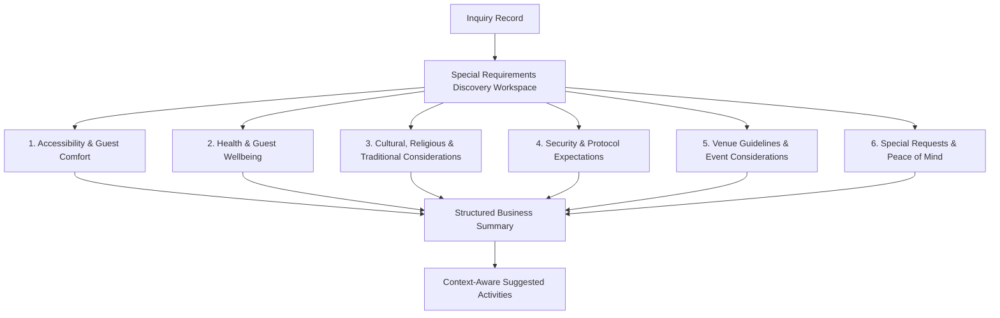

# Business Discussion & Philosophy: Special Requirements Discovery Workspace (`IM-WP02C-08`)

The **Business Discussion and Business Philosophy** for the **Special Requirements Discovery Workspace** (`IM-WP02C-08`) has been established following **DDS-001 (Discovery Design Standard)**.

---

# Core Philosophy: "Special Requirements Discovery is NOT Operational Planning"

> **Special Requirements Discovery is NOT Operational Planning.**
>
> The purpose of this workspace is **NOT** to plan execution, allocate staffing, arrange procurement, plan kitchen production, coordinate vendors, estimate pricing, prepare BOQs, schedule resources, or plan risk management.
>
> The goal is to discover exceptional requirements that influence the success of the event but do not naturally belong within the previous Discovery workspaces — customer expectations, sensitivities, accessibility needs, compliance considerations, and exceptional requests — early enough that Sales and Operations understand them before proposal and planning.

```
┌────────────────────────────────────────────────────────────────────────────────────────┐
│                        DISCOVERY BOUNDARY ARCHITECTURE                                 │
├──────────────────────────────────────────┬─────────────────────────────────────────────┤
│ IM-WP02C-08 Discovery Workspace          │ Downstream Operational & Compliance Work    │
│ (THIS WORKSPACE)                         │ (OUT OF SCOPE)                             │
├──────────────────────────────────────────┼─────────────────────────────────────────────┤
│ • Accessibility Requirements             │ ❌ Operational Planning                    │
│ • Health & Medical Considerations        │ ❌ Medical Assessment                      │
│ • Cultural & Religious Considerations    │ ❌ Legal Compliance Consulting             │
│ • Security & Protocol Expectations       │ ❌ Security Planning                       │
│ • Compliance & Venue-Specific Obligations│ ❌ Staffing Allocation                     │
│ • Other Exceptional Customer Requests    │ ❌ Procurement                             │
│                                           │ ❌ Vendor Assignment                       │
│                                           │ ❌ Pricing                                 │
│                                           │ ❌ Execution Planning                      │
└──────────────────────────────────────────┴─────────────────────────────────────────────┘
```

---

# Discovery Philosophy

Customers rarely ask:

> "I need a certified first-aider on-site and a written accessibility compliance report."

Instead they say things like:

- "My mother uses a wheelchair — please make sure she can get around easily."
- "One of our guests has a severe nut allergy. The whole team should just know."
- "We'll be doing a short prayer before the ceremony, just so you're aware."
- "We'd prefer no photographers near the family table during dinner."
- "The venue mentioned something about noise after 11 PM — not sure of the details."
- "Honestly, I just want to know nothing will go wrong that we didn't see coming."

Those are business discovery conversations.

Medical assessment, security planning, and compliance consulting come later, from the right specialists — not from this workspace.

---

# The 6 Guided Business Conversations



---

## 1. Accessibility & Guest Comfort

**Consultative Opening**

> **"Are there any guests who might need extra comfort or accessibility support?"**

Examples:

- Wheelchair Access
- Elderly Guests
- Children
- Nursing Mothers
- Accessible Seating
- Mobility Assistance
- Other Accessibility Considerations (free text)

> [!NOTE]
> Captures **awareness only**. This is a conversational check-in, not an accessibility audit or facilities assessment.

---

## 2. Health & Guest Wellbeing

**Consultative Opening**

> **"Are there any health or medical considerations we should be aware of for the event?"**

> [!NOTE]
> This card is **not** for menu planning — food preferences already belong in Food & Beverage Discovery.

Examples:

- Severe Allergies (Event-Wide Awareness)
- Emergency Medical Awareness
- Medication Storage Needs
- First-Aid Expectations
- Guest Sensitivities
- Other Event-Wide Health Considerations (free text)

> [!NOTE]
> Captures general awareness only. This workspace does **not** capture personal medical records or perform any medical assessment.

---

## 3. Cultural, Religious & Traditional Considerations

**Consultative Opening**

> **"Are there any cultural, religious, or traditional practices we should be mindful of?"**

Examples:

- Religious Customs
- Ceremonial Expectations
- Prayer Requirements
- Traditional Practices
- Language Preferences
- Cultural Sensitivities (free text)

> [!NOTE]
> Discovery stays respectful and awareness-only — this is not an advisory or interpretive service on customs or religious practice.

---

## 4. Security & Protocol Expectations

**Consultative Opening**

> **"Are there any security or protocol expectations we should know about?"**

Examples:

- VIP Attendance
- Restricted Access
- Guest Privacy
- Photography Restrictions
- Media Presence
- Security Coordination Expectations (free text)

> [!NOTE]
> Discovery only. No security planning, threat assessment, or coordination happens in this workspace.

---

## 5. Venue Guidelines & Event Considerations

**Consultative Opening**

> **"Are there any venue policies or compliance matters we should be aware of?"**

Examples:

- Permits Already Known
- Venue Compliance Expectations
- Noise Restrictions
- Environmental Rules
- Sustainability Requests
- Waste Management Expectations (free text)

> [!NOTE]
> Captures awareness only. This workspace does not assess, verify, or advise on compliance — it records what the customer already knows or expects.

---

## 6. Special Requests & Peace of Mind

**Consultative Closing**

> **"Before we prepare your proposal, is there anything important about your event, your guests, or your expectations that you'd like us to understand?"**

- Free-text discussion
- Exceptional requests
- Customer concerns
- "Anything we haven't asked"

This is the **emotional close** of the workspace — and, fittingly, the final Discovery conversation of the entire Inquiry module. Where every other workspace closes its own topic, this one closes the whole Discovery experience: a last, open invitation for the customer to say what matters to them that nothing else has captured yet.

---

# Structured Business Summary

The workspace automatically generates:

```markdown
### Accessibility

### Health & Wellbeing Considerations

### Cultural & Religious Considerations

### Security & Protocol

### Venue Guidelines & Event Considerations

### Special Requests
```

The summary is written as a business handover for Sales and Operations while preserving customer language — never technical, medical, legal, or security terminology.

---

# Context-Aware Suggested Activities

Examples:

🟢 RECOMMENDATION

- Mention accessibility awareness in the proposal so Operations can plan appropriately later.

🟠 IMPORTANT

- Include event-wide health or allergy awareness as a proposal note for the team.

🔴 URGENT

- Carry forward any security or VIP attendance expectations as an early proposal flag.

Suggested Activities remain informational and proposal-oriented only. They must never generate security tasks, medical tasks, operational assignments, or compliance actions — those belong to specialists working from the proposal, not to this workspace.

---

# Reused Workspace UX Controls & Integration

The workspace reuses the standard Discovery experience:

- System Validation Badge
- Discussion Status
- Conversation Progress
- 6 Guided Conversation Cards
- Insight Assistant Sidebar
  - Internal Sales Assessment
  - Structured Business Summary
  - Suggested Next Activities
- Save Discovery

---

# DDS-001 Compliance

- ✅ Workspace First
- ✅ Guided Business Conversations
- ✅ Discovery Before Planning
- ✅ Insight Assistant
- ✅ Structured Business Summary
- ✅ Context-Aware Suggested Activities
- ✅ Zero Operational Planning
- ✅ Zero Medical Assessment
- ✅ Zero Legal Compliance Consulting
- ✅ Zero Security Planning
- ✅ Zero Pricing Decisions

---

# Status

**Business Discussion & Philosophy: APPROVED — FROZEN.**

**Lifecycle**: Business Discussion (Approved) → Engineering Package (Approved) → Implementation (Complete) → Product Review (9.7/10, Approved After Final UX Polish) → UX Polish (Complete) → **Freeze (Complete)**.

Per ES-016, this document was locked after approval — only lifecycle-status lines changed. See `02-engineering-package.md` through `06-freeze.md` in this folder for the full downstream lifecycle record.

This is intended to be the final Business Discussion & Philosophy document in the Inquiry Discovery Suite (`IM-WP02C-04` through `IM-WP02C-08`).
