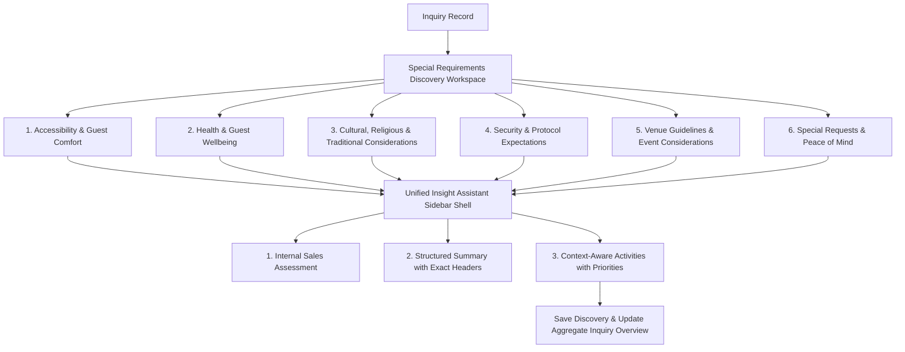

# Engineering Package: IM-WP02C-08 — Special Requirements Discovery Workspace

**Document ID**: ENG-PKG-IM-WP02C-08
**Module**: Catrack Catering ERP — Inquiry Management (`cat/inquiry`)
**Feature Area**: Special Requirements Discovery Workspace
**Compliance Standard**: DDS-001 (Discovery Design Standard)
**Status**: IMPLEMENTED & FROZEN — Product Review Approved (2026-07-28)

---

## 1. Executive Summary & Architectural Intent

### 1.1 Business Purpose
Some things that decide whether an event goes well never show up in a menu, a budget, or a decor mood board — a wheelchair that needs a clear path, a severe allergy the whole team should know about, a prayer before the ceremony, a request for no photography near the family table. The **Special Requirements Discovery Workspace** (`IM-WP02C-08`) exists to surface exactly this category of exceptional-but-decisive information — accessibility, health/wellbeing awareness, cultural and religious considerations, security and protocol expectations, venue guidelines, and anything else the customer wants understood — before Sales prepares the proposal.

### 1.2 Strict Scope & Operational Boundaries
> [!IMPORTANT]
> **Special Requirements Discovery is NOT Operational Planning.** This workspace is **NOT** a medical assessment tool, a legal compliance consultation, a security planning tool, a staffing allocator, or an execution planner. It exists purely to discover exceptional customer requirements so that Sales can carry them into the proposal and Operations can plan appropriately later, with the right specialists.

```
┌────────────────────────────────────────────────────────────────────────────────────────┐
│                        DISCOVERY BOUNDARY ARCHITECTURE                                 │
├──────────────────────────────────────────┬─────────────────────────────────────────────┤
│ IM-WP02C-08 Discovery Workspace          │ Downstream Operational & Compliance Work    │
│ (THIS WORKSPACE)                         │ (OUT OF SCOPE)                             │
├──────────────────────────────────────────┼─────────────────────────────────────────────┤
│ • Accessibility Requirements             │ ❌ Operational Planning                    │
│ • Health & Wellbeing Considerations      │ ❌ Medical Assessment                      │
│ • Cultural & Religious Considerations    │ ❌ Legal Compliance Consulting             │
│ • Security & Protocol Expectations       │ ❌ Security Planning                       │
│ • Venue Guidelines & Event Considerations│ ❌ Staffing Allocation                     │
│ • Other Exceptional Customer Requests    │ ❌ Procurement                             │
│                                           │ ❌ Vendor Assignment                       │
│                                           │ ❌ Pricing                                 │
│                                           │ ❌ Execution Planning                      │
└──────────────────────────────────────────┴─────────────────────────────────────────────┘
```

### 1.3 DDS-001 Compliance
- **Workspace First**: Dedicated workspace panel to be mounted within the Requirements Discovery directory, alongside every other Discovery workspace — the final one in the Inquiry Discovery Suite.
- **No Preference Weighting**: Unlike Decor & Ambience, Service Experience, and Entertainment & Add-ons, this workspace intentionally has **no `ESSENTIAL`/`PREFERRED`/`OPTIONAL` weighting mechanism anywhere**. Rating a severe allergy or a security expectation as "Nice to Have" would misrepresent what was actually discovered. Every field here is informational awareness only — present or not present, nothing weighted.
- **Unified Insight Assistant**: Right sidebar shell containing Internal Sales Assessment, Structured Business Summary, and Context-Aware Suggested Activities — identical shell used by every other Discovery workspace.

---

## 2. Workspace UX & 6 Guided Conversation Cards Architecture



---

### 2.1 Card 1: Accessibility & Guest Comfort
*Consultative Prompt*: **"Are there any guests who might need extra comfort or accessibility support?"**

- **Accessibility Considerations (Multi-Select)**:
  - `WHEELCHAIR_ACCESS`: *"Wheelchair Access"*
  - `ELDERLY_GUESTS`: *"Elderly Guests"*
  - `CHILDREN`: *"Children"*
  - `NURSING_MOTHERS`: *"Nursing Mothers"*
  - `ACCESSIBLE_SEATING`: *"Accessible Seating"*
  - `MOBILITY_ASSISTANCE`: *"Mobility Assistance"*

- **Other Accessibility Considerations**: free text (`accessibility.otherAccessibilityNotes`).

> Awareness only — no accessibility audit, facilities assessment, or logistics planning.

---

### 2.2 Card 2: Health & Guest Wellbeing
*Consultative Prompt*: **"Are there any health or medical considerations we should be aware of for the event?"**

> Not for menu planning — food preferences belong to Food & Beverage Discovery.

- **Health & Wellbeing Considerations (Multi-Select)**:
  - `SEVERE_ALLERGIES_AWARENESS`: *"Severe Allergies (Event-Wide Awareness)"*
  - `EMERGENCY_MEDICAL_AWARENESS`: *"Emergency Medical Awareness"*
  - `MEDICATION_STORAGE_NEEDS`: *"Medication Storage Needs"*
  - `FIRST_AID_EXPECTATIONS`: *"First-Aid Expectations"*
  - `GUEST_SENSITIVITIES`: *"Guest Sensitivities"*

- **Other Event-Wide Health Considerations**: free text (`healthWellbeing.otherHealthConsiderations`).

> General awareness only. No personal medical records are captured; no medical assessment is performed.

---

### 2.3 Card 3: Cultural, Religious & Traditional Considerations
*Consultative Prompt*: **"Are there any cultural, religious, or traditional practices we should be mindful of?"**

- **Cultural & Religious Considerations (Multi-Select)**:
  - `RELIGIOUS_CUSTOMS`: *"Religious Customs"*
  - `CEREMONIAL_EXPECTATIONS`: *"Ceremonial Expectations"*
  - `PRAYER_REQUIREMENTS`: *"Prayer Requirements"*
  - `TRADITIONAL_PRACTICES`: *"Traditional Practices"*
  - `LANGUAGE_PREFERENCES`: *"Language Preferences"*

- **Cultural Sensitivities**: free text (`culturalReligious.culturalSensitivityNotes`).

> Discovery stays respectful and awareness-only — not an advisory or interpretive service on customs or religious practice.

---

### 2.4 Card 4: Security & Protocol Expectations
*Consultative Prompt*: **"Are there any security or protocol expectations we should know about?"**

- **Security & Protocol Considerations (Multi-Select)**:
  - `VIP_ATTENDANCE`: *"VIP Attendance"*
  - `RESTRICTED_ACCESS`: *"Restricted Access"*
  - `GUEST_PRIVACY`: *"Guest Privacy"*
  - `PHOTOGRAPHY_RESTRICTIONS`: *"Photography Restrictions"*
  - `MEDIA_PRESENCE`: *"Media Presence"*

- **Security Coordination Expectations**: free text (`securityProtocol.securityCoordinationNotes`).

> Discovery only. No security planning, threat assessment, or coordination happens here.

---

### 2.5 Card 5: Venue Guidelines & Event Considerations
*Consultative Prompt*: **"Are there any venue policies or compliance matters we should be aware of?"**

- **Venue Guideline Considerations (Multi-Select)**:
  - `PERMITS_ALREADY_KNOWN`: *"Permits Already Known"*
  - `VENUE_COMPLIANCE_EXPECTATIONS`: *"Venue Compliance Expectations"*
  - `NOISE_RESTRICTIONS`: *"Noise Restrictions"*
  - `ENVIRONMENTAL_RULES`: *"Environmental Rules"*
  - `SUSTAINABILITY_REQUESTS`: *"Sustainability Requests"*

- **Waste Management Expectations**: free text (`venueGuidelines.wasteManagementNotes`).

> Awareness only. No compliance assessment, verification, or advisory happens here — only what the customer already knows or expects.

---

### 2.6 Card 6: Special Requests & Peace of Mind
*Consultative Closing*: **"Before we prepare your proposal, is there anything important about your event, your guests, or your expectations that you'd like us to understand?"**

- **Special Requests**: free text only (`specialRequests.specialRequestsNotes`) — no tags, no enum, no weighting. Purely open-ended.
- Not a mandatory validation field — a reflective closing prompt captured verbatim for the handover summary, in the same spirit as Service Experience's Hospitality Memory and Entertainment & Add-ons' "In their own words."
- This is both this workspace's own emotional close **and** the final Discovery conversation of the entire Inquiry Discovery Suite.

---

## 3. Data Model Specification (`SpecialRequirementsConversation`)

### 3.1 TypeScript Interface

```typescript
// No PreferenceImportanceWeighting anywhere in this interface — deliberate.
// Every field below is informational awareness only.

export type AccessibilityConsiderationTag =
  | 'WHEELCHAIR_ACCESS'
  | 'ELDERLY_GUESTS'
  | 'CHILDREN'
  | 'NURSING_MOTHERS'
  | 'ACCESSIBLE_SEATING'
  | 'MOBILITY_ASSISTANCE';

export type HealthWellbeingConsiderationTag =
  | 'SEVERE_ALLERGIES_AWARENESS'
  | 'EMERGENCY_MEDICAL_AWARENESS'
  | 'MEDICATION_STORAGE_NEEDS'
  | 'FIRST_AID_EXPECTATIONS'
  | 'GUEST_SENSITIVITIES';

export type CulturalReligiousConsiderationTag =
  | 'RELIGIOUS_CUSTOMS'
  | 'CEREMONIAL_EXPECTATIONS'
  | 'PRAYER_REQUIREMENTS'
  | 'TRADITIONAL_PRACTICES'
  | 'LANGUAGE_PREFERENCES';

export type SecurityProtocolTag =
  | 'VIP_ATTENDANCE'
  | 'RESTRICTED_ACCESS'
  | 'GUEST_PRIVACY'
  | 'PHOTOGRAPHY_RESTRICTIONS'
  | 'MEDIA_PRESENCE';

export type VenueGuidelineTag =
  | 'PERMITS_ALREADY_KNOWN'
  | 'VENUE_COMPLIANCE_EXPECTATIONS'
  | 'NOISE_RESTRICTIONS'
  | 'ENVIRONMENTAL_RULES'
  | 'SUSTAINABILITY_REQUESTS';

// Each card's fields are grouped into its own nested interface, mounted as a
// property on the root SpecialRequirementsConversation object — rather than
// six flat, same-level field groups — so each card's data has room to grow
// independently (e.g. a future field added to Health & Guest Wellbeing can
// never collide with or be confused for a field on a different card).

export interface AccessibilityGuestComfort {
  considerations: AccessibilityConsiderationTag[];
  otherAccessibilityNotes?: string;
}

export interface HealthGuestWellbeing {
  considerations: HealthWellbeingConsiderationTag[];
  otherHealthConsiderations?: string;
}

export interface CulturalReligiousConsiderations {
  considerations: CulturalReligiousConsiderationTag[];
  culturalSensitivityNotes?: string;
}

export interface SecurityProtocolExpectations {
  considerations: SecurityProtocolTag[];
  securityCoordinationNotes?: string;
}

export interface VenueGuidelinesEventConsiderations {
  considerations: VenueGuidelineTag[];
  wasteManagementNotes?: string;
}

export interface SpecialRequestsPeaceOfMind {
  specialRequestsNotes?: string;
}

export interface SpecialRequirementsConversation {
  accessibility: AccessibilityGuestComfort;
  healthWellbeing: HealthGuestWellbeing;
  culturalReligious: CulturalReligiousConsiderations;
  securityProtocol: SecurityProtocolExpectations;
  venueGuidelines: VenueGuidelinesEventConsiderations;
  specialRequests: SpecialRequestsPeaceOfMind;

  salesAssessment?: SalesAssessmentConfidence;
  businessSummary: string;
  isSummaryManuallyEdited?: boolean;
  discussionStatus: DiscussionStatus;
  validationStatus: BusinessValidationStatus;
}
```

---

## 4. Computed Business Validation Rules (`computeSpecialRequirementsValidation`)

> [!IMPORTANT]
> **Business validation is not the same thing as engineering validation.** Engineering validation is the technical layer — the function still exists, still receives a typed `Partial<SpecialRequirementsConversation>`, and still performs a structural check before evaluating anything (see the `!data` guard below). Business validation is a separate, narrower question layered on top: *which fields, if any, does the business require before this card can be considered Discovery-Ready?* For this workspace, the answer is: **none**.
>
> **This workspace has no mandatory business fields for Discovery Readiness.** Every card captures optional, informational awareness — a customer legitimately having zero special requirements is a complete, valid business answer, not an incomplete one. Per DDS-001, Discovery Readiness is never gated behind manufacturing a required field simply because one could technically exist. This is a deliberate departure from every prior sibling workspace, each of which has at least one mandatory "vision" field (e.g. `eventAtmosphere` in Entertainment & Add-ons, `hospitalityVision` in Service Experience) — Special Requirements has no equivalent, because there is no equivalent mandatory business question here.

```typescript
export function computeSpecialRequirementsValidation(
  data?: Partial<SpecialRequirementsConversation>
): BusinessValidationStatus {
  if (!data) return 'NEEDS_ATTENTION';

  // Business rule for this workspace: zero mandatory fields. Every card is
  // optional, informational awareness — "no special requirements" is itself
  // a complete business answer. This is not an absence of validation logic;
  // it is the validated business rule, expressed as an empty rule set.
  return 'READY';
}
```

---

## 5. Persistence Model & Database Integration

- **Table**: `cat_inquiry_discovery_areas`
- **Column**: `special_requirements` (JSONB)
- **API Endpoint**: `PATCH /api/cat/inquiries/[id]/discovery` with payload `areaKey = 'SPECIAL_REQUIREMENTS'` and `specialRequirements` object.
- `DiscoveryAreaKey` already includes the `'SPECIAL_REQUIREMENTS'` literal in `discovery-types.ts` — no union change required, only the new `specialRequirements?: SpecialRequirementsConversation` field on `DiscoveryArea`.

```sql
ALTER TABLE cat_inquiry_discovery_areas
ADD COLUMN IF NOT EXISTS special_requirements JSONB;
```

---

## 6. Structured Business Summary Generation

`generateAutoSummary()` will format captured discovery into the exact section headers specified in the frozen business discussion, as **narrative business prose — never a field-by-field dump of raw stored values**:

```markdown
### Accessibility
The customer flagged an elderly guest in attendance and asked for accessible seating support.

### Health & Wellbeing Considerations
One guest has a severe allergy the team should be aware of; no other event-wide health notes were shared.

### Cultural & Religious Considerations
A short prayer will take place before the ceremony; no other cultural notes were shared.

### Security & Protocol
The family requested no photography near the private family table.

### Venue Guidelines & Event Considerations
The venue has a noise restriction after 11 PM; no other guideline notes were shared.

### Special Requests
"We just want everything to feel effortless and taken care of."
```

When a card has nothing selected, its sentence reads as an honest, narrative "nothing flagged" statement (e.g. *"No accessibility considerations were flagged."*) rather than an empty section or a raw `none` value — consistent with the narrative-summary convention established in Entertainment & Add-ons Discovery.

---

## 7. Context-Aware Suggested Activities

| Captured Special-Requirements Intent | Context-Aware Suggested Activity |
| :--- | :--- |
| **Any Accessibility Consideration selected** | 🟢 RECOMMENDATION — *"Mention accessibility awareness in the proposal so Operations can plan appropriately later."* |
| **Any Health & Wellbeing Consideration selected** | 🟠 IMPORTANT — *"Include event-wide health or allergy awareness as a proposal note for the team."* |
| **Any Cultural & Religious Consideration selected** | 🟢 RECOMMENDATION — *"Note cultural or religious considerations for the proposal team's awareness."* |
| **Any Security & Protocol Consideration selected** | 🔴 URGENT — *"Carry forward any security or VIP attendance expectations as an early proposal flag."* |
| **Any Venue Guideline Consideration selected** | 🟠 IMPORTANT — *"Carry forward venue guideline awareness (e.g. noise, permits) as a proposal note."* |
| **Special Requests notes present** | 🟢 RECOMMENDATION — *"Reflect the customer's closing remarks in the proposal narrative."* |
| **Validation = READY & Discussion Complete** | 🟢 RECOMMENDATION — *"Special Requirements discovery ready for internal handover summary review."* |

> [!IMPORTANT]
> **Proposal-oriented only, never operational.** Wording is limited to "mention," "note," "include," "carry forward," and "reflect" — never "confirm," "schedule," "arrange," "assess," or "coordinate." Suggested Activities in this workspace must **never** generate security tasks, medical tasks, operational assignments, or compliance actions — only discussion points and proposal reminders.
>
> **Generated only when supported by captured data.** Each row fires only when its triggering field was actually populated during discovery. No activity is shown speculatively, by default, or for cards the customer left empty — an empty card produces zero activities from that row, which is expected and correct, not a gap.

---

## 8. Engineering Note: Downstream Data Flow

> [!NOTE]
> Information captured by this workspace is intended to flow into:
>
> - Proposal preparation
> - Event Brief
> - Operations awareness
>
> It must **never** automatically generate:
>
> - Medical workflows
> - Security workflows
> - Compliance workflows
> - Operational tasks
>
> This mirrors the same forward-looking, non-binding integration note established for Entertainment & Add-ons Discovery: the Structured Business Summary and captured discovery data are expected to inform later-stage documents and team awareness, but this workspace itself never triggers, schedules, or assigns anything on its own. Consistent with §7's "proposal-oriented only" rule and §4's zero-mandatory-field rule above — this is a forward-looking integration note only, not a requirement to build now.

---

## 9. Discovery Boundaries (Reinforced)

This workspace, across every card, must never produce:

- ❌ Medical assessment or diagnosis
- ❌ Legal advice or compliance consulting
- ❌ Security planning or threat assessment
- ❌ Staffing allocation or roster assignment
- ❌ Operational planning of any kind
- ❌ Execution planning of any kind

Every field captures awareness — what the customer told Sales — never a professional assessment performed by the workspace itself. Where a card's topic could tempt scope creep (Health, Security, Venue Compliance), the Business Discussion's own `[!NOTE]` disclaimers are carried into this package's card specifications verbatim (§2.2, §2.4, §2.5) and must be preserved in implementation.

---

## 10. Organic Master Growth Considerations

- No lookup-table dependency for this workspace — all tag/enum lists are static presets, consistent with every prior Discovery workspace's non-menu content. If a customer raises a consideration not covered by a preset (an accessibility need, a health note, a religious practice, a security expectation, a venue guideline), it is captured as free text in that card's own notes field rather than expanding the enum inline — avoids uncontrolled enum growth for a low-cardinality, discovery-only field set, and avoids the far more sensitive failure mode of *forcing* a customer's personal or medical disclosure into an ill-fitting preset category.

---

## 11. Verification & Engineering Checklist

| Requirement | Package Specification | Status |
| :--- | :--- | :---: |
| DDS-001 Compliance | Discovery design standard strictly followed | SPECIFIED |
| Workspace First Composition | Dedicated workspace panel to be mounted under Requirements Directory, final in the suite | SPECIFIED |
| No Preference Weighting | Zero `PreferenceImportanceWeighting` fields anywhere in the interface | SPECIFIED |
| No Mandatory Business Fields | Zero mandatory business fields for Discovery Readiness — "no special requirements" is a complete business answer. Business validation (which fields are required) is distinct from engineering validation (the function's structural correctness), per §4 | SPECIFIED |
| Nested Data Model Grouping | Each card's fields grouped under its own nested interface (`accessibility`, `healthWellbeing`, `culturalReligious`, `securityProtocol`, `venueGuidelines`, `specialRequests`) mounted on the root object, for future extensibility | SPECIFIED |
| Downstream Flow Note | Engineering note added (§8): data flows to Proposal preparation, Event Brief, and Operations awareness; never auto-generates medical/security/compliance workflows or operational tasks | SPECIFIED |
| Exact Card Titles | Accessibility & Guest Comfort; Health & Guest Wellbeing; Cultural, Religious & Traditional Considerations; Security & Protocol Expectations; Venue Guidelines & Event Considerations; Special Requests & Peace of Mind | SPECIFIED |
| Strengthened Closing Prompt | Card 6 uses the exact frozen wording: *"Before we prepare your proposal..."* | SPECIFIED |
| Exact Summary Headers | `Accessibility`, `Health & Wellbeing Considerations`, `Cultural & Religious Considerations`, `Security & Protocol`, `Venue Guidelines & Event Considerations`, `Special Requests` | SPECIFIED |
| Narrative Summary | Short business prose per section, never a field-by-field dump | SPECIFIED |
| Context-Aware Activities | Proposal-oriented only, generated only when supported by captured data, never security/medical/operational/compliance tasks | SPECIFIED |
| Pure Discovery Boundaries | Zero medical assessment, legal advice, compliance consulting, security planning, staffing, or operational/execution planning | SPECIFIED |
| API & DB Integration | `special_requirements` JSONB column in `cat_inquiry_discovery_areas`; `SPECIAL_REQUIREMENTS` areaKey literal already exists, no union change needed | SPECIFIED |

---

**Approval**: Engineering Package complete — 100% aligned with the approved Business Discussion. Implementation complete, Product Review completed and approved (9.7/10, after Final UX Polish), and the Work Package is now frozen. See `03-implementation-walkthrough.md`, `04-product-review.md`, `05-ux-polish.md`, and `06-freeze.md` in this folder for the full downstream lifecycle record. No content in this document (sections 1–11 above) was altered as part of that process.
