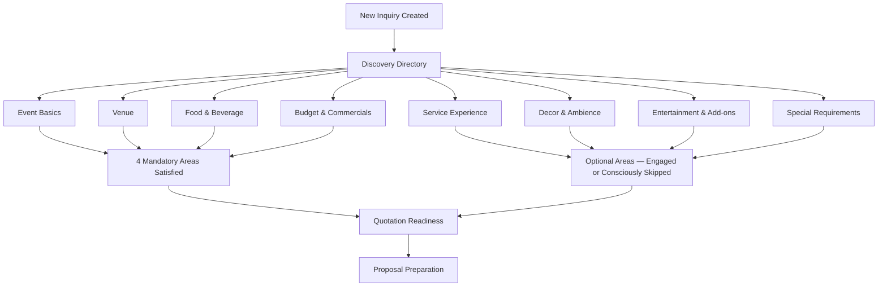

# MS-001A — Inquiry Discovery Suite Certification

**Document ID**: MS-001A
**Module**: Catrack Catering ERP — Inquiry Management (`cat/inquiry`)
**Type**: Certification Document (not a design document)
**Certifies**: The Inquiry Discovery Suite as a complete business capability

> This document does not redesign, re-specify, or modify any individual Work Package. Every Discovery workspace referenced here remains governed by its own frozen `01-business-discussion.md` through `06-freeze.md` lifecycle documents (where they exist). This certification summarizes and attests to the suite as a whole; it introduces no new business rules.

---

## 1. Purpose

The Inquiry module's job is to turn a customer conversation into a proposal-ready understanding of the event — before pricing, before vendor booking, before execution planning. The **Discovery Suite** is the set of eight guided conversation workspaces that do this job, one topic at a time, inside a single Inquiry record.

This document certifies that the suite is now complete: every planned Discovery area exists, is implemented, and is reachable from the Inquiry Requirements Directory. It records what the suite covers, the principles that hold it together, and the handful of framework-level gaps that were consciously left open along the way — without proposing how to close them.

---

## 2. Discovery Journey

Every area is reachable independently from the Discovery Directory, in any order. The four **Mandatory** areas gate quotation readiness; the four **Optional** areas contribute business intelligence to the proposal and to Operations, but a customer legitimately having nothing to say in an optional area does not block progress.

---

## 3. Discovery Coverage Matrix

| # | Workspace | Purpose (one line) | Requirement | ES-016 Status |
| :-: | :--- | :--- | :--- | :--- |
| 1 | **Event Basics** | Establish what's being planned — occasion, date, guest count | Mandatory | Implemented, in active use. No ES-016 lifecycle documentation exists — predates ES-016 adoption. |
| 2 | **Venue** | Establish where the event will happen | Mandatory | Implemented, in active use. No ES-016 lifecycle documentation exists — predates ES-016 adoption. |
| 3 | **Food & Beverage** (`IM-WP02C-03A`) | Establish what's being served | Mandatory | Implemented, in active use. Retroactively documented; `01-business-discussion.md` was never found and is honestly recorded as missing, not fabricated. |
| 4 | **Budget & Commercials** (`IM-WP02C-04`) | Establish commercial expectations, budget posture, decision process | Mandatory | Implemented. Retroactively migrated from historical source material; `04`/`05` explicitly marked "not recorded." |
| 5 | **Service Experience** (`IM-WP02C-06`) | Discover hospitality vision and guest-experience priorities | Optional | **Frozen.** Full ES-016 lifecycle (01–06), built and reviewed in-session. |
| 6 | **Decor & Ambience** (`IM-WP02C-05`) | Discover visual/aesthetic vision | Optional | **Frozen.** `03`/`05` reflect real, verified UX polish work performed in-session; earlier stages migrated from historical source material. |
| 7 | **Entertainment & Add-ons** (`IM-WP02C-07`) | Discover entertainment vision and value-added guest services | Optional | **Frozen.** Full ES-016 lifecycle (01–06), built and reviewed in-session. |
| 8 | **Special Requirements** (`IM-WP02C-08`) | Discover accessibility, health/wellbeing, cultural, security, and venue-guideline awareness, plus a final open request | Optional | **Frozen.** Full ES-016 lifecycle (01–06), built and reviewed in-session. Final workspace in the suite. |

---

## 4. Discovery Principles

Across every frozen Work Package, the same philosophy holds:

- **Discovery is not Planning.** Every workspace states, in its own Business Discussion, what it explicitly does *not* do — staffing, procurement, vendor booking, pricing, BOQ, scheduling, medical assessment, security planning, compliance consulting, execution planning. None of the eight workspaces cross that line.
- **Workspace First.** Each Discovery area is a dedicated, guided conversation panel — not a generic form — mounted in the Requirements Discovery directory.
- **Discovery Before Planning.** Conversations are sequenced to surface intent and feeling before any operational detail is asked for.
- **Informational weighting, never business logic.** Where preference weighting exists (`ESSENTIAL` / `PREFERRED` / `OPTIONAL`), it is documented, in every workspace that uses it, as informational only — it never influences pricing, staffing, or validation. Where weighting would misrepresent the nature of what's being captured (accessibility, health, security awareness in Special Requirements), it is deliberately absent rather than forced in for consistency's sake.
- **"No requirement" is a valid answer.** Optional areas do not manufacture a mandatory field just because one could technically exist — a customer with nothing to add in Entertainment or Special Requirements has completed a genuine, valid Discovery conversation.
- **Customer language over system language.** Conversations are phrased as a consultant would ask them, and Structured Business Summaries are increasingly written as narrative business prose rather than field-by-field data dumps.

---

## 5. Cross-Workspace Consistency

Every workspace in the suite (with the noted historical exceptions in §3 and §6) shares:

- **Common workspace shell**: header banner, system validation badge, Discussion Status toggle, conversation progress bar, guided numbered cards.
- **Unified Insight Assistant sidebar**: Discussion Tips, Internal Sales Assessment (salesperson-only win-probability rating), Structured Business Summary, and Suggested Next Activities — identical shell, identical interaction pattern, in every workspace.
- **Structured Business Summaries** with fixed, per-workspace section headers, handed over to Sales and Operations in the customer's own language.
- **Suggested Activities** that are advisory and proposal-oriented only in every workspace — phrased as "mention," "note," "include," or "carry forward," never as an operational, medical, security, or compliance task — and, in the two most recently built workspaces (Entertainment & Add-ons, Special Requirements), generated only when the triggering data was actually captured.
- **Save Discovery** persistence pattern: one JSONB column per optional area on `cat_inquiry_discovery_areas`, surfaced through the single shared `PATCH /api/cat/inquiries/[id]/discovery` endpoint, keyed by `areaKey`.
- **ES-016 lifecycle discipline**, for every workspace built or refrozen after its adoption: a Business Discussion, an Engineering Package, an Implementation Walkthrough, a Product Review, a UX Polish record, and a Freeze record — six documents, no more, no less.

---

## 6. Known Framework Observations

The following items were consciously identified and consciously deferred during the Discovery Suite's construction. They are recorded here as open observations, not as defects requiring immediate action, and no solution is proposed for any of them.

- **DDS-001 (Discovery Design Standard) has never been authored as a standalone document.** It is cited by name in every Business Discussion in this suite, but exists only as a consistently repeated pattern, not as a written standard. Tracked previously in `docs/project-governance/FOLLOW-UP-GOVERNANCE-ITEMS.md` (item 1).
- **Event Basics and Venue Discovery carry no ES-016 lifecycle documentation.** Both are implemented and in active daily use, but predate ES-016's adoption and were never brought into the documentation lifecycle retroactively, unlike Food & Beverage and Budget & Commercials.
- **Food & Beverage's Business Discussion (`01-business-discussion.md`) does not exist anywhere** — not in this repository, not in any historical archive searched. This is recorded as a genuine, unrepairable historical gap in `IM-WP02C-03A`'s own lifecycle documents, not fabricated to fill the gap.
- **The suite spans two visual eras.** Event Basics and Venue Discovery use an older interaction convention (plain field labels, traffic-light-style Yes/No/Unknown buttons); Food & Beverage onward uses the numbered-card, chip-based convention described in §5. A minor related inconsistency was also noted and left as-is at the time: Food & Beverage's validation badge reads "SYSTEM READY" where every other workspace reads "Discovery Ready."
- **Service Experience's conversation-progress calculation can plateau below 100% for a legitimately complete conversation.** Because optional cards (VIP, Signature Moments, Service Preferences) only count toward progress once something is selected, a simple, low-touch event can read as incomplete even after a genuinely thorough conversation. This was explicitly deferred at the time to "a future Discovery Framework enhancement, after the Inquiry module is complete" — a milestone this certification document now marks as reached.

---

## 7. Certification Statement

The Inquiry Discovery Suite — Event Basics, Venue, Food & Beverage, Budget & Commercials, Service Experience, Decor & Ambience, Entertainment & Add-ons, and Special Requirements — is certified **complete as a business capability**.

All eight Discovery areas are implemented, reachable from the Discovery Directory, and persist through a consistent, shared architecture. The four workspaces built or refrozen under ES-016 (`IM-WP02C-04` through `IM-WP02C-08`) each carry a complete, honest six-document lifecycle record. The remaining four carry the documentation history that genuinely exists for them, gaps included, per this repository's standing rule against fabricating historical artifacts.

This certification changes nothing about any individual Work Package. Every frozen Business Discussion and Engineering Package referenced in this document remains exactly as frozen. The observations in §6 are carried forward as open framework-level awareness, not as instructions, and are left for a deliberate future decision rather than resolved here.

**Certified**: 2026-07-28.
